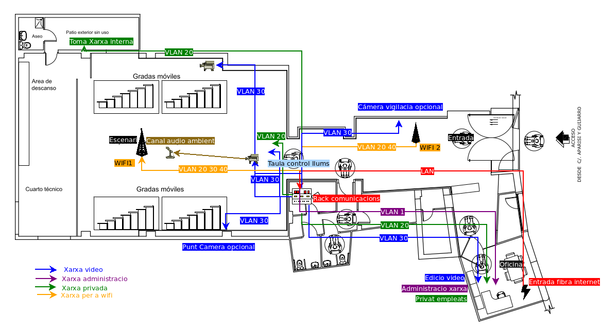
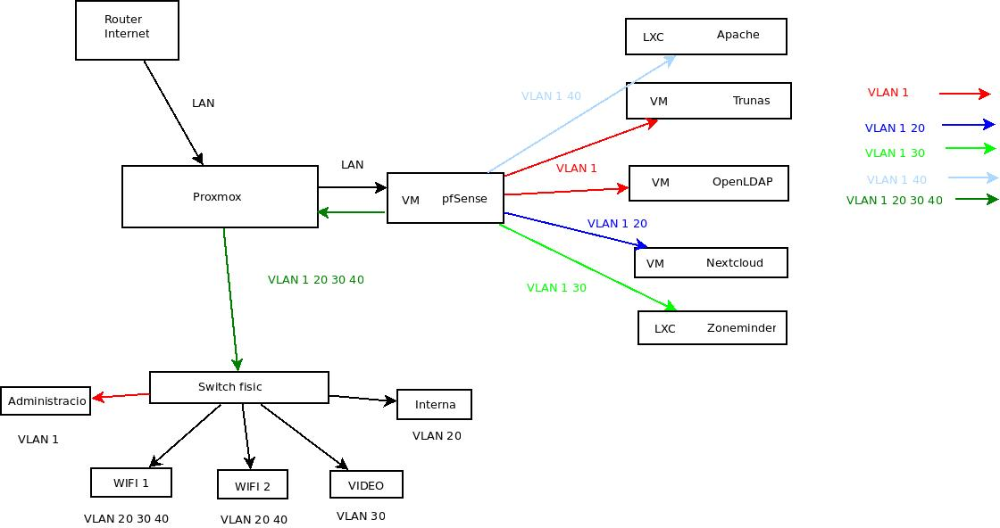

# Infraestructura

Definiren la distribució dels espais en el local de l'empresa i la configuració de la xarxa a muntar, per donar els serveis requerits.

## Xarxa per a la sala

Es proposa la següent configuració de xarxa per a la sala.

- Xarxa de Video per al *registrament / reproducció en línia* de les obres de teatre.
- Xarxa de wifi, pública i privada.
- Xarxa Privada per als treballadors, amb connexió externa per VPN.
- Xarxa d'administració
  
## Descripció de les instal·lacions

Pla de la sala

La sala la podem dividir en 4 espais

- Oficina
- Escenari
- Entrada
- Rebosts, en un d'ells posarem el Rack de comunicació i servidor.
  
### Oficina

En l'oficina tenim l'entrada de la connexió de fibra a internet. Des d'aci portem la connexió de xarxa al rack de comunicacions on tenim la infraestructura de la xarxa, el commutador i el servidor.

Des del rack de comunicacions, tornarem connexions de xarxa cap a l'oficina per donar accés als serveis interns VLAN 20, per poder fer l'edició de video i la reproducció en línia si es donara el cas VLAN 30, i una toma de xarxa per realitzar l'administració VLAN 1.

Per facilitar el seu ús, cadascuna d'aquestes per cables separats acabant en una roseta etiquetada segons VLAN.

### Sala d'espera

En aquest espai, tenim l'ordinador de venda d'entrades al que li donarem connexió, siga directa al commutador, per la connexió de l'oficina o el canal wifi privant.

En el centre de la sala aniria l'antena wifi 2 tipus PoE connectada al nucli de comunicacions per on tindrem VLAN 20 30 separades en dos SSID Privat i Pública.

També posarem una connexió VLAN 30 per si en un futur, es vol reciclar alguna camera per fer de videovigilància. Font a aquesta connexió hi ha un projector al qual li podem posar una roseta amb la VLAN 20 per reproduir arxius de video editats o presentacions des de VLAN 20 (no està dibuixada per claredat de l'esquema).

### Escenari

- En la sala d'espectacles es traurien 4 connexions de la xarxa video *VLAN 30*.

  - **Central**, baix de la taula de llums, on es connectara un Camera ip PoE fixa.
  - **Lateral**, una a cada banda de l'escenari, camera desmuntable que es pot traslladar lateralment segons les necessitats de l'obra representada. Es recomana que aquesta siga del tipus PTZ. Podent ser col·locada a la dreta o l'esquerra de l'escenari.
  - Una toma en la taula de llums, per poder retransmetre el video en la mateixa representació.
  - Una connexió per l'antena wifi, per poder ser sevir el movil com a camera web, amb app tipus [IP webcam](https://play.google.com/store/apps/details?id=com.pas.webcam&gl=US), [Irun webcam](https://iriun.com/).
  - **Micròfon ambient** que el connectarem a la camera central que es fixa.
- Una connexió per a la xarxa pública *VLAN 40*, per l'antena wifi, al centre del sostre de l'escenari, per donar millor cobertura.
- Un punt de connexió en el vestuari a la VLAN 20, per comunicació amb la xarxa interna, que pot donar cobertura per cable a l'escenari en cas de conferències, o altres actes que necessiten bona connexió de xarxa.
- Un altre punt de connexió a aquesta VLAN 20 en la taula de llums, per tindre accés als recursos interns i poder fer comunicació pel TALK de Nextcloud amb els vestuaris i oficines.

### Rebost

En un dels rebosts que hi ha en la sala, muntarem el Rack de comunicacions, aprofitarem en el que està instal·lada la infraestructura de luminació del escenari, que disposa de bones connexions elèctriques, bon aïllat acustica i tèrmicament.

## Descripció de les xarxes

*La configuració de les xarxes, la farem amb 4 VLAN.*

### VLAN 1 Administració

És la xarxa per on s'executaran les tasques d'administració dels serveis amb ssh, i per on passara tot el tràfic intern entre les diferents VM, autenticació LDAP, recursos d'espai de les aplicacions.

Aquesta xarxa, interna del servidor per open v Switch, i soles tindrà una eixida física a lo'oficina. I una OpenVPN pròpia per gestionar des de l'exterior, amb accés soles per a l'administrador. 

### VLAN 20 Privat

Xarxa amb connexió a internet i als serveis oferits per la sala.

Es donaran els següents accessos.

1. *Taula de llums*, perquè puguen accedir a recursos guardats en el servidor, mantenir comunicació amb el vestuari.

2. *Vestuaris*, comunicació o recursos de xarxa a l'escenari.

3. *Oficines*, donar accés a recursos del servidor, donar xarxa a telèfon ip instal·lat.
4. *Punts wifi*, crearem una segona xarxa amb enquesta Vlan en les antenes wifi de sol accés per als treballadors de la sala.

### VLAN 30 Video

Xarxa per la qual anirà el circuit intern de televisió, siga per la reproducció en línia o per fer gravació de les obres en el servidor. No disposara de connexió a internet.

Configurarem accés a aquesta Vlan des del punt wifi de l'escenari, per poder gastar el movil com a camera en les representacions.

::: {.rmdcuidao data-latex="{cap connexió a internet}"}
En la taula de llums, si volen fer servir aquest servei, no volen tindre cap connexió a internet en l'ordinador que gestionen les llums i el video, per no tindre sorpreses de notificacions, correus ... En meitat d'una representació.
:::

Per poder guardar el tràfic de video d'aquesta xarxa, tenim diverses opcions

1. Muntar en el servidor una LXC de [Zonaminder](https://zoneminder.com/), [Shinobi](https://shinobi.video/)... on gestionar les gravacions de video de les càmeres. Amb aquest tipus de programes NVR es facilita molt la gestió aquesta xarxa. 

::: {.rmdinfo .centre data-latex="{}"}
La gravadora (NVR)
En un sistema de càmeres de seguretat IP, el NVR (Network Video Recorder) és central que gestiona i emmagatzema les imatges de vídeo. Totes les càmeres IP enviaran les seues dades a les gravadores des de les quals podeu visualitzar en directe o fer còpies de seguretat de les gravacions.
:::

2. Les càmeres IP es poden gestionar des del seu propi servidor web, on podem configurar l'espai d'emmagatzemament per FTP, SMB ... Depenent del protocol que utilitzen, es pot compartir l'espai de video de Truenas amb el mateix protocol i programar-ho des de qualsevol connexió VLAN 30.

3. Des de l'oficina utilitzant programes tipus OSB per fer la reproducció en línia o copia a l'espai de Truenas

::: {.rmdcuidao data-latex="{afegir el servei Truenas}"}
Haguérem d'afegir el servei Truenas a aquesta xarxa VLAN 30 en el cas 2, i a la VLAN 20 en el cas 3, que en principi no està previst, es planteja fer tot el tràfic de dades per la VLAN 1.
:::

### VLAN 40 pública

Xarxa amb connexió a internet per al públic general a través dels punts wifi, i totalment aïllada de les altres VLAN.

La podem configurar amb un portal captiu, amb pfSense, amb permís de connectar a certes hores coincidint en les representacions, canviant el password en cada obra, que oferirem al públic per un codi QR. Posar un sistema de tiquets que per a les connexions ...

Es pot aprofitar aquesta connexió per a redirigir als espectadors en un primer moment a un servidor web propi on publicitar ressenyes de properes obres, donar més informació de l'obra que van a veure, o interactuant amb ells via web en el transcurs de la representació.

### Xarxa interna dels serveis

El disseny per a la xarxa de cada VM el representem en el següent diagrama, seria afegir les targetes necessaries per a cada VM i connectar-les a les VLAN que necessitem.

Tots els serveis administratius: Compartició d'espai d'emmagatzemament, autenticació LDAP, còpies de seguretat i administració dels serveis, aniran per la VLAN 1. Tots les VM tindran una connexió en aquesta VLAN.

Els serveis per al personal de l'empresa i convidats: Nextcloud i Zoneminder correran per la VLAN 20 que tindrà eixida a l'exterior per les antenes wifi i VPN. Aquesta xarxa sols oferira serveis per HTTPS 443, en un futur es podria plantejar oferir més serveis com correu, SMB, FTP. Pero amb l'entorn Nextcloud, els podem centralitzar amb aquesta aplicació.

La xarxa de video VLAN 30, principalment correra per cable, no disposa de connexió a internet. L'entrada per la xarxa wifi, sols es farà servir per connectar mòbils per fer de web cam en els espectacles, no sent tan fiable aquest tipus de connexió per a la retransmissió de video d'alta qualitat. En els punts de connexió d'aquesta VLAN , taula de llums i oficina, es podrà connectar directament a les càmeres, per poder editar les imatges per altres programes tipus OBS per fer streaming, o retransmetre al mateix espectacle.en directe.

Per acabar, la VLAN 40 estarà aïllada de la resta de xarxes pel firewall de pfSense, Soles sera servida pels punts wifi, La forma de gestionar aquests punts d'accés queda oberta a l'elecció del'empresa. Un password que es proporcionara per codi QR, un sistema de portal captiu, sistema de tiquets... La millor opció seria el portal captiu i reencaminar després a un servidor web intern per aquesta xarxa amb promocions de les obres. Aquest servidor web s'implementaria amb un contenidor, ja siga Wordpress, apache amb Pico de fulles estàtiques, en la carpeta conectada, on deixem els fitxers en md per generar les pàgines, estarà compartit amb nextcloud recurs extern, per poder generar-les des d’alli.
