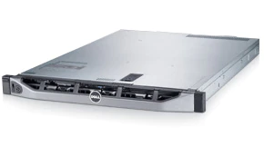
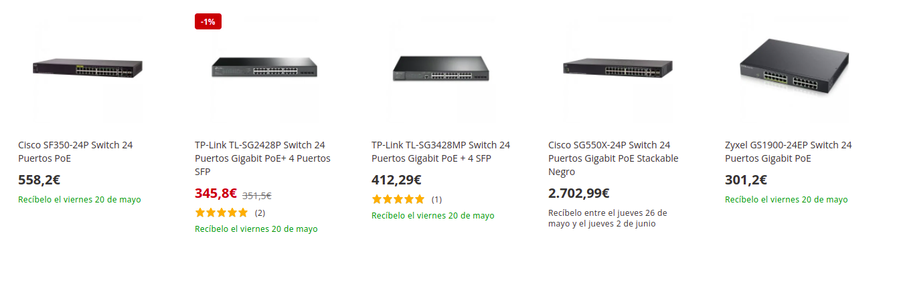

# Proposta de projecte

Requeriments de l'empresa

1. Implantar un sistema d'accés a internet wifi per al públic que entre en les instal·lacions.
2. Implantar un sistema de gravació de les obres que es representen per reproducció en continu o tindre una còpia per després editar-les.
3. Un entorn col·laboratiu per als empleats.

## Serveis proposats

* Entorn de serveis d'allotjament de fitxers Nextcloud, és funcionalment similar a Dropbox, Office 365 o Google Drive quan s'utilitza amb les seues solucions d'oficina integrades Collabora Online o OnlyOffice.
* Servei de comunicació entre membres, per Nextcloud Talk, video, audio o xat.
* Servei de wifi per a la sala, separant tres xarxes.
  * Interna, membres de l'equip (internet i xarxa local de serveis) VLAN 20
  * Públic (sols accessos a internet) VLAN 40
  * video (sense accés a internet) VLAN 30
* serveis de video, tipus videovigilància, que ens permet gravar les obres, retransmetre a usuaris autenticats en directe (per veure assajos), veure còpies d'esdeveniments gravats. La forma més senzilla és fent servir solucions NVR tipus Zoneminder o shinobi.
* Aprofitant la wifi pública, habilitar un servidor web intern en aquesta xarxa per promocions, documentació extra de les obres, o interactuar amb el públic.

Per portar-lo a terme es requeriria

1. Muntar punts wifi d'alta capacitat.
2. Un servidor per allotjar les VM dels serveis, espai per guardar els documents i les gravacions de video.
3. Instal·lacio d'una xarxa informàtica, commutador, cablejat, Rack.
  
## Pressupost del maquinari

Es proposa el següent maquinari

1. [Servidor](https://www.ebay.es/itm/125269454776?hash=item1d2aa42fb8:g:aTIAAOSw3ExiXvm5)

   **Cost 250 euros + iva -> 300 euros**
  
   

   No porta Discs durs.{width=25%}

2. Discs durs per al servidor, minim 3 per fer un sistema de seguretat a fallades, i un SSD per al sistema base i les VM. Disposa d’espai per a 4 de connexió en calent dins la seua caixa, si fera falta més, en un futur es posaran, pero ja fora del xassís.

   **Cost de 4TB, al voltant de 90 euros cada un**

   Referències orientatives
   [SEAGATE Barracuda ST4000DM004 4000GB 3.5 Serial ATA III](https://www.pcbox.com/st4000dm004-seagate-barracuda--st4000dm004-4000gb-3-5--serial-ata-iii/p)
   [amazon Barracuda 4TB](https://www.amazon.es/Seagate-Barracuda-Disco-Interno-cach%C3%A9/dp/B0713R3Y6F/ref=sr_1_5?__mk_es_ES=%C3%85M%C3%85%C5%BD%C3%95%C3%91&crid=JR7AGWGKGDES&keywords=hd%2Bsata%2B4tb&qid=1651315567&sprefix=hd%2Bsata%2B4tb%2Caps%2C93&sr=8-5&th=1)

3. Switch, [referencies orientatives](https://www.pccomponentes.com/buscar/?query=switch%2024%20poe&or-relevance)

{width=80%}
  Es requereix que siga PoE+ (alimentació elèctrica del dispositiu pel cable LAN) per a les càmeres IP i les dues antenes wifi. De 24 ports. El model s'elegira segons presupost final.
  **cost entre 300 i 600**

1. Armari [Rack](https://www.pccomponentes.com/microconnect-armario-rack-19-6u-600x600mm-negro) per al servidor i el switch.  
**Cost Microconnect Armario Rack 19" 6U 600X600mm Negro 130,56€**

5. [Patch panel](https://www.pccomponentes.com/buscar/?query=patch%20panel&or-relevance)  
**Cost depen dels ports del switch, al voltant de 30 euros**

6. Cablejat i rosetes, Eas contractara una empresa externa especialitzada.

7. Antena [wifi Unifi](https://ui.com/wi-fi#compare)  

   - U6 Professional $ 149.00
   - U6 Lite $ 99.00 

8. Càmeres ip.

En la sala coneixen una persona que treballa en el món d'imatge i so, esperant recomanacions.

   * **Professional** Sony, pero de 2500 euros no baixen.

   * Barates
  
     **càmeres amb nightcolor**

     [barata](https://www.amazon.es/Exteriores-Seguridad-vigilancia-detecci%C3%B3n-humanoide/dp/B09CMRTXCH/ref=sr_1_5?__mk_es_ES=%C3%85M%C3%85%C5%BD%C3%95%C3%91&crid=1HGWT0B8AQ04L&keywords=ptz+Visi%C3%B3n+Nocturna+a+Color+poe&qid=1652043379&s=tools&sprefix=ptz+visi%C3%B3n+nocturna+a+color+poe%2Cdiy%2C95&sr=1-5) 67.99 euros

     [Reolink 5MP PTZ Cámara](https://www.amazon.es/Reolink-Seguridad-Seguimiento-Autom%C3%A1tico-Outdoor-V3/dp/B099F2LGSB/ref=sr_1_9?__mk_es_ES=%C3%85M%C3%85%C5%BD%C3%95%C3%91&crid=1HGWT0B8AQ04L&keywords=ptz+Visi%C3%B3n+Nocturna+a+Color+poe&qid=1652043379&s=tools&sprefix=ptz+visi%C3%B3n+nocturna+a+color+poe%2Cdiy%2C95&sr=1-9) 139,99€

     [fixa reolink 4K](https://www.amazon.es/Reolink-Vigilancia-Bidireccional-Impermeable-RLC-812A/dp/B096K1P2RK/ref=sr_1_10?__mk_es_ES=%C3%85M%C3%85%C5%BD%C3%95%C3%91&crid=1HGWT0B8AQ04L&keywords=ptz+Visi%C3%B3n+Nocturna+a+Color+poe&qid=1652043379&s=tools&sprefix=ptz+visi%C3%B3n+nocturna+a+color+poe%2Cdiy%2C95&sr=1-10)  94,99€

::: {.rmdinfo .centre data-latex="{Segons fabricant}"}
Segons fabricant
La tecnologia d'avantguarda NightColor us permet obtenir una imatge nítida fins i tot quan és fosc. Aquesta càmera té 2 LED blancs que transmeten els seus raigs infrarojos en una freqüència imperceptible a l'ull humà. Les llums blanques emeten brillants que ofereixen una increïble gamma de NightColor de 66 peus. Amb aquesta potent funció, podeu aconseguir una consciència total sobre allò que no s'havia vist anteriorment i fer-ho d'una manera indetectable.

Pero no se jo. Es pot provar en una a veure com va, si no dona bon resultat es pot posar de camera de vigilància de l'entrada de la sala.
:::

* Un poc millor
[Amcrest UltraHD 4K (8 MP) POE IP, càmera exterior, 3840 x 2160, 131 pies NightVision](https://www.amazon.es/Amcrest-NightVision-resistente-intemperie-IP8M-2496EW-28MM/dp/B08SMPGF2L/ref=sr_1_1_sspa?__mk_es_ES=%C3%85M%C3%85%C5%BD%C3%95%C3%91&crid=B563YL5W8NZG&keywords=Amcrest&qid=1652041726&sprefix=amcrest%2Caps%2C93&sr=8-1-spons&psc=1&spLa=ZW5jcnlwdGVkUXVhbGlmaWVyPUEzNU04RVpYSEg2MTNDJmVuY3J5cHRlZElkPUEwODgxOTQwRDUzMkNEVUg0QUVIJmVuY3J5cHRlZEFkSWQ9QTEwMTQxOTBBNzRSODlYRllZNk4md2lkZ2V0TmFtZT1zcF9hdGYmYWN0aW9uPWNsaWNrUmVkaXJlY3QmZG9Ob3RMb2dDbGljaz10cnVl) 129,99€ [especificacions](https://amcrest.com/downloadable/download/attachment/id/22371/)

* Gamma Mitjana
[Zowietek PTZ Pro Cámara PTZ](https://www.amazon.es/Zowietek-PTZ-Pro-transmisi%F3n-videoconferencia/dp/B086X637W2/ref=sr_1_2_sspa?keywords=Zowietek%2BPro%2BCamera%2B20X%2BLive&qid=1652728314&sr=8-2-spons&th=1)
**Al voltant de 700 euros**

D'aquesta gamma hi ha moltes.
