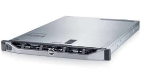
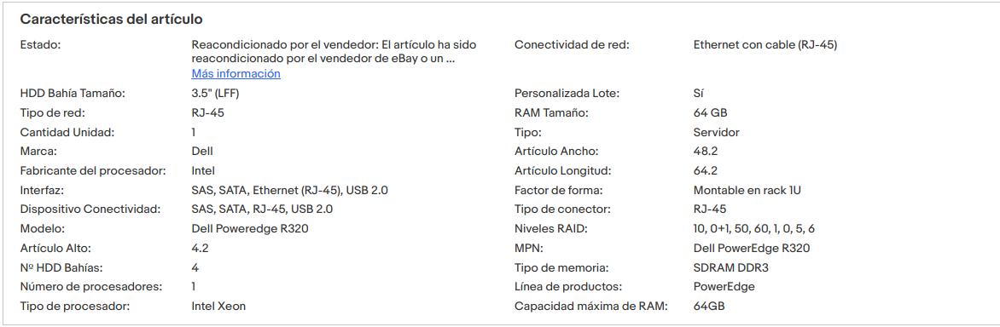
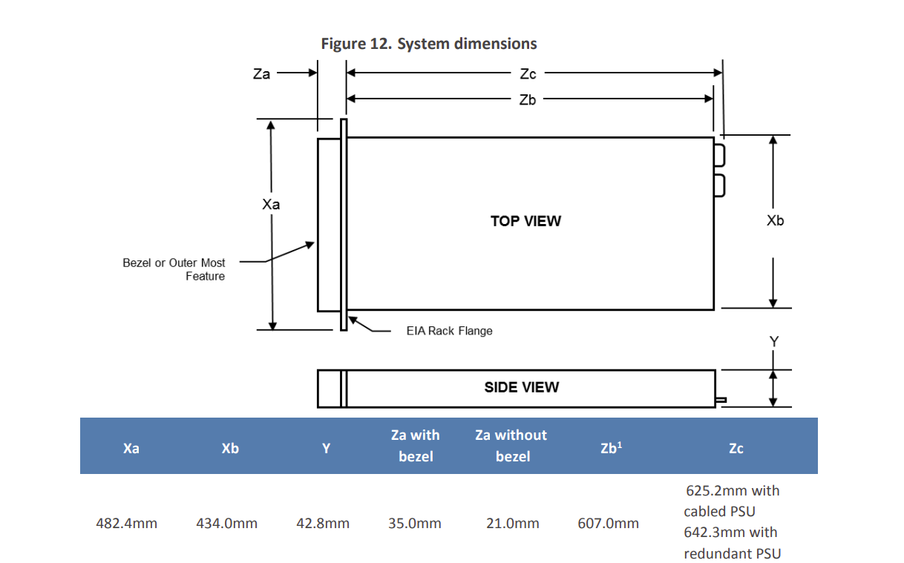
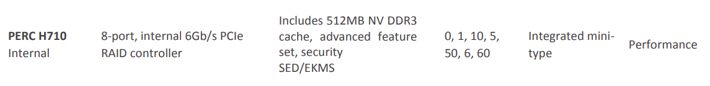
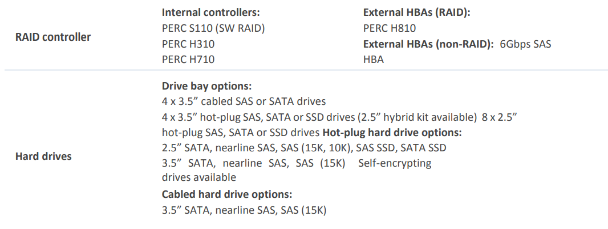
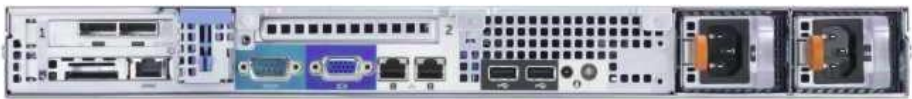

# Servidor

1. [Servidor](https://www1.la.dell.com/content/products/productdetails.aspx/poweredge-r320?c=ve&l=es&s=corp&cs=vecorp1). En [ebai](https://www.ebay.es/itm/125269454776?hash=item1d2aa42fb8:g:aTIAAOSw3ExiXvm5) el podem trobar per uns 250 euros + IVA, amb 64G de ram.

{width=30%}

**Especificacions**

{width=80%}

::: {.rmdnote .centre data-latex="{}"}
[Documentació del model](https://i.dell.com/sites/csdocuments/Shared-Content_data-Sheets_Documents/ja/jp/Dell-PowerEdge-R320Technical-Guide.pdf), i [manuals](https://www.dell.com/support/home/en-us/product-support/product/poweredge-r320/docs), [owner manual](https://dl.dell.com/topicspdf/poweredge-r320_owners-manual_en-us.pdf)
Compatibilitat amb [ubuntu server](https://ubuntu.com/certified?category=Server&vendor=Dell+EMC&offset=20), és compatible amb la versió 14 i posteriors. En la fulla de [Dell](https://www.dell.com/support/contents/en-us/article/Product-Support/Self-support-Knowledgebase/enterprise-resource-center/server-operating-system-support) 
:::

::: {.rmdinfo .centre data-latex="{}"}
És compatible amb la [versió 14.04 LTS](https://linux.dell.com/files/supportmatrix/Ubuntu_Support_Matrix.pdf), no apareix en la llista, manté la compatibilitat hardware amb les més recents. És un servidor del 2014, pero per als requisits que requerim, pocs usuaris, tràfic limitat, és suficient.
A una mala Posem [CentOS](https://www.centos.org/)
:::

*Dimensions servidor*

{width=50%}

Cal buscar un rack que done les dimensions.

[video d’instal·lació](https://www.dell.com/support/contents/es-es/videos/videoPlayer/os-deployment-installing-microsoft-windows-2012-r2-operating-system-by-using-lifecycle-controller/6079802988001)

1. *Discs durs*, admet segons documentació 4 SATA 3.5'' o 8 de 2.5'' Hot-plug. No fariem RAID per hardware.
   RAID: Kit RAID H710 Mini 512 MB NV (SAS/ SATA ) - 0/1/5/6/10/50/60
   {width=80%}
   Caddies: 4 LFF (3.5") incluidos

   {width=80%}
   
   Recomane
   [SEAGATE Barracuda ST4000DM004 4000GB 3.5 Serial ATA III](https://www.pcbox.com/st4000dm004-seagate-barracuda--st4000dm004-4000gb-3-5--serial-ata-iii/p)
   [amazon](https://www.amazon.es/Seagate-Barracuda-Disco-Interno-cach%C3%A9/dp/B0713R3Y6F/ref=sr_1_5?__mk_es_ES=%C3%85M%C3%85%C5%BD%C3%95%C3%91&crid=JR7AGWGKGDES&keywords=hd%2Bsata%2B4tb&qid=1651315567&sprefix=hd%2Bsata%2B4tb%2Caps%2C93&sr=8-5&th=1)
   [amazon usa](https://www.amazon.com/Seagate-BarraCuda-Internal-Drive-3-5-Inch/dp/B07D9C7SQH/ref=sr_1_1_sspa?keywords=4tb%2Bsata%2Bhard%2Bdrive&qid=1651315472&sr=8-1-spons&spLa=ZW5jcnlwdGVkUXVhbGlmaWVyPUExSldCREdJVFMzRUtNJmVuY3J5cHRlZElkPUEwNTc5NTIwMlRYQzQ0OTA0QVNDOCZlbmNyeXB0ZWRBZElkPUEwNjQxNjk2MjU1VkFSWjM1NVA4MiZ3aWRnZXROYW1lPXNwX2F0ZiZhY3Rpb249Y2xpY2tSZWRpcmVjdCZkb05vdExvZ0NsaWNrPXRydWU&th=1)

   Farien falta, 3 SATA per les dades, i un ssd 2.5 per al sistema base i les VM. Estaria bé tindre un de reserva per si falla un disc, no haver d'anar buscant un altre igual. `

2. RAM: RAM registrada DDR3 de 64 GB. No és la més ràpida del mercat, pero suficient per al que necessitem: 
   - pfSense Min 1GB (imatge oficial), 2GB
   - Znemindre NVR video 4 GB, si sobra, posar un poc mes, com anem a fer registre directe, sense detecció de moviment, no requereix tants recursos.
   - Nextcloud Min 2GB, recomanat + 8GB
   - Ldap, web server, antenes wifi, Collabora office server, algun altre servei futur, si es vol mail intern ...  8GB.
   - Truenas, minim 8GB, quant mes millor. Les exigencies de ZFA son altes.
  
   

3. CPU: 1x Intel Xeon E5-2440 V2: 8 núcleos, 16 subprocesos, 1,90 GHz (aumento de 2,40 GHz, caché de 20 MB, TDP de 95 W)

4. Segons la informació del venedor.

    - Bisel: No incluido
  [Rieles](https://www.pccomponentes.com/salicru-rack-rail-kit-accesorio-de-bastidor-480-a-780mm): Rieles no incluidos
   Factor de forma: Montaje en rack 1U

    - Part posterior: 1 puerto RJ-45, Preguntar si no és uno doble. En la documentacio oficial, la sèrie porta
    **I/O adapter options
    1Gb Ethernet:
    Broadcom 5720 Dual Port 1Gb NIC**
    The Broadcom 5720 is a 14th generation 10/100/1000Base-T Ethernet LAN controller
    Broadcom 5720 2x1Gb Base-T
    {width=60%}

    - 2 fonts d'alimentació redundants. 
   Fuente de alimentación: 2 fuentes de alimentación intercambiables en caliente de Dell
   **Platinum efficiency 350W or 550W power supply**
    
   - Dell OpenManage Systems Management
    OpenManage Essentials
  
   - Acustica, sobre 30db. El posarem en una habitació fora de l'oficina i la sala. No sera problema.
