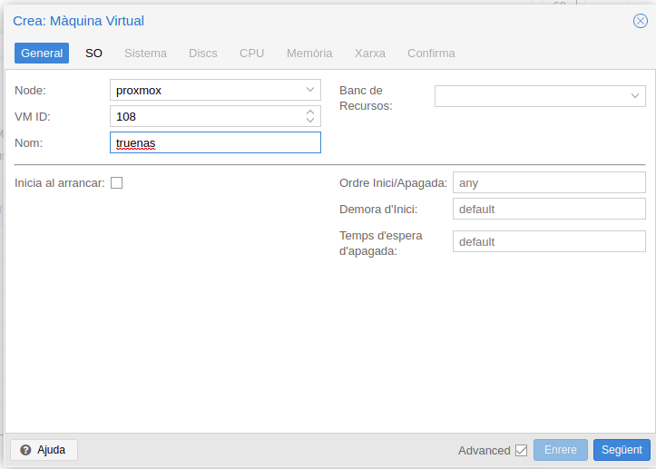
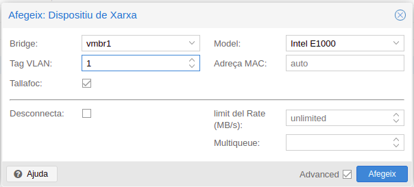

# Proxmox

Instal·larem el hypervisor [Proxmox](https://www.proxmox.com/en/)

Ho farem en proves viralitzant en KVM en ubuntu local, en el servidor sera directe.
Per a poder importar les imatges de les iso o VM que volem instal·lar crearem un servei NFS en el host local per a poder recuperar-les i no haver d'anar en USB.

## Preliminars

### Servidor NFS en local

Servirem les imatges de les ISO des de el host local per no tindreles que torna a baixar. Ho farem servint un directori NFS al Guest Proxmox.

#### En el host local, instal·lem i arranquem el servei

Seguint la [guia](https://phoenixnap.com/kb/ubuntu-nfs-server), primer hem d'arrancar el servei

```bash
sudo apt install nfs-kernel-server
```

Creem la carpeta on compartirem les imatges i VM per a proxmox, canviem el propietari i els permisos.

```bash
sudo mkdir nfsdir
sudo chown nobody:nogroup /home/enkidu/nfs
sudo chmod 777 /home/enkidu/nfs
```

Ara exportem el recurs, editem el fitxer /etc/exports i afegim la linea per donar permisos d'accés als clients.

{width=80%}

Exportem el directori i reiniciem el servei

```bash
sudo exportfs -a
sudo systemctl restart nfs-kernel-server
```

Ja tenim preparat el directori de les imatges per quan acabem d'instal·lar Proxmox

## Instal·lacio de Proxmox en una VM amb KVM

Ho farem en KVM des de l’Ubuntu local

1. Creem la VM
2. Elegim el medi d'instal·lacio, ho fem des d'un fitxer iso, en el servidor real, tindríem que haber fet un USB d'arrancada d'aquesta iso seguint els passos que ens indique.

{width=50%}

Elegim la imatge i li diguen quina es la base del SO, Debian 10

{width=50%}

Creem el volum per aquesta VM, el format és qcow2 amb espai dinàmic, i la mida 40 Gib, després li afegirem un segon volum on posarem les VM.
En disc ocupa 2 Gib reals, /mnt/vbox és on munte una partició del ssd en el meu portàtil, servirem d'aquest.

{width=50%}

Al final queda la VM com la imatge, després ja li afegirem altres HD i targetes de xara. Li he donat quasi tota la RAM, reservant part per a la host.

{width=50%}

## Arranquem la instal·lacio

En arrancar la VM ens ix la presentació

{width=50%}

Elegim el format del HD, el podem deixar en ext4, he provat fer ZFS, per fer la prova, en el cas de tindre el servidor, es pot plantejar fer-ho amb 2 ssd RAID 1.

Pero amb una bona política de còpies de seguretat, no seria necessari.

::: {.rmdinfo .centre data-latex="{RAID inconvenients}"}
Una matriu de paritat com ara RAID (1, 5, 6 o 10) introdueix cicles de treball estés i acumulació de calor reduint així la vida útil del motor. Una matriu de striping com ara RAID-0 redueix els cicles de treball i l'acumulació de calor augmentant així la vida útil del motor. També ofereix un major rendiment com a avantatge, mes velocitat de lectura i escriptura.
:::

{width=50%}

{width=20%}

Després configurem la zona horària i el password,

::: {.rmdtip data-latex="{Per entrar}"}
Per entrar des d'un navegador ip port 8006 amb usuari root i el password que acabem de posar.
:::

{width=50%}

Configurem la xarxa cap a fora, internet NAT al host.

* Donem el FQON que sere proxmox.inestable.dedyn.io
* La ip 192.168.122.2/24
* El Gateway 192.168.122.1
* DNS 192.168.122.1 Ho canviarem després
  
::: {.rmdcuidao data-latex="{directrius RFC 1918}"}
Triarem X.X.X.254 en pfSense tant per a la passarel·la com per a DNS perquè es troba fora dels valors predeterminats de l'interval d'adreces DHCP (192.168.x.100-192.168.x.200) a la majoria d'encaminadors. Directrius RFC 1918.
:::

Al final queda una configuració

{width=50%}

::: {.rmdnote data-latex="{Recorda}"}
Canviar la Timezone després :)
:::

En acabar es reinicia i passem a la configuració

{width=50%}

## Primeres configuracions

Anem en el navegador a l'adreça IP seleccionada, al port 8006, i amb l'usuari root i el password que hem elegit, entrem.

{width=60%}

I ja estem dins en la primera arrencada

{width=80%}

Muntem el volum NFS d'abans, on tenim les ISO de les VM que volem instal.lar

Entrem per ssh en proxmox, també ho podem fer des de la GUI en la finestra del navegador.

```bash
enkidu@enkidu:/mnt/vbox$ ssh root@192.168.122.2
root@192.168.122.2's password: 
Linux proxmox 5.15.30-2-pve #1 SMP PVE 5.15.30-3 (Fri, 22 Apr 2022 18:08:27 +0200) x86_64

The programs included with the Debian GNU/Linux system are free software;
the exact distribution terms for each program are described in the
individual files in /usr/share/doc/*/copyright.

Debian GNU/Linux comes with ABSOLUTELY NO WARRANTY, to the extent
permitted by applicable law.
Last login: Sun May 22 22:42:06 2022 from 192.168.122.1
root@proxmox:~# 
```

Busquem el recurs nfs on estan les ISO, la meua host te la ip 192.168.0.103
Creem un punt per enllaçar el recurs i el muntem.

```bash
root@proxmox:/mnt# pvesm nfsscan 192.168.0.103
/home/enkidu/nfs 192.168.122.2
root@proxmox:~# mkdir -p /mnt/pvex/enkidu
root@proxmox:~# mount -t nfs 192.168.0.103:/home/enkidu/nfs /mnt/pvex/enkidu
root@proxmox:~# ls -la  /mnt/pvex/enlidu
total 5
drwxrwxrwx 2 nobody nogroup 4096 May 22 19:54 .
drwxrwxrwx 4 nobody nogroup    4 May 22 22:57 ..
drwxrwxrwx 1 nobady nogroup   46 May 22 19:54 isos_esceniques
drwxrwxrwx 1 nobody nogroup   32 May 22 19:53 vm
```

Ho podem fer també per la GUI de proxmox. En vista de l'emmagatzemament -> emmagatzematge -> NFS
Des d'aci és on es configura els tipus de discs que podem crear o afegir.

{width=50%}

Ara configurem el nou recurs.

{width=50%}

1. Li donem un ID, que sera també el nom de la carpeta que es crea en /mnt/vpex/per muntar el recurs.
2. La IP o FQON on està el recurs. Com encara no tenim DNS, li posem la IP.
3. El directori compartit, al posar la IP, en el menu desplegable ens mostra els recursos compartits per aquest servidor NFS.
4. El tipus de recurs que es comparteix. Volem guardar aci les imatges ISO, podem seleccionar altres recursos com copies de seguretat, Discs VM ...
5. Afegim

I ja tindríem el recurs accessible.

{width=80%}

Ja podríem començar a crear les VM en el volum local dins la VM, pero primer afegirem un nou HD, per tindre separat el sistema host de les VM, es com si ara li posarem un altre HD ssd al servidor, ho recomana la documentació oficial per més estabilitat. En la pràctica, segurament tindrem un sol ssd per al proxmox i les VM. Faríem les particions abans una per al sistema base i l'altra per a les VM, en el cas de tindre dos SSD, faríem un RAID1 (espill) + ZFS, i el mateix una partició separada de l'arrel per a posar les VM. En gestió personalitzada dels dics.

::: {.rmdwarn data-latex="{No per Maquinari}"}
Per fer el RAID1 no el faríem des del maquinari del servidor el servidor no es nou, i si fallara, haguérem de buscar la mateixa peça perquè arranque, el format ZFS no es compatible amb RAID per maquinari, ja porta el seu propi sistema de fer-ho.
:::

## Actualitzar repositoris

Per defecte els repositoris que porta definits es la versió enterprise, que s'ha de tindre subscriptcio per poder accedir, canciarem per la No-Subscription Repository

[Documentacio](https://pve.proxmox.com/wiki/Package_Repositories)

En /etc/apt/source.list afegim i el repositori No-Subscription commentem l’enterprise

```bash
deb http://ftp.debian.org/debian bullseye main contrib
deb http://ftp.debian.org/debian bullseye-updates main contrib

# PVE pve-no-subscription repository provided by proxmox.com,
# NOT recommended for production use
deb http://download.proxmox.com/debian/pve bullseye pve-no-subscription

# security updates
deb http://security.debian.org/debian-security bullseye-security main contrib
```

## Afegir nous HD al servidor

Ara seria el moment que afegiríem els HD al servidor físic. El cas hipotètic seria tindre 3 HD SATA i un ssd.

Tots els discs es formataran fent servir ZFS pels avantatges que proporciona, instantànies, control d'errors, redimensionament de volums, compressió nativa ...

El que es proposa

1. El SSD siga d'us exclusiu de Proxmox, una partició per al sistema base i l'altra per guardar les VM dels serveis. I els SATA per ús exclusiu de Truenas, i des d'aci compartir volums en la resta de VM, tenint centralitzada l'emmagatzemament de dades facilitant les còpies de seguretat.

2. Els SATA es dividiran en dos blocs, SATA 1 i 2 format un RAID 0 que ens proporciona millor rendiment de velocitat, on crearem espai compartit per NFS per:

   * Dades d'usuaris Nextcloud.
   * Còpies de seguretat de les VM, fitxers de configuració, repositori ISO dels sistemes a instal·lar, part administrativa.
   * Espai per la captura de video, en dues seccions, una per a videos editats per guardar, i l'altra per a registres en brut.
   * Altres serveis futurs, com un xicotet espai per al servidor web de promocions internes, que podria estar dins de l'espai de Nextcloud per poder editar des d'aques entorn el contingut (configuració amb [pico](https://picocms.org)), o espai per contingut Wordpress si s'adopta aquesta opció. 
  
3. L'altre SATA per fer còpies de seguretat.
    * De les dades de Nextcloud.
    * De les còpies de seguretat de Proxmox i fitxers administratius.
    * De la carpeta de Video de còpies per guardar. Soles els arxius de video d'obres pròpies.
  
::: {.rmdtip data-latex="{Tip}"}
Per la forma en què l'empresa vol d'utilització les còpies de video, fer captures de video per a les companyies convidades per oferir-les com un servei mes de la sala, aquestes còpies s'esborraran una vegada el convidat la descarregue. I les pròpies s'han d'editar. No val la pena estar gastant gran quantitat de recursos del servidor en fer un RAID 1, quan el pes més gran de les dades son descartables. Amb una política frequent rsync entre volums en Truenas, les tindrem protegides amb poc consum.
:::


### Procediment

Simularem que li afegim un nou SSD de 100Gib i tres SATA dos de 50 Gib i un de 100 Gib.
Creem els 4 volums en format qcow2 i els afegim en KVM a la VM de Proxmox

En KVM/qemu creem els discs i els afegim a la nostra VM.

{width=80%}

{width=50%}

Afegim els discs, com a VirtiO. Ho farem primer soles en el SSD i després posarem els altres.

{width=50%}

Arranquem. i apareix el nou HD /dev/vdb

{width=80%}

### Configuracio del nou SSD per a les VM

Tenim dues opcions, configurar el nou volum com a LVM-thin o com un volum ZFS

1. Si el volguérem configurar com a LVM
   [Documentacio](https://pve.proxmox.com/wiki/Logical_Volume_Manager_(LVM))

```bash
root@proxmox:~# cat /proc/partitions 
major minor  #blocks  name

 252        0   41943040 vda
 252        1       1007 vda1
 252        2     524288 vda2
 252        3   41417711 vda3
 252       16  104857600 vdb
  11        0    1048575 sr0
```

Crearem un LVM per al nou SSD que acabem d'instal·lar, aquesta opció te tots els avantatges de LVM, podem afegir mes espai si en el futur ens fera falta, afegint un nou ssd, canviar la mida de les VM ...

Per consola, primer crear el volum, soles tenim un i després el grup de volums que li direm lvsVM es per a imatges de màquines virtuals.

```bash
root@proxmox:~# pvcreate /dev/vdb
  Physical volume "/dev/vdb" successfully created.
root@proxmox:~# vgcreate lvmVM /dev/vdb
  Volume group "lvmVM" successfully created
```

També ho podem fer per la GUI, els mateixos passos que farem després en el format ZFS pero elegint LVM

Afegim el volum logic

```bash
root@proxmox:~# lvcreate -n VM -V 100G lvmVM/lvmVM
  WARNING: Sum of all thin volume sizes (100.00 GiB) exceeds the size of thin pool
  lvmVM/lvmVM and the size of whole volume group (<100.00 GiB).
  WARNING: You have not turned on protection against thin pools running out of space.
  WARNING: Set activation/thin_pool_autoextend_threshold below 100 to trigger
  automatic extension of thin pools before they get full.
  Logical volume "VM" created.
```

En aquest tipus de volums l'hauríem de configurar com a LVM-thin si el volem utilitzar per a emmagatzemament d'imatges, ofereix un suport eficient per a instantànies i clons. És la forma predeterminada de particions de Proxmos per a les VM que genera en el volum local, fa una part per al sistema base i una altra que li diu local per a les VM, és el que es veu en el disc /dev/vda.

2. Com a volum ZFS

Al final el creem com a ZFS, que té les mateixes característiques que LVM-thin millorades.

Dins de discs elegim ZFS -> afegir, seleccionem el disc que volem crear, apareixen els nous discs afegits. El /dev/vde és el ssd de 100G que configurarem.

{width=50%}

El crearia i l'afegeix com a nou emmagatzemament

El podem editar i li diguem que tipus de contingut volem que es guarde en ell, Imatges de disc i contenidors.

{width=50%}

Ja el podríem utilitzar per crear la primera VM i guardar-la dins d'ell.

## Afegir l'emmagatzenament de còpia de seguretat

Una vegada creat i compartit el volum de còpia de seguretat, en la secció de Truenas, l'afegim a emmagatzemaments. Aquest volum l'hem compartit com a NFS + ZFS, ho fem com en el cas del disc de la host -> afegir NFS, pero ara li direm que guarde en tipus de dades, elegim totes. Aci guardarem tant les ISO, les VM, els contenidors que baixem... sera d'on en un futur obtindrem els recursos d'administració, eliminant l'espai compartit de la host d'on importem ara les ISO per instal·lar les VM.

{width=50%}

Ja tindríem el nou espai backup

## Crear nova VM

Crearem una nova VM Truenas per definir els passos a seguir.

1. Creem una nova VM, elegim el node, soles tenim un proxmox
2. L'ID, es com reconeix Proxmox la VM
3. Li donem un nom

{width=50%}

4. Elegim el SO, li diguem el lloc on està la imatge, de moment, del recurs compartit en la host, més avant seria el recurs Backup d'administracio en Truenas.
5. Elegim de les ISO disponibles la que volem
6. Elegim el tipus de sistema a instal·lar, Linux

{width=50%}

7. Podríem elegir targeta gràfica, en la que ve per defecte ens va be, Si la VM requerira potència GPU i el servidor disposara, la podríem configurar.
8. El tipus d'emulacio del procesador.

{width=50%}

9. Definim el tipus de disc SATA
10. On es creara la VM, en l'espai que hem configurat per aquesta tasca vmZFS
11. La grandària del disc
12. El format, per caracteristique del lloc on creem les VM, soles ens deixa elegir el format RAW, pero en ser ZFS i l'hem definit la compressio, és millor que un volum qcow2, té accés directe al disc va més fluid, i mantenim la mida dinamica. 

{width=50%}

13. Configurariem el número de CPU

{width=50%}

14. La memoria, Elegim la maxima que pot utilitzar
15. Per la forma de gestionar la memoria, li podem definir la minima, si no l'utilitza, no reserva tota la que li hem donat, soles la minima, alliberant la resta al sistema.
16. Comparticions, crec recordar que és un mòdul del nucli linux, que comparteix memoria amb altres VM, aquesta és una FreeBSD, les llibreries igual amb una altra FreeBSD les comparteixen, alliberant memoria.

{width=50%}

17. La Xarxa, de moment per a les primeres configuracions la posem en el pont vmbr0, és el pont NAT a la host, després editarem la configuracio de la VM i la posarem en el pont Open virtual switch, en les VLAN que volem que estiga, afegint-li més targetes de xarxa.
    
{width=50%}

18. Tenim el resum de la VM que acabem de crear, Soles quedaria arrancar-la i comença el proces d'instal·lacio, en l'apartat Truenas.

{width=50%}

```{r sheets-option-drag64, echo = FALSE, fig.cap="Instal·lacio VM Truenas"}
if(knitr::is_html_output(excludes="markdown")) knitr::include_graphics("imatges/proxmox/install_truenass.gif")
```

## Contenidors LXC en Proxmox

Els contenidors són una alternativa lleugera a les màquines totalment virtualitzades (VM). Utilitzen el nucli del sistema amfitrió en què s'executen, en lloc d'emular un sistema operatiu (SO) complet.

Els costos d'execució dels contenidors són baixos, normalment insignificants. Tanmateix, hi ha alguns inconvenients que cal tenir en compte:

* Només es poden executar distribucions de Linux als contenidors Proxmox.
* Per motius de seguretat, s'ha de restringir l'accés als recursos de l'amfitrió. Per tant, els contenidors s'executen en els seus propis espais de noms separats.

Proxmox VE fa servir [Linux Containers (LXC)](https://linuxcontainers.org/lxc/introduction/) com a tecnologia de contenidors subjacent. Es gestiona amb "Proxmox Container Toolkit" ( pct ). Els contenidors estan estretament integrats amb Proxmox VE, podem utilitzar la mateixa xarxa i recursos d'emmagatzematge que les màquines virtuals.

::: {.rmdtip data-latex="{Tip}"}
Si voleu executar contenidors d'aplicacions, per exemple, imatges Docker, es recomana que els executeu dins d'una VM Proxmox Qemu.
:::

### Distribucions suportades

Basicament les més importants, algunes d'elles són

* [Alpine Linux](https://alpinelinux.org)
* [Arch Linux]( https://archlinux.org/)
* [CentOS](https://centos.org)
* [Debian]( https://www.debian.org)
* [Ubuntu](https://ubuntu.com/)
...

### Imatges de contenidors

Les imatges de contenidors, “templates” són arxius tar que contenen tot per executar un contenidor. Proxmox VE proporciona una varietat de plantilles bàsiques per a les distribucions de Linux més comunes. Es poden descarregar mitjançant la GUI o la utilitat de línia d'ordres pveam, també es poden descarregar plantilles de contenidors [TurnKey Linux](https://www.turnkeylinux.org/).

```bash
root@proxmox:~# pveam update
update successful
root@proxmox:~# pveam available
mail            proxmox-mailgateway-6.4-standard_6.4-1_amd64.tar.gz
mail            proxmox-mailgateway-7.0-standard_7.0-1_amd64.tar.gz
system          almalinux-8-default_20210928_amd64.tar.xz
system          alpine-3.12-default_20200823_amd64.tar.xz
system          alpine-3.13-default_20210419_amd64.tar.xz
system          alpine-3.14-default_20210623_amd64.tar.xz
system          alpine-3.15-default_20211202_amd64.tar.xz
system          archlinux-base_20211202-1_amd64.tar.zst
system          centos-7-default_20190926_amd64.tar.xz
system          centos-8-default_20201210_amd64.tar.xz
system          centos-8-stream-default_20220327_amd64.tar.xz
system          debian-10-standard_10.7-1_amd64.tar.gz
system          debian-11-standard_11.3-1_amd64.tar.zst
system          devuan-3.0-standard_3.0_amd64.tar.gz
system          devuan-4.0-standard_4.0_amd64.tar.gz
system          fedora-34-default_20
...
```

Abans de poder usar aquesta plantilla, cal que la descarregueu a un dels volums emmagatzematges. En el nostre cas en el volum backup que es on guardem les iso, VM i ara les imatges dels contenidors. Baixarem una Bebian 11, on després farem servir par Zoneminder.

```bash
root@proxmox:~# pveam download backup debian-11-standard_11.3-1_amd64.tar.zst
downloading http://download.proxmox.com/images/system\
/debian-11-standard_11.3-1_amd64.tar.zst to\
/mnt/pve/backup/template/cache/debian-11-standard_11.3-1_amd64.tar.zst
--2022-05-29 23:10:05--  
http://download.proxmox.com/images/system/debian-11-standard_11.3-1_amd64.tar.zst
Resolving download.proxmox.com\
(download.proxmox.com)... 51.91.38.34, 2607:5300:203:7dc2::162
Connecting to download.proxmox.com (download.proxmox.com)|51.91.38.34|:80...
connected.
HTTP request sent, awaiting response... 200 OK
Length: 123216040 (118M) [application/octet-stream]
Saving to:
'/mnt/pve/backup/template/cache/debian-11-standard_11.3-1_amd64.tar.zst.tmp.195914'
     0K ........ ........ ........ ........ 27%  800K 1m49s
 32768K ........ ........ ........ ........ 54%  709K 73s
 65536K ........ ........ ........ ........ 81%  517K 34s
 98304K ........ ........ .....            100%  765K=2m59s
2022-05-29 23:13:05 (671 KB/s) -
'/mnt/pve/backup/template/cache/debian-11-standard_11.3-1_amd64.tar.zst.tmp.195914'
saved [123216040/123216040]

calculating checksum...OK, checksum verified
download of
'http://download.proxmox.com/images/system/debian-11-standard_11.3-1_amd64.tar.zst'
to 
'/mnt/pve/backup/template/cache/debian-11-standard_11.3-1_amd64.tar.zst' finished
```

Una vegada ja la tenim, procedirem a fer la instal·lacio d'un contenidor amb aquesta plantilla. Que utilitzarem per al servei de captura de video.

### Creem una CT amb la imatge que acabem de baixar

{width=50%}

És molt paregut a la creacio de VM, pero en aquest cas hem de donar un password per al root del contenidor, i tindre en compte de marcar contenidor unprivileged.

::: {.rmdcuidao data-latex="{Ves amb compte}"}
Contenidors sense privilegis
Els contenidors sense privilegis fan servir una nova característica del nucli anomenada espais de noms d'usuari. L'UID arrel 0 dins del contenidor està assignat a un usuari sense privilegis fora del contenidor. Això vol dir que la majoria dels problemes de seguretat (escapada de contenidors, ús abusiu de recursos, etc.) en aquests contenidors afectaran un usuari aleatori sense privilegis, i seria un error de seguretat genèric del nucli més que un problema de LXC. L'equip de LXC creu que els contenidors no privilegiats són segurs per disseny.
:::

::: {.rmdtip data-latex="{Tip}"}
En l'apartat de disks, podem afegir nous discs i seleccionant el punt on es munta en mount points, en l'exemple en /mnt/espai. Es pot fer servir despres per muntar el volum de video de truenas, o fer-ho per NFS.
:::

{width=50%}

Punts de muntatge amb suport d'emmagatzematge
Els punts de muntatge amb suport d'emmagatzematge els gestiona el subsistema d'emmagatzematge Proxmox VE i es presenten en tres tipus diferents:

* Basades en imatges: són imatges en brut que contenen un únic sistema de fitxers amb format ext4.

* Subvolums ZFS: tècnicament són muntatges d'enllaç, però amb emmagatzematge gestionat i, per tant, permeten redimensionar i capturar instantànies.

* Directoris: passar size=0 activa un cas especial en què es crea un directori en lloc d'una imatge en brut.

Per poder gestionar-lo en shell, camand pct

```bash
pct start 100  # arrancar
pct console 100 # inici de sessio
pct enter 100 # Shell amb root
...
```

```{r sheets-option-drag211, echo = FALSE, fig.cap="(Contenidor LXC)"}
if(knitr::is_html_output(excludes="markdown")) knitr::include_graphics("imatges/proxmox/contenidor.gif")
```

Tambe el podem arrancar per la GUI, com cualsevol altra VM

{width=80%}

El primer que hem de fer es un upgrede i update. I ja està a punt per a gastar.
Provem si té IP asignada.

```bash
root@Zoneminder:~# ip a
1: lo: <LOOPBACK,UP,LOWER_UP> mtu 65536 qdisc noqueue state UNKNOWN
group default qlen 1000
    link/loopback 00:00:00:00:00:00 brd 00:00:00:00:00:00
    inet 127.0.0.1/8 scope host lo
       valid_lft forever preferred_lft forever
    inet6 ::1/128 scope host 
       valid_lft forever preferred_lft forever
2: eth0@if33: <BROADCAST,MULTICAST,UP,LOWER_UP> mtu 1500 qdisc noqueue
state UP group default qlen 1000
    link/ether 9e:ab:81:76:34:b7 brd ff:ff:ff:ff:ff:ff link-netnsid 0
    inet 192.168.122.250/24 brd 192.168.122.255 scope global dynamic eth0
       valid_lft 3416sec preferred_lft 3416sec
    inet6 fe80::9cab:81ff:fe76:34b7/64 scope link 
       valid_lft forever preferred_lft forever
root@Zoneminder:~# 
```

## Subxarxes en Proxmox

[Documentacio oficial](https://pve.proxmox.com/wiki/Open_vSwitch)
[Open vswitch](https://www.openvswitch.org/)
[PfSense virtualitzat a Proxmox amb Open vSwitch
](https://webworxshop.com/virtualised-pfsense-on-proxmox-with-open-vswitch/)

Crearem la xarxa interna per a les VM la forma mes facil és per [Open vSwitch](https://www.openvswitch.org/), té una lògica més neta que el pont Linux i està dissenyat específicament per funcionar en entorns virtualitzats.

En la consola de Proxmox instal·lem openvswitch-switch, no s'instal·la de manera predeterminada.

```bash
apt update
apt install openvswitch-switch
```

::: {.rmdwarn data-latex="{Perill}"}
Es recomana que el pont estiga lligat a un port troncal sense vlans sense etiquetar; això vol dir que el nostre pont mai tindrà una adreça IP. Dividim les nostres VLAN etiquetades mitjançant interfícies virtuals (OVSIntPort) per si necessitem accedir a aquestes VLAN des de la nostra host local.
Proxmox assignarà a les màquines virtuals convidades una interfície de toc associada a una vlan, de manera que no necessitem un pont per vlan
:::

Per dividir les vlans amb ips per utilitzar-les a l'amfitrió local, hauríem d'utilitzar OVSIntPorts

Perquè l'amfitrió (per exemple, l'amfitrió proxmox, no les màquines virtuals, utilitze una vlan dins del pont, heu de crear OVSIntPorts. Per a VLAN 1 que dona flux d’espai d’emmagatzenament.)

::: {.rmdcuidao data-latex="{OVSintPorts}"}
Aquests OVSintPorts que creeu també han d'aparéixer a la definició del pont real a ovs_ports. Si no ho fan, no es mostraran encara que hàgeu especificat un ovs_bridge.
:::

La diferència principal és que en lloc de tidre un pont per vlan, tenim un únic pont que conté totes les nostres vlan. Aleshores, quan configureu la interfície de xarxa per a la màquina virtual, seleccionareu el pont nou pont OVS i li assignem una VLAN.

Quedaria 

{width=80%}

El pont vmbr0 és un pont linux, és el que es crea automaticament en instal·lar Proxmox. Que està connectat a enp1s0, que és la interfase que ell creu real del servidor (dispositiu de xarxa). Aquest pont té la IP 192.168.122.2/24 i gateway 192.168.122.1 és per on entra internet NAT des de la host. No és convenient tindre xarxes linux i xarxer OVS barretjades. Hauriem d'eliminar aquest pont i connectar le enp1s0 al nou pont OVS vmbr1 directament, de moment he preferit no tocar res, ja que molts problemes que he tingut en les xarxes és per la configuracio de la prova. Virtualitzar el proxmox. En el cas real, o en la seguent fase de les proves, el Proxmox anira directament al hardware de la màquina, sense ser virtualitzat. Com de moment funciona, no fare més proves per aquest cami, que no adelenta res en el resultat final.

El vmbr1 es el pont OVS que hem creat per a la xarxa interna de les VM, es tan sencill com anar a xarxes i crea nou pont OVS

{width=50%}

En aquest pont OVS, no li donem IP ni gateway (pren la predeterminada del sistema, la definida en vmBr0). En font li diguem les interfices que estan connectades, la intovs1 (és la interfase internade proxmox que es connecta a la xarxa NAT), i les VLAN 1 20 30 40 que són les interfases internas de proxmox per a les VLAN que crearem a continuacio. Són per a què Proxmox és conecta a aquestes VLAN, la veritat és que soles ens faria falta la VLAN 1 que és per on comparteix l'espai de backup truenas.

{width=50%}

::: {.rmdtip data-latex="{Tip}"}
En el cas posterio que eliminem el pont vmbr0, si li tindriem que donar la IP i el gateway, com els que te aquest.

{width=50%}
:::

Per crear una OVS intport, igual que hem fet en el pont pero ara elegim intPort

1. Li donem un nom, li he posat VLAN 1, haguera sigut millor dir-li TeagetaVlan1
2. Li donem IP estatica
3. La vinculem al pont OVS vmbr1

{width=50%}

Quedaria per a cada VM maquinari -> afegir -> dispositiu de xarxa, crear una interfase de xarxa nova, asociarla al pont OVS i seleccionar la VLAN a la qual es connecta.

{width=50%}

{width=50%}

Veiem que tenim net1 al pont vmbr0, està l'eliminariem, una vegada tot configurat, és la que he utilitzat per fer les configuracions des del navegadordel host local per comoditat.

En el cas de pfSense, no li afegim una targeta de xarxa per a cada VLAN. Li afegim soles una sense definir la VLAN, i OVS la tacta com a Trunk, per on van totes les xarxes. Des de dins de pfSense, es creen les diferents interfases per a cada VLAN.

Fem un ping a la IP de pfSense en la VLAN 1 des de Proxmox per comprovar que esten en la VLAN 1

```bash
root@proxmox:~# ping 172.16.0.254
PING 172.16.0.254 (172.16.0.254) 56(84) bytes of data.
64 bytes from 172.16.0.254: icmp_seq=1 ttl=64 time=5.79 ms
64 bytes from 172.16.0.254: icmp_seq=2 ttl=64 time=2.70 ms

--- 172.16.0.254 ping statistics ---
2 packets transmitted, 2 received, 0% packet loss, time 1002ms
rtt min/avg/max/mdev = 2.698/4.245/5.792/1.547 ms
```

### Segon intercace, post install

En el cas real, o en la seguent fase de les proves aquest apartat no és necesari, és soles per poder traure la xarxa interna a l'exterior, queda per acabar de configurar.

La primera la crea automàticament i la tenim en NAT, es la que anirà connectada directament l'encaminador que ens dona internet.

Farem un pont en el host per simular l'altra interfices del servidor, una anirà pel primer pont en NAT, i l'altra la connectem a enp3s0 que és l’ethernet física del portàtil, per connectar aquesta a un encaminador casolà que farà de switch, o el switch físic real.

[Documentacio pont linux](https://linuxconfig.org/how-to-use-bridged-networking-with-libvirt-and-kvm)

El dimoni libvirtd s'està executant, es crea una xarxa per defecte. Podem comprovar que aquesta xarxa existeix mitjançant la virsh

```bash
$ sudo virsh net-list --all
 Name      State    Autostart   Persistent
--------------------------------------------
 default   active   yes         yes
```

La seua configuració es

```bash
sudo virsh net-edit default
```

```xml
<network>
  <name>default</name>
  <uuid>4aee1ff6-80c4-4edb-b155-7abd67ca293a</uuid>
  <forward mode='nat'/>
  <bridge name='virbr0' stp='on' delay='0'/>
  <mac address='52:54:00:d5:0b:34'/>
  <ip address='192.168.122.1' netmask='255.255.255.0'>
    <dhcp>
      <range start='192.168.122.2' end='192.168.122.254'/>
    </dhcp>
  </ip>
</network>
```

virbr0 utilitza connectivitat basada en NAT per connectar les màquines virtuals que formen part de la xarxa amb el món exterior. Tenint activat servei DHCP.

Per veure qui esta connectat aquest pont

```bash
$ ip link show master virbr0  
16: vnet5: <BROADCAST,MULTICAST,UP,LOWER_UP> mtu 1500 qdisc 
noqueue master virbr0 state UNKNOWN mode DEFAULT group default qlen 1000
    link/ether fe:54:00:df:dd:09 brd ff:ff:ff:ff:ff:ff
```

Soles tenim connectada la vnet5, que apareix en arrancar la màquina virtual,

El que volem es una connexió de pont completa, on els dispositius convidats estan connectats a la LAN amfitrió, sense fer servir NAT, hauríem de crear un nou pont i compartir una de les interfícies físiques d'Ethernet de l'amfitrió.

Primer creem un nou pont anomenat br0 i mostrem els ports

```bash
$ sudo ip link add br0 type bridge
$ sudo ip link show type bridge
8: virbr0: <BROADCAST,MULTICAST,UP,LOWER_UP> mtu 1500 qdisc noqueue 
state UP mode DEFAULT group default qlen 1000
    link/ether 52:54:00:d5:0b:34 brd ff:ff:ff:ff:ff:ff
17: br0: <BROADCAST,MULTICAST> mtu 1500 qdisc noop
state DOWN mode DEFAULT group default qlen 1000
    link/ether 82:bd:1e:40:5c:fd brd ff:ff:ff:ff:ff:ff
```

Li afegirem la interfície física host enp3s0, faig servir la de xarxa, perquè per a la connectivitat faig gastar la wifi, si connectàrem aquesta, perdríem la connectivitat, ja que perdria la seua IP.

Primer l'alcem i l'afegim al pont

```bash
$ sudo ip link set enp3s0 up
$ sudo ip link set enp3s0 master br0

RTNETLINK answers: Operation not supported
```

De moment no va, queda pendent resoldre-ho, provarem una altra via, macvtap

[macvtap](https://blog.scottlowe.org/2016/02/09/using-kvm-libvirt-macvtap-interfaces/) és per connectar interfícies de contenidors directament amb interfícies d'amfitrió. 

Provar que ho soporta el nucli

```bash
$ sudo modprobe macvlan
lsmod | grep macvlan

```

Fer el fitxer xml on definim el pont macvtap

```xml
<network>
  <name>macvtap-net</name>
  <forward mode="bridge">
    <interface dev="enp3s0"/>
  </forward>
</network>
```

Per enllaçar directament a enp3s0
Feu servir l'virsh net-defineordre amb aquest XML per definir la xarxa Libvirt real. El fitxer anterior està en macvtap_enp3s0.xml

```bash
virsh net-define macvtap_enp3s0.xml
Network macvtap-net defined from macvtap_enp3s0.xml
```

A continuació, establiríem la xarxa Libvirt resultant per iniciar-la automàticament.

```bash
$ sudo virsh net-autostart macvtap-net
Network macvtap-net marked as autostarted
$ sudo virsh net-start macvtap-net
Network macvtap-net started
```

Després la connectem a la VM proxmox

{width=50%}

Aquest mètode si funciona, ja tenim les dues xarxes al servidor, ara hem de configurar el pfsense perquè es connecte al switch per aquesta i podríem connectar als recursos del servidor des d'un altre ordinador concertat a un router.

## Còpies de seguretat

Les imatges de les VM no haurien de canviar molt en el temps, per això, tindrem una politica de còpies de seguretat d'una vegada al mes, mantenint la primera configuracio blocada a l'esborrat.

Durem a terme aquesta tasca amb l'opcio que de backup que porta el GUI, tenint en compte de no afegir discs durs secondaris de les VM si en tingueren, no es el cas, en la forma que ho hem configurat, l'espai per a dades el compartim per xarxa, i no entra en le backup per defecte.

Per fer les còpies de seguretat de les VM anem a centre de dades
En centre de dades -> còpia de seguretat -> afegir nova ens ix el seguent panell.

1. Node, el nostre node, soles en tenim un.
2. Emmagatzenament, on volem que es cree la imatge, en Backup que es l'espai compartit pel nas.
3. Programes, configurem la frecuancia de les còpies, una al mes a les 3 a.m.
4. Elmode, soles les escollides, ja que la de Truenas no volem que la faça.
5. Compresio, podem elegir el tipus, que compremeix mes i tarda més, el de per defecte va bé.
6. El mode, seleccionem si volem instantanea, suspensio o aturada, le més segura és aturada, i com les farem a altes hores i no tindra usuaris el servei, no deu ser problema, si no podera para, es faria instanatanea.

{width=50%}

En l'opcio retention configurem perquè soles guarde les dues últimes.

{width=50%}

Per conservar una imatge determinada, en el nostre cas la primera de configuracio inicial, en el volum on estan guardades, backup, seleccionem la que volem protegir i li canviem en change protection que deuria d'apareixer ara l'escut.

{width=80%}

```{r sheets-option-drag212, echo = FALSE, fig.cap="Copia seguretat VM"}
if(knitr::is_html_output(excludes="markdown")) knitr::include_graphics("imatges/proxmox/backup_vm.gif")
```

### Copia de seguretat de truena

No podem fer una còpia de seguretat de Truenas i guardar-la per xarxa en Truenas. En principi es podria fer una instanatanea, pero s'atura el servei i es queda clavat.

Farem còpia de seguretat en local i després la pasarem al directori de Backup amb rsync.
La fem com en el cas anterior, pero ara la guardarem en local.

{width=50%}

i li diguem que guarde les dues últimes

Les guada en *./var/lib/vz/dump/vzdump-qemu-102-2022_05_27-22_27_02.vma.zst*
les passarem per rsync al directori de backup de les VM compartit per Tuenas, està en */mnt/pve/backup/dump*

```bash
root@proxmox:/mnt/pve/backup/dump# ls
vzdump-qemu-105-2022_06_02-00_02_12.log
vzdump-qemu-107-2022_05_30-23_54_17.log
vzdump-qemu-105-2022_06_02-00_02_12.vma.zst
vzdump-qemu-107-2022_05_30-23_54_17.vma.zst
vzdump-qemu-105-2022_06_02-00_02_12.vma.zst.notes
vzdump-qemu-107-2022_05_30-23_54_17.vma.zst.notes
vzdump-qemu-107-2022_05_30-23_49_20.log
root@proxmox:/mnt/pve/backup/dump# rsync -a /var/lib/vz/dump/ /mnt/pve/backup/dump
```

Quan acaba, ja ens apareix en l'espai d'emmagatzenamet backup.

{width=80%}

Farem un scipt perquè sincronitze el directori local amb del backup i ho afegirem a cron en la periocitat bque hem definit per a fer les còpies, en principi a principi de cada mes, deixarem un marge de temps i sincronitzarem una hora després.

```bash
#!/bin/sh
rsync -a /var/lib/vz/dump/ /mnt/pve/backup/dump
```

### Còpia de seguretat de Proxmox

Com el sistema base de proxmox, una Debian 11 està en un volum ZFS fem un clon de rpool que es un estan el directori arrel i el guardem en l'espai Backup en el servidor nas.

::: {.rmdwarn data-latex="{Perill}"}
Com estem en el porces de proves i no voldria trencar les cosesque de moment van, he efegit un altre disc virtual la VM de proxmox l'hem creat un colum ZFS que es diu vmZFS1 per fer les proves de clonacio. en backup seria igual pero encaminant al directori on està muntat vmZFS
:::

Primer mirem els pools que té proxmox

```bash
root@proxmox:~# zpool status
  pool: rpool
 state: ONLINE
config:

        NAME        STATE     READ WRITE CKSUM
        rpool       ONLINE       0     0     0
          vda3      ONLINE       0     0     0

errors: No known data errors

  pool: vmZFS
 state: ONLINE
config:

        NAME        STATE     READ WRITE CKSUM
        vmZFS       ONLINE       0     0     0
          vdb       ONLINE       0     0     0

errors: No known data errors

  pool: vmZFS1
 state: ONLINE
config:

        NAME        STATE     READ WRITE CKSUM
        vmZFS1      ONLINE       0     0     0
          vde       ONLINE       0     0     0

errors: No known data errors

  pool: zfspool1
 state: ONLINE
config:

        NAME        STATE     READ WRITE CKSUM
        zfspool1    ONLINE       0     0     0
          vdc       ONLINE       0     0     0
          vdd       ONLINE       0     0     0

errors: No known data errors
root@proxmox:~# zfs list -r rpool
NAME               USED  AVAIL     REFER  MOUNTPOINT
rpool             15.2G  22.6G       96K  /rpool
rpool/ROOT        15.2G  22.6G       96K  /rpool/ROOT
rpool/ROOT/pve-1  15.2G  22.6G     15.2G  /
rpool/data         15
```

El sistema base Debian de proxmox està en rpool, i l'arrel en rpool/ROOT/pve-1.
Per poder clonar, primer hem de fer un snapshot i després clonar d'aques snap segons la documentacio [clones ZFS](https://www.howtoforge.com/tutorial/how-to-use-snapshots-clones-and-replication-in-zfs-on-linux/)

```bash

root@proxmox:/rpool# df
Filesystem                         1K-blocks     Used Available Use% Mounted on
udev                                14001688        0  14001688   0% /dev
tmpfs                                2807172     1304   2805868   1% /run
rpool/ROOT/pve-1                    39619072 15897344  23721728  41% /
tmpfs                               14035840    43680  13992160   1% /dev/shm
tmpfs                                   5120        0      5120   0% /run/lock
vmZFS                               68554496      128  68554368   1% /vmZFS
rpool                               23721856      128  23721728   1% /rpool
rpool/data                          23721856      128  23721728   1% /rpool/data
rpool/ROOT                          23721856      128  23721728   1% /rpool/ROOT
zfspool1                               13056      128     12928   1% /mnt/zfspool1
/dev/fuse                             131072       20    131052   1% /etc/pve
vmZFS1                             101088768      128 101088640   1% /vmZFS1
172.16.0.4:/mnt/datatruenas/backup  55712384  5337856  50374528  10% /mnt/pve/backup
vmZFS1/backup                      101088768      128 101088640   1% /vmZFS1/backup
tmpfs                                2807168        0   2807168   0% /run/user/0
root@proxmox:/rpool# zfs snapshot rpool/ROOT/pve-1@today
root@proxmox:/rpool# zfs list -t snapshot
NAME                             USED  AVAIL     REFER  MOUNTPOINT
rpool@proxmox                      0B      -       96K  -
rpool@today                        0B      -       96K  -
rpool/ROOT@base_data              64K      -       96K  -
rpool/ROOT/pve-1@today          1.72M      -     15.2G  -
rpool/data@base_data              56K      -       96K  -
vmZFS/base-103-disk-0@__base__     8K      -     2.69G  -
vmZFS/vm-100-disk-0@pfsense      310M      -     1.24G  -
vmZFS1/backup@today                0B      -       96K  -
root@proxmox:/rpool# zfs send rpool/ROOT/pve-1@today | zfs receive vmZFS1/backup
cannot receive new filesystem stream: destination 'vmZFS1/backup' exists
must specify -F to overwrite it
root@proxmox:/rpool# zfs send rpool/ROOT/pve-1@today | zfs receive vmZFS1/poxmox
```

Ens assegurem que tenim els arxius clonats. Anem a on munta el volum /vmZFS1, i veiem que ho ha clonat.

```bash
root@proxmox:/# cd vmZFS1/
root@proxmox:/vmZFS1# ls -l
total 9
drwxr-xr-x  4 root root  4 May 22 21:07 backup
drwxr-xr-x 21 root root 27 Jun  5 10:10 poxmox
root@proxmox:/vmZFS1# cd proxmox
-bash: cd: proxmox: No such file or directory
root@proxmox:/vmZFS1# cd poxmox/
root@proxmox:/vmZFS1/poxmox# ls
backupZFS  bin  boot  dev  etc  home  lib  lib32
lib64  libx32  media  mnt  opt  proc  root  rpool
run  sbin  srv  sys  tmp  usr  var  vmZFS  vmZFS1
root@proxmox:/vmZFS1/poxmox# 
```

En el cas de perdre el sistema base, instalariem una nova còpia de Proxmox i en aquesta carpeta tindriem una còpia de l'original que accederiem simplement muntant el volum, o si tinguerem la copia en un servidor en un altre node, accedint per xarxa.

::: {.rmdtip data-latex="{Tip}"}
Tratant-se d'una debian, en tindre una còpia de */etc/pve /etc/network/interfaces /etc. /passwd i /etc/resolv.conf* seria suficient per restaurar, Pero no ve mal tindre una idea com fer clon de volums, per si es treballa en cluster poder migrar VM entre ells.
:::

Si s'adopta aquesta solucio per fer la còpia, faltaria fer un script i posar-lo en cron amb un pipe després de send per comprimir la còpia abans d'enviar-la.

```bash
#!/bin/sh
zfs snapshot rpool/ROOT/pve-1@today
zfs send rpool/ROOT/pve-1@today | zfs receive vmZFS1/backupProxmox
```

Un altre script per comprimir el /etc i remetre-lo al backup i posar-lo en cron.

Script /etc

```bash
#!/bin/sh
timestamp="$(date +'%b-%d-%y')"
tar -cvpzf /vmZFS1/etcBackup/etcBackup-${timestamp}.tar.gz /etc
```

### pve-zsync

Pendent d'estudiar funcionament

Tambe es pot fer el rsync per la GUI de Proxmox, instal·lant [pve-zsync](https://pve.proxmox.com/wiki/PVE-zsync)

Primer hem d'instal·lar pve-zsync

```bash
apt-get install pve-zsync
```

#### Principals característiques

* Limitador de velocitat
* L'interval de sincronització es pot establir mitjançant cron
* Sincronització de VM (discs i configuració), però també conjunts de dades ZFS
* Pot mantenir diverses còpies de seguretat
* Es pot utilitzar en ambdues direccions
* Es pot enviar a l'amfitrió local
* El trànsit està encriptat
