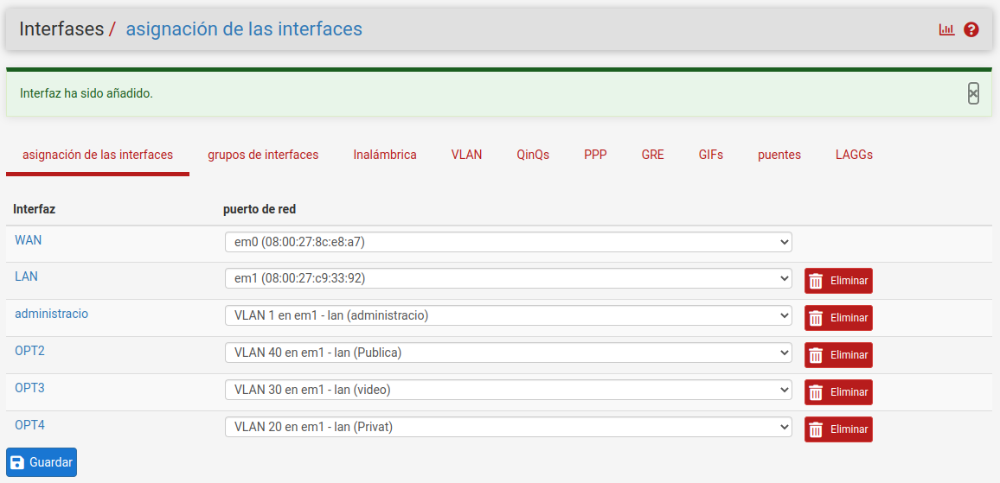

# pfSense

*Utilitzem [pfsense](https://docs.netgate.com/pfsense/en/latest) com a cor de la xarxa*

El projecte pfSense® és una distribució personalitzada gratuïta de codi obert de FreeBSD dissenyada per utilitzar-la com a tallafoc i encaminador, gestionada completament per una interfície web fàcil d'utilitzar, el programari pfSense inclou una llarga llista de funcions relacionades. El sistema de paquets pfSense permet una major expansió sense afegir vulnerabilitats de seguretat potencials a la distribució base.

## Per a què el farem servir

* *Tallafocs perimetrals*, pfSense admet xarxes que requereixen diverses connexions a Internet, diverses xarxes LAN i diverses xarxes DMZ. De moment soles configurarem una WAN, pero estarà preparat pel seu escalat si fera falta en un futur, donar més amplada de banda o redundància de connexió a internet. També per a un servidor web en la zona DMZ per als espectadors en la xarxa pública.

* *Encaminador LAN*, per connectar diversos segments de xarxa interna amb VLAN configurades amb troncal 802.1Q.

* *Dispositiu VPN*, com a dispositiu de xarxa privada virtual independent afegeix capacitats VPN sense interrompre la infraestructura del tallafoc existent i inclou diversos protocols VPN. Configurarem OpenVPN per als treballadors i convidats.
  
* *Dispositiu de servidor DHCP*, permet que un dispositiu com el programari pfSense® assigne dinàmicament adreces IP als clients des d'un grup d'adreces predefinits. DHCP també envia informació de configuració als clients, com ara una passarel·la, servidors DNS, nom de domini i altres paràmetres útils.

* *DNS resolver*, el gastarem com a DNS primari.

* Portal captiu, possibilitat de fer un *Hotspot* per a la wifi pública. Obliga els usuaris a autenticar-se abans de concedir accés a Internet. Quan siga possible, el tallafoc presenta automàticament una pàgina web d'inici de sessió en la qual l'usuari ha d'introduir credencials com ara un nom d'usuari/contrasenya, un codi de val o un simple acord de clic. També el podem configurar obert, que presente una fulla de presentació de la sala i encaminar després al servidor web amb informació de l'obra.
  
* *DDNS*, per a configuració del DNS dinàmic i la renovació de credencials.

## Requeriments

La distribució de pfSense® és compatible amb la majoria de maquinari compatible amb FreeBSD, són compatibles amb la màquina d'arquitectura de 64 bits (amd64, x86-64).

**Requisits mínims**

* CPU compatible amb amd64 (x86-64) de 64 bits

* 1 GB o més de RAM, El mateix sistema operatiu, juntament amb altres serveis, requerirà almenys 175-256 MB de RAM addicional i possiblement més segons les funcions utilitzades. Els tallafocs en entorns que requereixen un gran nombre d'estats simultanis han de tenir suficient RAM per a contenir la taula d'estats. Cada estat necessita aproximadament 1 KB de RAM. Cada connexió a través del tallafoc consumeix dos estats: un entrant al tallafoc i un altre que surt del tallafoc.

* Unitat de disc de 8 GB o més (SSD, HDD, etc.)

* Una o més targetes d'interfície de xarxa compatibles, [Broadcom 5720](https://www.freebsd.org/cgi/man.cgi?query=bge&sektion=4&format=html), amb driver bge.

::: {.rmdwarn data-latex="{Perill}"}
Problemes específics de la targeta Broadcom bce, fer el que recomana el [manual](https://docs.netgate.com/pfsense/en/latest/hardware/tune.html#broadcom-bge-4-cards), La del servidor recomanat és bge, no hauria de tindre problemes.
:::

* Opcional, Suport de l'accelerador criptogràfic. El servidor recomanat te [AES-NI](https://i.dell.com/sites/csdocuments/Shared-Content_data-Sheets_Documents/ja/jp/Dell-PowerEdge-R320Technical-Guide.pdf) pag. 17 del manual. Recomanat per a VPN siga més fluid, i no sature la CPU. No cal seleccionar res perquè OpenVPN utilitze AES-NI, natiu.

* Unitat USB d'arrencada o unitat òptica d'alta capacitat (DVD o BD) per a la instal·lació inicial

## Instal·lació

Mitjan un dispositiu [Netgate](https://www.netgate.com/pfsense-plus-software/how-to-buy#appliances) o viralitzant que és el que farem servir. Descarreguem la [imatge](https://www.pfsense.org/download/) AMD64 ISO
Estem en fase de proves, farem la instal·lacióó en Virtual Box.

Configuració de prova VBox

{width=50%}

::: {.rmdnote data-latex="{Nota}"}
Recomanem fer servir hypervisors de tipus 1 per a ús de producció.
Els hypervisors de tipus 2 com ara VirtualBox o VMware Workstation funcionen bé per a les proves, però eviteu fer servir-los per a funcions de producció sempre que siga possible.
:::

La forma d'instal·lació és com qualsevol VM, hem baixat la versió 2.6

En l'opció 2 definim les ip de les targetes, pfSense les detecta automàticament, pero les he canviat per les proves. En el meu cas de moment

* em0 és 192.168.122.59 amb un pont linux a la primera ethernet real del servidor (no exactament, és un pont a l’ethernet de proxmox que comunica a la ethernet del servidor real), per on entra internet, per a la WAN (DHCP de Proxmox per al vmbr0).
* La em1 interna LAN 192.168.56.10 per comunicar amb vmbr1 Open vswitch (switch intern virtual de les VM), la canviarem més avant, quan configurem las VLAN i el DHCP de pfsense per aquestes xarxes. Es recomana ser una 172.16.x.x si es vol fer VPN.
* La em2 la que comunicarem amb un pont linux vmbr2 amb la segona targeta real del servidor, que comunicara amb el switch físic de la sala.(l'he connectat a la targeta de xarxa del portàtil per fer les proves cap a fora)

::: {.rmdnote data-latex="{Nota}"}
Per configurar-lo, millor no donar d'altade moment la LAN (em1), o en el proper reinici, el pfSense tanca els ports WAN, i ja no podem comunicar-nos amb la GUI web per configurar, en VirtualBox no hi ha problema, la LAN la conectes al pont intern amb el host (vbnet0) i pots entrar a aquesta IP (192.168.56.40) per configurar, Pero en Proxmox no és tan evident, hauria d'estar la em2 en vmbr2 configurada, i connectaré al switch real i d'aci a la xarxa LAN, o crear una VM amb un ubuntu per exemple, connectat al vmbr1 i des d'aci configurar el pfSense.
:::

El que tenim en consola

```bash
VirtualBox Virtual Machine - Netgate Device ID: 8258d4ba8668f91ae9d7

*** Welcome to pfSense 2.6.0-RELEASE (amd64) on pfsense ***

 WAN (wan)       -> em0        -> v4: 192.168.122.59/24
 LAN (lan)       -> em1        -> v4: 192.168.56.10/24

 1) Logout (SSH only)                  9) pfTop
 2) Assign Interfaces                 10) Filter Logs
 3) Set interface(s) IP address       11) Restart webConfigurator
 4) Reset webConfigurator password    12) PHP shell + pfSense tools
 5) Reset to factory defaults         13) Update from console
 6) Reboot system                     14) Disable Secure Shell (sshd)
 7) Halt system                       15) Restore recent configuration
 8) Ping host                         16) Restart PHP-FPM
 9) Shell

Enter an option: 

```

Connectant via web, hem d'accedir des de la xarxa LAN, per defecte el tallafoc bloca la GUI des de la WAN.

{width=70%}

La resta de configuracions es pot fer mitjançant aquesta GUI.

## Configuració

Comencem la configuració del pfSense, es pot fer pel wizard o manualment, descriurem breument la manual.

### Informació general

En sistema -> configuració general, donarem nom al host i el domini, així com l'idioma de la GUI, NTP, DNS primari.

El nom del host sera pfsense, i el domini inestable.dedyn.io, ja que s'ha tret un conte en el DDNS de [deSEC](https://desec.io/) amb aquest nom.

{width=80%}

::: {.rmdinfo data-latex="{Nota}"}
El servidor DNS es poden deixar en blanc si el DNS Resolver està actiu mitjançant la configuració predeterminada. La configuració predeterminada té el DNS Resolver actiu en mode de resolució (no en mode de reenviament), quan s'estableix d'aquesta manera, el DNS Resolver no necessita reenviar servidors DNS, ja que es comunicarà directament amb els servidors DNS arrel i altres servidors DNS autoritzats. Per forçar el tallafoc a utilitzar aquests servidors DNS configurats, activeu el mode de reenviament al DNS Resolver. Més tard podem fer un ns2 rèplica i configurar aquesta opció dels dos servidors.
:::

### Configuració WAN

Aquesta és la xarxa externa que s'enfronta a l'ISP o a l'encaminador amunt, de manera que l'assistent ofereix opcions de configuració per admetre diversos tipus de connexió d'ISP comuns.

* Tipus WAN, El tipus seleccionat ha de coincidir amb el tipus de WAN requerit per l'ISP, l'opció predeterminada és DHCP a causa del fet que és el més comú, aquesta configuració permet que un tallafoc "Just Work" sense configuració addicional.

{width=80%}

::: {.rmdtip data-latex="{Nota}"}
Seleccionem en el tipus DHCP i que ens proporcione una ip l'encaminador, la podríem posar en estàtica i ens apareix un nou menu on li donaríem una ip en la mateixa xarxa que l'encaminador, una màscara i la direcció del gateway.
:::

#### Bloqueja les xarxes

* Privades RFC 1918, Bloqueja les connexions procedents de xarxes privades registrades d'entrar a la interfície WAN. (10.0.0.0/8, 172.16.0.0/12, 192.168.0.0/16)
Normalment, aquesta opció només és desitjable en interfícies de tipus WAN per evitar la possibilitat que arribe trànsit numerat de manera privada per una interfície pública.
* Bogon, el tallafoc bloqueja l'entrada de trànsit si prové d'espai IP reservat o no assignat que no s'hauria d'utilitzar. La llista de xarxes bogon s'actualitza periòdicament en segon pla i no requereix cap manteniment manual.
  
::: {.rmdtip data-latex="{Nota}"}
Aquesta opció, **Bogon**, només hi ha de fer ús en interfícies externes (WAN), no és necessària en interfícies locals i pot bloquejar el trànsit local necessari.
:::
  
Seleccionem els dos bloquejos.

{width=80%}

#### Passerella

La definim per a WAN, no per a les LAN o tracta aquestes com si foren WAN en l'àmbit de tallafoc.
Ho definim en Sistema -> routes
Li donem la direcció del gateway del encaminador, eixida a internet.

{width=80%}

### Configuració LAN

Tenim dues opcions

* Si aquest tallafoc no es connecta a cap altra xarxa mitjançant VPN, és possible que la 192.168.1.0/24 xarxes predeterminada siga acceptable.
* Si aquesta xarxa s'ha de connectar a una altra xarxa, mitjançant VPN des d'ubicacions remotes, triarem un rang d'adreces IP privades molt més fosc que el predeterminat comú de 192.168.1.0/24. L'espai IP dins del 172.16.0.0/12 blocs d'adreces privades RFC 1918 és generalment el que s'utilitza amb menys freqüència, així que trieu alguna cosa 172.16.x.x per 172.31.x.x evitar les dificultats de connectivitat VPN.
  
::: {.rmdwarn data-latex="{Nota}"}
Si habilitem interfaz ens tancara l'entrada per la xarxa 192.168.122.0, Compte an aço.

Si un client remot es troba en un punt d'accés sense fil fent servir 192.168.1.x (molt comú), el client no es podrà comunicar a través de la VPN. En aquest cas, 192.168.1.x és la xarxa local del client al punt d'accés, no la xarxa remota a través de la VPN.
:::

{width=80%}

::: {.rmdnote data-latex="{Nota}"}
De moment ho deixarem en la 192.168.56.x per acabar la integració de tots els serveis, i ho modificarem en implementar la VPN.

Si seleccionem una passarel·la, el tallafoc s'encarregarà de tractar aquesta interfície com una interfície de tipus WAN per a NAT i funcions relacionades. Això no és desitjable per a interfícies internes com ara LAN. Les passarel·les encara es poden utilitzar en aquestes interfícies per a rutes estàtiques i altres finalitats sense seleccionar una passarel·la aquí a la pàgina d'interfícies.
:::

### Configuració de les VLAN

Creem 4 VLAN sobre la targeta de la LAN em1 per tindre separats els serveis en diferents xarxes.

* Control, per l'administració VLAN 1 xarxa 172.16.0.0
  És per la que tindrem accés ssh a les VM, el tràfic administratiu, com LDAP i la compartició d'emmagatzemament de les VM.
* Privat, per al personal de l'empresa VLAN 20 xarxes 172.16.20.0
 Accés a serveis web de Nextcloud, Zoneminder.
* Video, per a les video ip VLAN 30 xarxa 172.16.30.0
  Xarxa sense internet per a la transmissió de video.
* Pública, per al públic VLAN 40 xarxa 172.16.40.0
  Sol accés a internet i servidor web dedicat per informació.
  
Anem a interfases -> VLAN i afegim una nova.

1. Les farem en la interfaz LAN, la em1.  
2. Etiqueta VLAN els numere de la VLAN 1,20,30,40
3. Descripció li posarem el nom de la xarxa.
4. Guardem

{width=80%}

Després d'afegir-les, ens quedaria

{width=80%}

Després les hem d'assignar, les assigna a noves Ethernet's que ha creat internes en pfSense

{width=80%}

Igual que hem fet amb la interface LAN, configurem les interfaces de les VLAN que hem creat, donant una xarxa per a cada una.

Per exemple, la de privat li donem la xarxa 172.16.20.0/24 amb ip estàtica 254

1. L'habilitem
2. Donem nom
3. Elegim IP estàtica
4. Li donem una IP i màscara de xarxa
5. Guardem

{width=80%}

IP de les xarxes

* Xarxa Control 172.16.0.0/24
* Xarxa Privat 172.16.20.0/24
* Xarxa video 172.16.30.0/24
* Xarxa Pública 172.16.40.0/24

```{r pfsense1, echo = FALSE, fig.cap="(ref:sheets-option-drag)"}
if(knitr::is_html_output(excludes="markdown")) knitr::include_graphics("imatges/proxmox/VLAN1.gif")
```

#### Servidor DHCP per a les VLAN

En últim lloc, habilitarem el servidor DHCP per aquesta VLAN

En serveis -> DHCP elegim la VLAN que volem configurar.
En la VLAN privada li donem l'assignació des de la 50 a la 200. Reservant les primeres 60 per a futurs serveis

1. habilitem el servei
2. Elegim el rang de direccions que volem assignar.

{width=80%}

3. Es pot configurar els DNS, el Domini, servidor LDAP
  En servidors DNS li diguem que el primer és el de la nostra xarxa local, en aquest cas 172.16.20.254, donem també un d'OpenDNS 208.67.220.220 i el de Google 8.8.8.8, si no es posa res, te els de la WAN per defecte, es per si volem posar un específic per aquesta xarxa.
  
::: {.rmdinfo .centre data-latex="{Pendent}"}es pot habilitar el servidor Bind i configurar servidor DNS per zones, a cada zona li assignem soles les resolucions que necessite.
:::

::: {.rmdcuidao data-latex="{Denegar DNS privat}"}
Per a la xarxa pública, no li donarem accés al nostre DNS, soles als de fora.
Més avant la idea és donar soles el registre del servidor web d'informació d'obres
:::

4. Baix de tot, és on configurarem les direccions estàtiques per als serveis en cada VLAN

{width=80%}

{width=80%}

## Configuració DNS

Configurem el DNS de pfSense

De moment farem una configuració bàsica, pero més avant la idea és instal·lar el connector de Bind i fer-ho més professional.

En Serveis -> DNS resolver

En la configuració general, per defecte, el manual diu que ho fem per a tots les interfaces de xarxa. No és el nostre cas. Voldríem unes per a la xarxa d'administració. Soles les càmeres i el servei Zoneminder per a la de video. La privada el servei nextcloud, zoneminder i si afegim algun mes. I per a la pública, que no consulte el nostre DNS o si s'afegeix un servidor web, soles a aquest. Pero de moment en les proves posem que ho puguen consultar totes, ja es refinara és avant.

{width=80%}

Després d'afegir alguns registres quedaria d'aquesta forma

{width=80%}

Per configurar un registre li donem a afegir i omplim la configuració que ens demana

1. Nom, soles el nom, sense el Domini
3. La IP
4. Descripcion
5. Baix de tot li podem afegir àlies, per exemple ns1

{width=80%}

::: {.rmdcuidao data-latex="{Soles per les proves}"}
La configuració és provisional per a les proves, En un futur es posaran les IP de les VLAN on s'ofereix el servei cada màquina.
:::

## Firewall

[Documentacio](https://calvin.me/block-traffic-vlan-pfsense)

Fem les ragles de firewall per a les VLAN

* La VLAN 1 tindrà accés a ella mateixa, ja que totes le màquines que volem administrar tenen una interface en aquesta xarxa.

* La Vlan 20 Li donarem acces a internat i als ports web 80 i 443 ( al STUN si configurem més avant per a les comunicacion de Talk Nextcloud)

* La VLAN 30 Soles a ella mateixa, blocant internet.

* La VLAN 40 Soles a internet i port web d'ella si posem el servidor web promocional.

Primer que res, hem de bloquejar l'accés a la web de pfSense per a les VLAN 20 30 40, per fer aço fem un alies en firewall que tinga totes les pasareles de la diferent VLAN inclosa la LAN si és que no està desactivada. Tipus host, seleccionem les IP del pfSense en totes les xarxes.

Firewall -> alies

{width=80%}

També creem un alies per a les xarxes internes RFC 1918 les *192.168.0.0/16, 10.0.0.0/8, 172.16.0.0/12* de la mateixa forma pero ara en comptes de host el tipus ha de ser xarxes.
Bloquejar l'accés a xarxes privades només permetria l'accés a Internet.

{width=80%}

Quedaria

{width=80%}

Anem a regles de firewall flotant i creem una regla per impedir que determinades VLAN 20 30 40 accedisquen a la GUI de pfsense.

* Accio blocar
* Interfaz les xarxes que volem blocar: privat, pública i video
* Direcció entrada
* Protocol TCP
* Font Qualsevol
* Destí, hem d'elegir unico host o alias per poder triar el alias que acaben de definir *pfSenseGUIAcces*
* Rango, el rang de ports a blocar, el 443 (hem de tindre configurat el pfSense perquè soles done la GUI en el port https, o elegir el port que estem fent servir, si l'averem canviat)
* Descripció

{width=80%}

### VLAN 1

Una VLAN administrativa amb accés a qualsevol persona i qualsevol cosa que vulga. Només cal que creeu una regla on qualsevol cosa d'aquesta xarxa puga accedir a tota la resta.

Afegim una regla en la VLAN administració on qualsevol cosa d'aquesta xarxa puga accedir a tota la resta.

1. Li donem pas
2. La interfaz administració
3. Font Administració net
4. Destí qualsevol

{width=80%}

Quedaria

{width=80%}

### VLAN 20

Acces a internet i la mateixa xarxa, on estan els serveis Web Nextcloud, Zoneminder i entre ells per comunicació directa per exemple el xat.

1. Cap amfitrió d'aquesta xarxa NO POT accedir a la xarxa d'administració (redundant però més segur d'aquesta manera).

{width=80%}

2. La xarxa es pot comunicar amb ella mateixa.

{width=80%}

3. Qualsevol host de la xarxa de convidats POT accedir a la passarel·la

{width=80%}

4. Qualsevol host de la xarxa de convidats  pot accedir a qualsevol cosa.

{width=80%}

Quedaria

{width=80%}

### VLAN 30 soles interna, no internet

Els amfitrions d'aquesta xarxa poden interactuar entre ells, però res més.

Afegim les següents regles

1. Cap amfitrió d'aquesta xarxa NO POT accedir a la xarxa d'administració

{width=80%}

2. La xarxa es pot comunicar amb ella mateixa.

{width=80%}

3. Aquesta xarxa no es pot comunicar amb res.

{width=80%}

Quedaria

{width=80%}

### VLAN 40 Soles internet

Els usuaris d'aquesta VLAN poden accedir a Internet i res més.

Afegim les següents regles

1. Cap amfitrió de la xarxa de convidats NO POT accedir a la xarxa d'administració

{width=80%}

2. Qualsevol host de la xarxa de convidats POT accedir a la passarel·la (això és el que proporciona accés a Internet).

{width=80%}

3. Cap amfitrió de la xarxa de convidats NO POT accedir a cap adreça privada. (això bloqueja tot l'accés a qualsevol cosa a la xarxa d'àrea local). El alies que vam crear private networks com a destí.

{width=80%}

4. Qualsevol host de la xarxa de convidats pot accedir a qualsevol cosa. (aquesta darrera regla permet l'accés a Internet)

{width=80%}

Quedaria

{width=80%}

### LAN

En principi estaria deshabilitada, pero encara no he arribat a plantejar-me aquest problema, si cau pfSense, connectaríem amb la LAN a Proxmox i des d'aci arreglariem el problema, segurament pel i-DRAC pero no he mirat res d'aço de moment.

## DNS dinàmic

Configurem un DNS dinàmic per poder connectar en el servidor des de l'exterior per VPN, traguem un conte en un DDNS per exemple en [deSEC](https://desec.io/) i amb el password que ens dona i el token configurem el servei.

Si ens loguem podem configurar els registres DNS del nostre domini. inestable.dedyn.io

{width=80%}

Dins del nostre domini, podem afegir subdominis o noms de màquines de serveis que després farem servir per a donar d'alta els certificats [letsencrypt](https://letsencrypt.org/)

Afegim CNAME de servei nextcloud que apunte a la nostra IP pública.

{width=50%}

Registrem el nom dels serveis que ens facen falta, d'exemple tenim el

* TALK de Nextcloud per si el volem posar per un nom de DNS diferent per habilitar el protocol STUN per millorar les comunicacions de video.
* [Collabora](https://www.collaboraoffice.com/) per a Nextcloud, que és la versió web del libreoffice. La podem tindre per Docker en la màquina de Nextcloud o crear una VM per a ella, si la càrrega de treball és alta i no volem afectar el rendiment de Nextcloud. (no crec que siga el cas pel número de treballadors, pero ho deixem preparat)
* Nextcloud, clar
* Zoneminder, el servei de video.
* La resta de serveis són interns a la xara VLAN 1 d'administració, i en un certificat auto firmat aquestasta be. Tampoc volem donar pistes dels serveis que tenim. (sense contar en esta guia, clar)
  
{width=80%}

Fent un ping al domini, ens porta

```bash
enkidu@enkidu:~$ ping inestable.dedyn.io
PING inestable.dedyn.io (193.111.55.165) 56(84) bytes of data.
64 bytes from 193.111.55.165 (193.111.55.165): icmp_seq=1 ttl=62 time=10.5 ms
64 bytes from 193.111.55.165 (193.111.55.165): icmp_seq=2 ttl=62 time=53.8 ms

enkidu@enkidu:~$ ping nextcloud.inestable.dedyn.io
PING inestable.dedyn.io (193.111.55.165) 56(84) bytes of data.
64 bytes from 193.111.55.165 (193.111.55.165): icmp_seq=1 ttl=62 time=6.77 ms

enkidu@enkidu:~$ dig inestable.dedyn.io

; <<>> DiG 9.16.15-Ubuntu <<>> inestable.dedyn.io
;; global options: +cmd
;; Got answer:
;; ->>HEADER<<- opcode: QUERY, status: NOERROR, id: 23673
;; flags: qr rd ra; QUERY: 1, ANSWER: 1, AUTHORITY: 0, ADDITIONAL: 1

;; OPT PSEUDOSECTION:
; EDNS: version: 0, flags:; udp: 65494
;; QUESTION SECTION:
;inestable.dedyn.io.  IN A

;; ANSWER SECTION:
inestable.dedyn.io. 60 IN A 193.111.55.165

;; Query time: 135 msec
;; SERVER: 127.0.0.53#53(127.0.0.53)
;; WHEN: dl. de juny 06 18:52:32 CEST 2022
;; MSG SIZE  rcvd: 63

enkidu@enkidu:~$ dig @8.8.8.8 nextcloud.inestable.dedyn.io

; <<>> DiG 9.16.15-Ubuntu <<>> @8.8.8.8 nextcloud.inestable.dedyn.io
; (1 server found)
;; global options: +cmd
;; Got answer:
;; ->>HEADER<<- opcode: QUERY, status: NOERROR, id: 49066
;; flags: qr rd ra ad; QUERY: 1, ANSWER: 2, AUTHORITY: 0, ADDITIONAL: 1

;; OPT PSEUDOSECTION:
; EDNS: version: 0, flags:; udp: 512
;; QUESTION SECTION:
;nextcloud.inestable.dedyn.io. IN A

;; ANSWER SECTION:
nextcloud.inestable.dedyn.io. 3600 IN CNAME inestable.dedyn.io.
inestable.dedyn.io. 60 IN A 193.111.55.165

;; Query time: 179 msec
;; SERVER: 8.8.8.8#53(8.8.8.8)
;; WHEN: dl. de juny 06 19:20:19 CEST 2022
;; MSG SIZE  rcvd: 87
```

::: {.rmdinfo data-latex="{}"}
La IP 193.111.55.165 se la publica de casa, no puc provar fent un port forwarding apuntant a la màquina nestcloud, perquè és una connexio per antena, router apunta a una 10.1.X.X, no tinc accés a configurar la IP pública.

:::

### Renovacions del servei

PfSense s'encarregara de la renovació periòdica del servei, en sevicies -> DNS dinàmic, afegim uno nou en ADD i omplim la plantilla que ens mostra a continuació.

* En tipo de servei, el DDNS que ens dona el servei *deSEC*
* La interfaz, la WAN, que és la que està en contacte en la xarxa rel router.
* Nom de la host, el nom del nostre domini *inestable.dedyn.io*
* Contrasenya li posem el token que ens ha proporcionat el DDNS.
  
{width=80%}

## vpn

[openVPN config pfSense](https://support.openvpn.com/hc/en-us/articles/4408498995483-Access-Server-pfsense-Configuration)

Les VPN d'accés remot permeten als usuaris connectar-se de manera segura a una xarxa des de qualsevol lloc on hi haja una connexió a Internet disponible. Per oferir als empleats la possibilitat de treballar des de casa. Amb la proliferació de telèfons intel·ligents, els usuaris tenen la necessitat d'accedir de manera segura als serveis interns des dels seus telèfons mitjançant una VPN d'accés remot.

Les VPN d'accés remot es poden configurar de manera que passe tot el trànsit del sistema client a través de la VPN, té un impacte en el rendiment, la farem soles per accedir als serveis de l'empresa.

### Autenticació

Possibilitats

* IPsec
* OpenVPN
* WireGuard (No recomanable)

L'ús d'OpenVPN amb certificats, autenticació TLS i autenticació d'usuari és el mètode més segur i més senzill d'implementar. El xifratge es veu compromés si es comprometen les claus privades de l'estructura PKI, tot i que l'ús de múltiples factors com l'autenticació TLS a la part superior de la PKI pot mitigar part del perill.

OpenVPN requereix l'ús de certificats per a l'accés remot a la majoria d'entorns, que inclou la seua pròpia corba d'aprenentatge i pot ser una mica difícil de gestionar. Hi ha un assistent per gestionar les configuracions d'accés remot d'OpenVPN més habituals i els paquets d'exportació de clients d'OpenVPN faciliten el procés de posar en funcionament els clients.

OpenVPN té [clients](https://openvpn.net/vpn-client/) disponibles per a Windows, Mac OS X, tots els BSD, Linux, Solaris i Windows Mobile, [Android](https://play.google.com/store/apps/details?id=de.blinkt.openvpn), [iOS](https://apps.apple.com/us/app/openvpn-connect/id590379981), però el client no ve preinstal·lat en cap d'aquests sistemes operatius.

En funció del desplegament. Els clients mòbils (Accés remot), poden rebre una configuració automàtica en determinats casos. Poden rebre automàticament una adreça IP (recomanat 172...) assignada des d'un grup, i es poden enviar nombroses opcions addicionals per controlar el seu comportament des del costat del servidor (encaminament, DNS i molts altres).

### Firewall

OpenVPN és molt compatible amb el tallafoc. Com que utilitza un únic port UDP o TCP i no es veu afectat per les funcions NAT habituals. OpenVPN admet NAT entrant (per exemple, reenviaments de ports) i sortint mitjançant la pestanya OpenVPN del grup i també a les interfícies assignades. L'única dificultat possible és si el protocol i el port en ús estan bloquejats. Quan s'assignen com a interfície, les instàncies d'OpenVPN admeten completament les regles per túnel.

#### Regles

L'assistent VPN d'accés remot d'OpenVPN ofereix, crear regles per passar el trànsit i el trànsit WAN a la interfície d'OpenVPN.
El trànsit encapsulat dins d'una connexió OpenVPN activa es controla mitjançant regles definides per l'usuari a la pestanya OpenVPN a Firewall > Regles.

### Configuració òptima de xifratge

* Feu servir maquinari compatible amb AES-NI.
* A la configuració de la Fase 1 (IKE), utilitzeu:
  * AES128-GCM amb longitud de clau de 128 bits per a l'algorisme
  * AES-XCBC per al hash, que en aquest cas és efectivament una funció pseudoaleatòria (PRF). Això donarà el màxim rendiment en combinació amb AES128-GCM en maquinari que pot accelerar tots dos (per exemple, AES-NI)
* A la configuració de la Fase 2 (SA infantil), utilitzeu:
  * AES128-GCM amb longitud de clau de 128 bits per a l'algorisme
  * No seleccioneu cap algoritme hash. Un algorisme hash no és necessari per a AES-GCM, ja que ja inclou l'autenticació.

### UDP

UDP té menys despeses generals per a les dades tunelades i, si un client ha de retransmetre, no augmentarà el problema retransmetent tant dins com fora del túnel.

### Utilitzeu TLS només per a l'autenticació

OpenVPN pot utilitzar TLS tant per a l'autenticació com per al xifratge del canal de control. Realitzar el xifratge del canal de control afegeix més sobrecàrrega, que pot augmentar amb molts clients. Si no cal el xifratge del canal de control, considereu fer ús TLS només per a l'autenticació. Independentment de quina opció escolliu, el trànsit transportat per OpenVPN està xifrat.

### Utilitzeu la negociació de xifratge de dades

La negociació de xifratge de dades es pot usar per a establir preferències de manera que els clients puguen preferir xifrats més eficients quan siga possible, però es poden fer úsr altres quan siga necessari. Estableix primer seleccions d'alta prioritat com ara AES-128-GCM, seguides d'altres com AES-128-CBC.

### Túnels dividits

El túnel dividit només envia trànsit per a subxarxes específiques a través de la VPN en lloc d'enviar tot el trànsit. Amb OpenVPN, això es pot fer desmarcant les opcions de redirecció de la passarel·la IPv4/IPv6 i configurant les entrades de xarxes locals IPv4/IPv6. Tanmateix, els clients encara poden anul·lar aquest comportament de forma remota, així que comproveu també les configuracions del client.

### Desactiva la compressió

 La majoria de les dades trameses a través de VPN en entorns moderns ja estan xifrades o no es poden comprimir, cosa que malgasta la CPU quan s'intenta comprimir. A més, vulnerabilitats com VORACLE poden permetre als atacants obtenir informació sobre dades xifrades quan s'han comprimit.

### Connexions duplicades

 Normalment, si un client OpenVPN es connecta utilitzant el mateix nom d'usuari o certificat CN, la connexió anterior es trenca a favor de la nova connexió. Això és més segur, però no permet que cap usuari es connecte diverses vegades. És el cas que tenim, pot estar connectat via web i via app movil.

### Augmenta la memòria intermèdia d'enviament/recepció

La mida de memòria intermèdia predeterminada és segura, però no òptima. Augmentar la mida de la memòria intermèdia fins a 512 KiB a ambdós costats pot augmentar el rendiment.

### OpenVPN i certificats

La millor pràctica és emprar certificats per a l'accés remot i les VPN de lloc a lloc perquè permet revocar l'accés per a clients o llocs individuals. Idealment, els certificats haurien de ser únics per dispositiu o almenys per usuari.
Si un client amb un certificat individual està compromés o l'accés s'ha de revocar per qualsevol altre motiu, simplement revoqueu aquest certificat. No hi ha cap altre client afectat.

La GUI del programari pfSense inclou una interfície de gestió de certificats totalment integrada amb OpenVPN. Les autoritats de certificació (CA) i els certificats de servidor es gestionen al Gestor de certificats a la interfície web, que es troba a Sistema > Gestor de certificats. Els certificats d'usuari també es gestionen a la interfície web, com a part del gestor d'usuaris integrat que es troba a Sistema > Gestor d'usuaris. Els certificats es poden generar per a qualsevol compte d'usuari creat localment al tallafoc, excepte el compte d'administrador predeterminat.

* Peer to Peer (SSL/TLS)
* Peer to Peer (clau compartida)
* Accés remot (SSL/TLS)
* Accés remot (autenticació d'usuari)
* Accés remot (SSL/TLS + autenticació d'usuari)

Utilitzarem *Accés remot (SSL/TLS + autenticació d'usuari)*

Aquesta és l'opció més segura disponible. No només obté els avantatges d'altres opcions SSL/TLS, sinó que també requereix un nom d'usuari i una contrasenya del client quan es connecta. L'accés del client es pot eliminar no només revocant el certificat, sinó també canviant la contrasenya. A més, si no es descobreix immediatament una clau compromesa, el perill es redueix perquè és poc probable que l'atacant tinga les claus i la contrasenya.

### Mode de dispositiu

OpenVPN es pot executar en un dels dos modes de dispositiu:

* tun:
Funciona a la capa 3 OSI i realitza l'encaminament en interfícies punt a punt.

* Toc:
  Pot funcionar a la capa 2 OSI i pot dur a terme tant l'encaminament com el pont si és necessari.
  
Els clients com els que es troben a Android i iOS només admeten el mode *tun* a les aplicacions que la majoria de la gent pot utilitzar. Farem servir aquest mode.

### Configuració

[oepenvpn pfsense](https://www.redeszone.net/tutoriales/vpn/pfsense-configuracion-servidor-openvpn/)

[Configure the OpenVPN Server in pfSense with the Best Security](https://itigic.com/configure-openvpn-server-in-pfsense-with-the-best-security/)

Primer que res instal·larem el paquet que genera automaticament les configuracions per als clients. En sistema grent d'empaquetacio instal·lem openvpn-client-export

{width=80%}

Després hem de crear els certificats digitals en el propi pfSense, s'ha de crear una autoritat certificadora CA que firmara els certificats. Hem de crear un certificat per al servidor OpenVPN de tipus servidor, i els certificats VPN dels clients.

En sistema -> gerent de certificats des d'aci tambe podem revocar certificats si un usuari el perd.

#### CA interna

Creem la CA li donem a ADD

1. Nom descriptiu OpneVPN_usuaris
2. Elaboracio CA interna
3. Tipus de clau ECDSA
4. Algoritme resum sha512
5. vida util 3650 10 anys
6. Nom cumu, un nom per a identificarlo openvpn-usuaris-CA

Quedaria

{width=80%}

Apareixeria en ñe CAs del sistema

{width=80%}

Des d'aci, podem veure si està en ús i quants certificats té actius.

#### Certificat per al servidor de VPN

Ara crearen el certificat per al servidor OpenVPN intengrat en pfSense. Anem a la seccio certificats i li donem a ADD molt paregut a l'anterior.

1. Elaboracio certificat interior
2. Autoritat, el certificat creat per a OpenVPN d'abans
3. Clau ECDSA
4. Algoritme sha512
5. Vida util 3650 10 anys
6. Nom cumu, un nom per a identificarlo openVPN-servidor


En atributs del certificat, li hem de dir que és per a servidor, el reste ho podem deixar en blanc.


Aquest és el certificat que li hem de donar en configurar el servidor VPN

Certificats dels clients

El mateix proces que hem fet amb el servidor pero ara elegirem en comptes de servidor , client.

{width=80%}

Ara podem veure que apareix en la llisra dels certificats.

{width=80%}

Si els editem, els podem exportar amb un password que cifraria el certificat amb ell.

{width=80%}

### Configuracio del servidor

En el menu de pfSense anem a la pestany VPN -> OpneVPN -> servodoes -> ADD

Hi ha un wizards (asistent) per poder-lo configurar, pero ho farem pas a pas.

Eligirem les opcions

1. Descriptcio, podem tindre varis, i de fet farem un altre per administracio externa
2. Mode servidor Acceso remot (SSL /TLS + Aut. de usuario)
3. backend LDAP Turnkey (és el servidor LDAP que tenim instal·lat, tambe es va provar zentyal que és un servidor Active Directori i en ell se'n va instal·lar un FreeRadius)
4. Protocol UDP
5. Mode tipe Tun, que és la que admeten dispositius Android
6. Interface WAN és per la que entrara
7. Local port 1194 per defecte, es recomana que el canviem.

{width=80%}

Configuerm la part criptografica

1. Habilitem la clau TLS per poder fer uns de tls-crypt i generar automaticament la clau
2. Autoritat de certificacio, la CA que hem creat per a aquest servidor OpenVPN_usuaris
3. peer certificate revocation, si hem creat una llista d'usuaris que no tinguen acces, l'eligiriem aci, es crea en la seccio system
4. server certificate, el certificat de servidor per aquest servei OpneVPNServidor
5. DH parametr length ECDH only
6. Curva ECDH secp521r1
7. Data Encryption Algorithms Data AES-256-GCM, AES-128-GCM i CHACHA20-POLY1305
8. Algoritme Fallback per si el client no és compatible, el que ve per defecte AES-256-CBC
9. Auth Digest Algorithm SHA256
10. Certificado de Profundidad No admet certificats fets per CA intermedi.

{width=80%}

Configurem la part del tunell

1. Xarxa per als clients, ha de ser una xarxa lliure, que encara no hem utilitzat per defecte 10.8.0.0/24
2. Pasarela IPv4 de Redirección, si habilitem aquesta opcio, el client tindra acces a totes les xarxes internes, ho farem per al sevidor OpneVPN d'administracio. En el dels clients li direm baix a la xarxa que te acces, la privat VLAN 20, o definir després regle firewall per aquesta connexio i llimitar soles a la VLAN 20 172.16.20.0/24.
3. IPv4 red (s) local la VLAN 20 172.16.20.0/24
4. Conexiones concurrentes el número de conexions simultanies 15
5. Compresio, no, és un risc de seguretat, explicat mes a dalt.
6. compresio, no
7. Inter-client communication, comunicacio entre clients, si
8. Duplicate Connection, és perquè client es puga connectar en diversos dispositius amb un sol compte, portatil, movil . Es recomana que no ho posem i creem un certificat per a cada dispositiu, de moment l'activem

{width=80%}

Configurem la part del client

1. IP dinamica
2. Topologia subred

Configuracio ping, és per veure si un client continua conectat, ho deixem com esta.
Habilitem el nom de domini predeterminat
Li donem el DNS local de la xarxa, el mateix pfSense, i el de Google 8.8.8.8

{width=80%}

Configuracion avanzada

Tipus de pasarela IPv4

{width=80%}

En guardar per primera vegada es genera la clau TLS en configuracio de cifrat, ara tindriem que tornar i baix canviar el modo de uso de clave a cifrado y autentificacion.

{width=80%}

I ja el tindriem configurat.

{width=80%}

Soles quedaria configurar el firewall de connecxions entrants per deixar que accedeixquen per la WAN

En firewall -> WAN afegim una nova regla

1. que deixe pasar
2. interfaz WAN
3. Familia IPv4
4. protocol UDP
5. Font cualquiera
6. Destination WAN en el port que tenim servitn aquest servidor OpenVpn 1194

{width=80%}

{width=80%}

Quedaria definir les regles de firewall de la nova interface openVpn que acaba de crear-se

Com en el cas de les VLAN anem a interfase -> assignar interfases i l'afegim

{width=80%}

Li donem nom i l'habilitem com sempre

{width=80%}

I li donem les regles de firewall

1. Acces a la xarxa VLAN 20 privat

{width=80%}

2. Bloquetjar la d'administracio

{width=80%}

3. Permet entre elles

{width=80%}

4. De la xarxa vpn a la passarella

{width=80%}

Quedaria 

{width=80%}

Faltaria provar si funciona bé, en casa no puc fer-ho per la meua connexio a internet. No s'ha posat la regla de la net a qualsevol cosa, crec que en aço no li donem acces a internet per la VPN, pero no estic segur.

::: {.rmdnote data-latex="{Nota}"}
Ara tindriem que fer el mateix per un altre servidor OpenVpn per a les tasques d'administracio amb acces a totes les xarxes
:::

### Servidors d'autentificacio

Aprofitarem aquesta secio per a definir els servidors d'autenticacio. Hauria de tindre un capitol per ell mateix, pero de moment no he arribat a plantejar-me l'organigrama de l'organitzacio. És un problema que abordare quan ja estiga tot configurat i funcionant. De moment he creat un usuari per probar que funciona.

La idea és tindre com a minim 4 o 5 grups

- Administracio (administrador i colaborador administratiu per donar d'alta i baixes usuàries solament)
- Nextcloud (tots els usuaris)
- video (sol usuariper accedir a Zoneminder)
- VPN, en principi tots els de Nextcloud tindran acces a VPN.
- Convidats temporals.


Ara tenim dues opcions, utilitzar [Zentyal](https://zentyal.com/) que és una versio lliure 100% Active Directori i instalar un servidor Radius, el porta ja com a plugin, perquè comprove els usuaris, o utilitzar [OpenLDAP](https://www.turnkeylinux.org/openldap), he utilitzat la versio que hi ha en [Turnkey](https://www.turnkeylinux.org/) per agilitzar les proves.


#### Configuracio OpenLDAP

Instal·lariem la VM com la resta, i la poseriem en la VLAN 1 sol.
En la demostracio està en la LAN, simplement seia posar-la en la VLAN 1 després. No afecta la prova.

{width=50%}

Creem l'usuari de prova per PhpLDAPAdmin
Farem una configuracio simple d'un usuari per phpLDAPadmin, en el grup usuari, ja en proces de produccio farem els grups, és soles per provar que ens autentica pfSense

{width=70%}

El seguent pas seria anar a pfSense i en sistema -> gestio d'usuaris -servidors d'autenticacio afegir el servidor LDAP i perquè el volem fer servir, en el nostre cas, per autenticar els usuaris d'OpenVPN que acabem de crear.

1. Nom, LDAP turnkey 
2. Tipus LDAP
3. IP, li posariem el nom DNS LDAP.inestable.dedyn.io o la IP
4. El port si l'hem canviat, per defecte el 389
5. Transport, s'hauria d'usar SSL/tsl, pero tindriem que crear el certificat per al servidor ... Ho deixem per mes avant, posem TCP standart, que no va encriptada, com anira per una VLAN sola d'administracio, no seria un  problema crític, pero millor encriptar.
6. Peer autoritat certificacio, aci li posarem perquè el volem, per autenticar els usuaris d'OpenVPN OpenVPN_usuaris que el que vam crear.
7. Base DN dc=inestable,dc=dedyn,dc=io
8. Contenedors d'autenticació ou=Users,dc=inestable,dc=dedyn,dc=io
9. Enllaç anònim com el tenim habilitat, ho marquen i no hem de posar l’admin ni el seu password perquè realitce les cerques, no és recomanable.
10. Atribut de nom d'usuari he posat uid, pero podria ser CN 
11. La resta és per refinar més la recerca LDAP, es mirara ms avant. Pendent

{width=80%}

Comprovarem que funciona, anem a diagnòstic -> autenticacio i en el servidor que acabem de configurar posem el uid del usuari i el password per veure que funciona.

{width=80%}

#### Configuracio Zentyal

Es comporta com un Active Directori, la veritat és que en la versio gratuita, la GUI té apartats llimitats, en principi ens és indiferent configurar la xarxa com una AD Windows, soles la volem per autenticar usuaris per als serveis, la resta com samba, correu ... No els implementarem.

L'entorn de configuracio és més amigable que el PHPLDAPAdmin, és una opcio a tindre en compte, si deixem l'administracio d'usuaris a una tercera persona, Tambe utilitza més recursos de la màquina server.

Creem un usuari en zentyal. En users and computers -> users li donem al +


[Setup Radius For Authentication With A pfSense VPN Server](https://julianscorner.com/windows/ad/radius_vpn)

Farem el mateix, configurarem un usuari basic per provar que l'autentica.

{width=80%}

Comprovem que està afegit

{width=80%}

En gestio de Software l’hem d'installar, el paquet RADIUS, des d’aci és on podem instal·lar més serveis con DHCP, FTP, correu ... i ho configurariem des del GUI, Es el que fa interesant aquesta opcio.

Una vegada ja instal·lat anem a RADIUS i el configurem

1. elegiriem a quin grup es que volem que s’autentique, en el nostre cas soles tenim un grup usuaris, o podem elegir a tot el món. (seria posar en un futur un grup VPN)
2. Configurem el client RADIUS li donem un nom, en el nostre cas volem que siga pfSense
3. La IP del client 192.168.56.254 en un futur, seria la de la xarxa VLAN 1 172.16.0.254
4. I definim una clau compartida que l'hem d’introduir després en el pfSense.

{width=80%}

Pasariem a pfSense

Afegiriem un altre servidor d'autenticacio

1. Nom Radius
2. Tipus Radio
3. Protocol ms-chapv2
4. Nom o ip, el del servidor Zentyal 192.168.56.14, en un futur la de VLAN 1
5. secret compartit, la clau que hem definit abans en el servidor RADIUS 
6. L'últim és per on escoltara les peticions, per la WAN que és per on entra OpenVN, pero podrien definir-loper a una altra xarxa per si volem utilitzar usuari i password per exemple per conectar per wifi a les VLAN mode enterprise, per a aquest fi, pfsense porta tambe per instal·lar el paquet freeRadio on es pot configurar un altre servidor Radio que conecte en LDAP i valide els accesos a les VLAN.... 

[Configureu el servidor FreeRADIUS a pfSense i utilitzeu WPA2 / WPA3 Enterprise](https://codepre.com/en/configure-freeradius-server-in-pfsense-and-use-wpa2-wpa3-enterprise.html)

{width=80%}

Comprovem que podem autènticar amb aques metode

{width=80%}

Resum metodes d’autenticacio, es podria posar tambe per a Zential tipus LDAP

{width=80%}

### Exportar els arxius de configuracio VPN dels clients

Si vam instal.lar el mòdul OpenVPN-export anem a VPM -> OpenVPN -> Client Export
Per Exportar directament en un paquet instal·lable la configuracio per als clients, aquest sol han d'executar-lo i queda tot configurat. Hi ha per a Windows, Mac, Android, IOS... El baixem i l'enviem al client.

1. Remote acces servidor, el que tenim configurat, el dels usuaris
2. Resolució del nom d'amfitrió, El domini que tenim en el DDNS inestable.dedyn.io
3. Verifiqueu el CN del servidor CN: Automatic – use verify-x509-name
4. Block outside DNS habilitada
5. Mode d'enllaç port d'origen aleatori
6. Guardem
7. Exportem per al tipus de dispositu que volem

{width=80%}

{width=80%}

Els podem encriptar per a distribuir-los 

{width=80%}

Soles apareix OpenVPNSclient que es el que hem creat, soles un, pero podriem, i deuriem crear per usuaris individuals, per si els perden poder-los revocar, sence afectar els altres o per a treballadors i convidats.

Baixem el d'android 

{width=50%}

Soles quedaria provar a vore si funciona.

### Configuracio VLAN en ubuntu host


En l'iface de vboxinterna de pont

```bash
sudo apt install vlan
```

Si el modul no esta actiu , el carreguem

```bash
sudo modprobe --first-time 8021q
```

Per provar si funciona

```bash
sudo ip link add link vboxnet0 name privat.400 type vlan id 400
sudo ip link add link vboxnet0 name public.200 type vlan id 200
sudo ip link add link vboxnet0 name video.300 type vlan id 300
```

Que és la VLAN privat que hem definit
Li donem una ip

```bash
sudo ip addr add 172.16.40.10/24 dev vboxnet0.400
```

Fem ip per veure que anat be.
O podem fer

```bash
sudo dhclient -v
```

Per obtenir les ip del dhcp de cada VLAN
