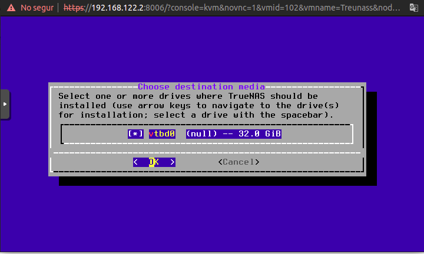
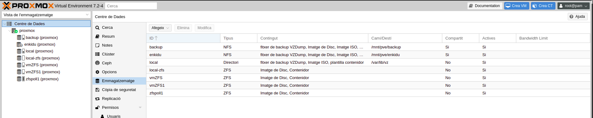

---
output:
  html_document: default
  pdf_document: default
---
# TrueNas

[Truenas](https://www.truenas.com/) és una solucio NAS lliure basada en FreeBSD.
Farem servir aquesta plataforma per a compartir espais en la resta de VM, i tindre d'una forma centralitzada tots els fitxers per poder fer còpies de seguretat més eficients i facilitar la gestio.


## Instal·lar Truenass

Instal·lem TrueNass, creant un amfitrió de virtualització Proxmox amb un servidor NAS integrat. Instal·leu el NAS com qualsevol altra màquina virtual amb el seu sistema operatiu residint en un disc virtual en *vmZFS*. Les unitats d'emmagatzematge reals residiran a l'emmagatzematge físic *zfspool1* assignat mitjançant una tècnica coneguda com a pas de maquinari.

Creem una nova màquina virtual com sempre amb la següent configuració.

{width=50%}


::: {.rmdinfo .centre data-latex="{}"}
El disc sata1 que es veu en la configuració, l'afegirem ara seguint els següents passos.
:::

Arranquem i comença la instal·lacio.

{width=50%}

De moment soles tenim el disc dur per instal·lar el sistema base, 32 Gib que està en l'espai vmZFS del host. L'altre, el d'espai, l'afegirem després.

{width=50%}

Seguim els passos fins al final, com qualsevol SO, i reiniciem.

{width=50%}

Des d'aci podríem configurar la xarxa i canviar al password del root per poder entrar des del navegador.

La xarxa de moment no la toquem fins que no estiga tot configurat en pfSense, i el passem a les VLAN que li adjudiquem.

{width=50%}

::: {.rmdinfo .centre data-latex="{}"}
L'usuari que pot entrar és root amb el password que li hem posat en el pas anterior.
:::

{width=80%}

### Afegirem disc de pas, discs reals

D'aquesta forma tenim separades en dos discs, la VM i les dades. Aquest mètode permet una còpia de seguretat del sistema molt petita, perquè només feu una còpia de seguretat del sistema operatiu VM Truenas i NO de les dades. També proporciona un rendiment de disc moderadament millor per als cicles de lectura/escriptura

El més gran avantatge és que les dades NO s'emmagatzemen en un fitxer de disc virtual. Si es destrueix la VM, les dades estan segures en un disc real, que es pot muntar amb qualsevol altre SO.

### Afegim el disc a Truenas

Per buscar els discs durs en Trueas

```bash
cat /proc/partitions
```

Podem crea un LVM o un ZFS, per aquest espai

Afegim 3 discs durs, tenim dues opcions

- Fer una RAID0 en dos discs i l'altre disc per fer les còpies de seguretat de les parts que ens interesse guardar.

  En el primer volum, de dos discs, és on guardarem les dades del nextcloud, els fitxers de la part administrativa, les captures de video i tots els espais de disc compartits amb els serveis que oferirem ara o en un futur. En el segon volum, el tercer disc dur, farem una rèplica de les dades de Nextcloud i serveis, la part administrativa i la carpeta de *videos editats*.
  
 ::: {.rmdnote data-latex="{Nota}"}
Per la forma de treballar de l'empresa, no ens interessa còpies de seguretat de totes les captures de video, ja que es vol oferir com un servei per a les companyies externes que actuen, i després esborrar-les. Soles les còpies de les obres pròpies es voldrien guardar. Si fem un RAID 1 carreguem el sistema TrueNas en càlculs, fent el disc de paritat, quan la major part de les dades no ens interessa. És molt més rapid, canviar un disc que es trenca i restaurar la còpia de seguretat, que restaurar la paritat d'un sistema RAID 1, on mes de la meitat de les dades que es restauren ens són indiferent. 
:::

En cas de catàstrofe

  1. En cas de catàstrofe d'un dels discs del volum 1, es canvia i es restaura les còpies de seguretat.
  2. En cas de desastre en disc de còpies de seguretat, es canvia i es regeneren les imatges de les VM i es torna a fer còpia de seguretat de les dades.
  3. En cas de catàstrofe en el ssd on està el proxmox, el canviem, instal·lem altra vegada Proxmos, connectem el volum de còpies de seguretat i restaurem la configuració de proxmox i les VM.

:::{.rmdtip data-latex="{Tip}"}
Un altre avantatge d'aquest mètode, és que amb RAID0, la velocitat del disc format d'aquesta forma és més ràpit. Ja que reparteix la lectura i escriptura entre els dos discs. Si li donem molta resolució a les càmeres, igual si vindria bé aquest plus de velocitat enfront del de seguretat, si al mateix temps estan utilitzant el Nextcloud per llegir fitxers.
:::

- Fer un RAID 1 en els tres discs. Si falla un, el canviem i es regenera la paritat.
  
  3 SATA RAID 1 en els tres discs. Fer un volum en els tres discs i guardar alli el backup, les dades i els videos, cada u en el seu Zvol.
  
En cas de catàstrofe

  1. En cas de catàstrofe del ssd, igual que en cas anterior
  2. En cas de catàstrofe d'un dels 3 discs, es canvia i es regenera el RAID automàticament, és procés pot ser més lent que el de tornar a copiar les dades de des del backup. Ja que tindríem moltes dades que realment no volem que es tornarien a regenerar,

### Afegim els discs a Proxmox

Ho he fet de dues formes diferents. La segona em pareix la més correcta, pero deixe la documentació de la primera, perquè part dels següents passos per compartir espai en Nextcloud ho vaig fer en el volum creat d'aquesta forma. No està de més tindre la documentació de com es va fer, per si en algun cas específic, convé més fer-ho d'aquesta manera.

En la realitat, li posaríem els discs en les valdes del servidor.
En l'edició de proves, hem creat tres discs durs virtuals en format qcow2 en la partició HD del portàtil, no SSD.

{width=50%}

{width=50%}

Hem elegit tipus de bus VirtiO que és el que en principi dona més rendiment i ens deixa fer més coses, si dona problemes es pot elegir SATA que és el real.

### Volums

Ara hem d'elegir el tipus de volum que volem crear, LVM o ZFS.

En principi LVM és més pràctic, i els requisits de hardware, en concret de RAM és minim. Arranquem qualsevol linux, muntem el volum, i accedim a les dades. En ZFS el mateix, pero no és tan usual, i els requisits de RAM per aquest volum és més alt. Es recomana minim 4GiB, pero l'òptim son 8GiB, i 1GiB per cada Tera de mes. En el nostre cas, si es compra el servidor en 64GiB de RAM, no seria problema, la resta de VM no tenen gran demanda de RAM.

::: {.rmdcuidao data-latex="{Conte en la RAM}"}
ZFS depén molt de la memòria, de manera que necessiteu almenys 8 GB per començar. A la pràctica, utilitzeu tot el que pugueu obtenir pel vostre maquinari/pressupost. Si no tenim tanta RAM, es pot gastar un disc SSD,  sol ser més barat, es pot comprar en altre SSD de menor capacitat per fer aço, no recomane fer-ho en una partició de l'arrel de Proxmox, aço el desgasta molt i tenim mes probabilitat que falle mes ràpidament. Es posa un secundari, i quan falle es canvia, pero si tenim RAM millor, i es el cas.
Crea un grup nou amb memòria cau (L2ARC)
És possible emprar una partició d'unitat de memòria cau dedicada per augmentar el rendiment (fa ús SSD).
:::

El crearíem en cas de falta de recursos.

```bash
zpool create -f -o ashift=12 <pool> <device> cache <cache_device>
```

### ZFS

Elegim ZFS pel format de tots els nostres discs.

ZFS és un sistema de fitxers combinat i un gestor de volums lògics dissenyat per Sun Microsystems.

L'emmagatzematge ZFS és una combinació de sistema de fitxers i LVM, que proporciona emmagatzematge d'alta capacitat amb funcions importants, com ara protecció de dades, compressió de dades, autocuració i instantànies. ZFS té un RAID definit per programari integrat, que fa que l'ús de RAID basat en maquinari siga innecessari.

::: {.rmdnote data-latex="{Nota}"}
Una matriu de discs amb ZFS RAID es pot migrar a un node completament diferent i després importar-la completament sense reconstruir tota la matriu. Només podem emmagatzemar imatges de disc virtual en format .raw a l'emmagatzematge ZFS.
:::

Mitjançant l'ús de ZFS, és possible aconseguir les màximes funcions empresarials amb maquinari de baix pressupost, però també sistemes d'alt rendiment aprofitant la memòria cau SSD o fins i tot configuracions només SSD. ZFS pot substituir les targetes RAID de maquinari de costos intensos per una càrrega moderada de CPU i memòria combinada amb una gestió fàcil.

Avantatges

* Fiable

* Protecció contra la corrupció de dades

* Compressió de dades en l'àmbit de sistema de fitxers

* Imatges instantànies

* Clon de còpia sobre escriptura

* Diversos nivells de raid: RAID0, RAID1, RAID10, RAIDZ-1, RAIDZ-2 i RAIDZ-3

* Pot utilitzar SSD per a la memòria cau

* Autocuració

* Comprovació contínua d'integritat

* Dissenyat per a altes capacitats d'emmagatzematge

* Replicació asíncrona a la xarxa

* Encriptació
  
Després d'afegir els discs, en proxmox apareixen directament.
Tenim els nous discs vdc. vdd i vde

{width=80%}

Per fer RAID0 ho hem de fer des de consola, aquesta opció no la proporciona el GUI, i a més no la recomana, si es perd un disc, es perden les dades.

{width=80%}

Per fer-ho mirem la [documentació](https://pve.proxmox.com/wiki/ZFS_on_Linux) oficial.

RAID0
També s'anomena "striping". La capacitat d'aquest volum és la suma de les capacitats de tots els discs. Però RAID0 no afegeix cap redundància, per la qual cosa la fallada d'una sola unitat fa que el volum no es puga utilitzar.

Quan s'escriu una matriu de paritat com ara RAID (1, 5, 6 o 10), s'ha de sincronitzar la memòria cau de dades sense interrupcions o es degradarà. Si es degrada, es reconstruirà! Si es reconstrueix, introdueix un cicle de treball estés i una acumulació de calor. Aquesta acumulació de calor degrada els components de manera irreversible que condueix a una eventual fallada.

Una matriu de striping com ara RAID-0 mai no se sincronitza ni es degrada. Això redueix el cicle de treball i l'acumulació de calor augmentant així la vida útil dels components.

Construïm el nostre sistema utilitzant només matrius de striping sense paritat i després fem servir RSync o replica per a replicar les dades en diverses màquines o volums del NAS. Això ofereix el rendiment de RAID-0 mantenint la redundància de dades.

Sembla que es compleixen tots els requisits, excepte les sol·licituds de restauració de l'usuari final i minimitzar la corrupció de dades. Per aço tindrem TruNAS amb ZFS.

Per crear l'agrupació ZFS

```bash
zpool create <nom_agrupació> <tipus_raid> <nom_dev1> <nom_dev2>
```

Tipus de RAID ZFS

|      Tipus RAID       |         Parametre       |
|      --------         |        ------------     |
|    RAID0              |       no string (res)   |
|    RAID 1             |       mirror            |
|    RAIDZ-1            |       raidz1            |
|    RAIDZ-2            |       raidz2            |

En el nostre cas li direm zfspool1 i del tipus RAID0 que és no string, és a dir, no posar res.

```bash
zpool create zfspool1 /dev/vdc /dev/vdd
```

::: {.rmdinfo .centre data-latex="{}"}
Son */dev/vdx* per què son discs virtuals, en el server seran */dev/sdx*
:::

Per verificar que el grup s'ha creat

```bash
root@proxmox:~# zpool list
NAME       SIZE  ALLOC   FREE  CKPOINT  EXPANDSZ   FRAG    CAP  DEDUP    HEALTH  ALTROOT
rpool       39G  1.24G  37.8G        -         -     1%     3%  1.00x    ONLINE  -
vmZFS     99.5G  16.6G  82.9G        -         -     3%    16%  1.00x    ONLINE  -
zfspool1    99G   105K  99.0G        -         -     0%     0%  1.00x    ONLINE  -
```

S'ha creat zfspool1 en l'espai sencer dels dos discs durs

Podem utilitzar l'agrupació directament o podem crear un conjunt de dades (dataset) dins de l'agrupació i connectar-lo per separat a Proxmox com a emmagatzematge individual. L'avantatge d'això és aïllar els diferents tipus de dades emmagatzemades en cada conjunt de dades. Aquesta part la farem en Truenas, crearem conjunts de dades per a cada servei.

Cada conjunt de dades ZFS es pot configurar individualment amb el seu propi conjunt d'opcions de configuració encriptació, compressió...

::: {.rmdinfo data-latex="{}"}
Podem activar la compressió per al conjunt de dades de les VM mentre mantenim la compressió desactivada per al conjunt de dades d'emmagatzematge de còpia de seguretat dels fitxers de còpia de seguretat de VM i video. Ja estan comprimits, estalviant així recursos valuosos del servidor.
:::

Per crear els conjunts de dades, que es diu pool en ZFS

```bash
zfs crea <zpool_name>/<zfs_dataset_name>
```

El *zpool_name* és el que hem creat *zfspool1* i el *dataset* el que volem crear, *next* per exemple, per a les dades de Nextcloud.

Els conjunts de dades s'han de muntar en un directori abans que es puguen utilitzar. De manera predeterminada, un nou conjunt de dades o conjunt de dades zfs es munta al directori arrel.

```bash
zfs set mountpoint=/mnt/zfs-vm zfspool1/next
```

En el nostre cas li direm zfspool1 i del tipus RAID0 que és no string

Per habilitar la compressió per al conjunt de dades

```bash
zfs set compression=on zfspool1/next
```

En combinar l'agrupació ZFS amb una compartició NFS, podem crear un emmagatzematge compartit amb funcions ZFS completes. Creant d'aquesta forma un emmagatzematge compartit flexible. Podríem muntar cada volum en la màquina virtual que el vol fer servir, sense falta del Truenas, pero haguérem de donar-li RAM suficient a cada màquina per a gestionar ZFS i les tasques de còpia de seguretat serien més laborioses. Millor centralitzar-ho tot en una VM dedicada a aquestes labors com Truenas.

:::{.rmdtip data-latex="{Tip}"}
Si tinguerem soles el Truenas, tots els passos de la creació de la pool ens els podríem haver estalviat, es pot fer mitjançant la seua GUI.
:::

Ara l'afegim, al nostre servidor proxmox per passar-lo després a la VM Truenas.

En centre de dades -> emmagatzemament -> ZFS -> afegir

L'ID és el nom que li volem donar que siga únic en el servidor. Elegim el zfspool1, el mateix que en el que l'hem creat.

{width=80%}

```{r sheets-option-drag1, echo = FALSE, fig.cap="(Afegir pool a proxmox)"}
if(knitr::is_html_output(excludes="markdown")) knitr::include_graphics("imatges/proxmox/afegirpool.gif")
```

Ara l'afegirem a Tuenas.

En la màquina virtual afegim el disc ZFS que acabem de crear. L'afegim d'aquesta forma virtIO block perquè el disc siga una unitat física real, no un disc dur virtual. Les dades estan en un disc real i no en una imatge de màquina virtual, i es pot accedir a elles encara que la VM ja no estiga.

::: {.rmdcuidao data-latex="{Ves amb compte}"}
No em deixa posar més de 93GiB, diu que el disc supera l'espai, coses de ZFS que es fa una partició reservada.
:::

{width=80%}

```{r sheets-option-drag2, echo = FALSE, fig.cap="(Disc afegit a Truenas)"}
if(knitr::is_html_output(excludes="markdown")) knitr::include_graphics("imatges/proxmox/disc_freenas.gif")
```

### Configurar el nou disk

Dins de Truenas, anem a storage -> diks per configurar-lo

{width=80%}

Li podríem canviar les opcions d'energia del disc, encriptar ...

{width=80%}

I ho salvem

::: {.rmdcuidao data-latex="{Ves amb compte}"}
En principi és indiferent qui cee els volums ZFS, en el proposat abans els fa Proxmox i després el muntem per compartir-lo en Truenas, pero no sé si és la forma més correcta de fer-ho. Ho vaig fer al principi i és la solució que vaig trobar, per a la resta de configuracions d'espais de dades i zvol compartits no afecta. Per al tercer disc SATA el que farà de Còpia de seguretat Total, repetirem el procés, pero tot amb la GUI de Truenas. En la pràctica seria soles amb un disc SATA, pero per fer la demostració, ho farem en dos discs com abans, una vegada fet el volum, la resta és com si fora soles una unitat física.
:::

::: {.rmdinfo .centre data-latex="{}"}
A partir d'aci, crearíem la primera pool igual que l'apartat posterior, pero soles amb el disc ada0.
:::

### Passthrough disc físic a màquina virtual (forma correcta)

[Passthrough disc físic a màquina virtual (VM)](https://pve.proxmox.com/wiki/Passthrough_Physical_Disk_to_Virtual_Machine_(VM))

Per fer-ho d'aquesta segona forma, hem afegit dos discs més a proxmox per KVM
/dev/vdf /dev/vdg


::: {.rmdinfo data-latex="{Per les proves}"}
La idea era que aci tindrien soles el tercer SATA, pero afegim dos per fer el RAID per Truenas que no hem fet abans.
:::

Primer hem de veure les característiques dels discs a afegir amb lshw

```bash
root@proxmox:~# lshw -class disk -class storage 
 *-scsi                    
       description: SCSI storage controller
       product: Virtio block device
       vendor: Red Hat, Inc.
       physical id: 0
       bus info: pci@0000:04:00.0
       version: 01
       width: 64 bits
       clock: 33MHz
       capabilities: scsi msix pm pciexpress bus_master cap_list
       configuration: driver=virtio-pci latency=0
       resources: irq:22 memory:f9a00000-f9a00fff memory:fe400000-fe403fff
     *-virtio2
          description: Virtual I/O device
          physical id: 0
          bus info: virtio@2
          logical name: /dev/vda
          size: 40GiB (42GB)
          capabilities: gpt-1.00 partitioned partitioned:gpt
          configuration: driver=virtio_blk
          guid=f2e35e7d-3cde-4753-be5c-f7e181a4f0fe logicalsectorsize=512
          sectorsize=512

....

  *-scsi
       description: SCSI storage controller
       product: Virtio block device
       vendor: Red Hat, Inc.
       physical id: 0
       bus info: pci@0000:0f:00.0
       version: 01
       width: 64 bits
       clock: 33MHz
       capabilities: scsi msix pm pciexpress bus_master cap_list
       configuration: driver=virtio-pci latency=0
       resources: irq:23 memory:f8600000-f8600fff memory:fd000000-fd003fff
     *-virtio11
          description: Virtual I/O device
          physical id: 0
          bus info: virtio@11
          logical name: /dev/vdf
          size: 50GiB (53GB)
          configuration: driver=virtio_blk logicalsectorsize=512 sectorsize=512
  *-scsi
       description: SCSI storage controller
       product: Virtio block device
       vendor: Red Hat, Inc.
       physical id: 0
       bus info: pci@0000:10:00.0
       version: 01
       width: 64 bits
       clock: 33MHz
       capabilities: scsi msix pm pciexpress bus_master cap_list
       configuration: driver=virtio-pci latency=0
       resources: irq:23 memory:f8400000-f8400fff memory:fce00000-fce03fff
     *-virtio12
          description: Virtual I/O device
          physical id: 0
          bus info: virtio@12
          logical name: /dev/vdg
          size: 50GiB (53GB)
          configuration: driver=virtio_blk logicalsectorsize=512 sectorsize=512
```

Ens interessen els dos últims virtio11 virtio12 de 53 GB pero al ser un disc virtual en realitat no apareix el model del producte ni el guid, els afegirem per dev/vdf i g com a SATA2 i 3, millor seria afegir-los per by-id.

```bash
root@proxmox:~# qm set  102  -sata2 /dev/vdg
update VM 102: -sata2 /dev/vdg
root@proxmox:~# qm set  102  -sata3 /dev/vdf
update VM 102: -sata3 /dev/vdf
```

Ara ja apareixen en la VM de truenas com SATA2 i 3. Estan connectats a Truenas, sense estar manipulats ni muntats en Proxmox.  L'hem d'afegir de tipus SATA perquè es crega que és un disc real, si el posem com scsi el detecta com a qcow, i no el podem enganyar.

{width=50%}

En entrar en la GUI, en discs, ens apareixen els nous dos discs ada1 ada2, el ada0 és el zfspool1 del primer pas.


Ara crearem el pool amb aquests dos discs.
Guia [Storage Configuration](https://www.truenas.com/docs/core/gettingstarted/storingdata/)

::: {.rmdnote data-latex="{Nota}"}
La pool que es veu datatruenas és la que vam crear en el volum zfspool1 per les dades de Nextcloud i còpia de seguretat que es detalla com crear-les i compartir-les en els apartats corresponents a aquestes VM.
:::

Una vegada ja tenim els nous discs afegits, anem a piscines (pools) per crear la nova unitat amb afegir.

{width=80%}

Seguim les instruccios del guiat, crear piscina nova

{width=80%}

Seleccionem els discs que volem, els dos nous que acabem d'afegir i que no tenen format, El ada0 no apareix, perquè ja té creada la pool.

{width=80%}

Els passem a la dreta i elegim ratlla (striping) per fer RAID 0, ens apareix un missatge d'advertència dient que no té redundància de dades .. L'acaptem

{width=80%}

Apareix una altra advertència, l'acceptem, cliquem força

{width=80%}

Li donem un nom i acceptem

{width=80%}

I el crearia.
Apareix una altra pool, còpia de seguretat total, on podem crear Zvol i dades.

{width=80%}

A partir d'aci és com en el cas anterior, pero d'una forma més correcta de fer-ho. La nova pool, és indiferent que siga formada per un sol disc o per dos, en el cas real seria de soles un disc per aquesta pool BackupTotal.

```{r sheets-option-drag14, echo = FALSE, fig.cap="(Pool backup Total)"}
if(knitr::is_html_output(excludes="markdown")) 
```

Ja tindriem el tercer SATA per fer alli les còpies de seguretat de tot el sistema.

### Crear dataset

Com a exemple, crearem un dataset per a fer les còpies de seguretat de les VM, guardar les ISO dels sistemes a instal·lar, les imatges LCX ...

El dataset vindria a ser aproximadament anàleg a un sistema de fitxers muntat estàndard, que podem compartir i on podem crear capetes per a compartir amb NFS, SMB...

Sera la carpeta d'administració que després compartirem en Proxmox on estarà centralitzat tots els fitxers d'imatges..

En storage -> pool, sobre datatruenas que és el disc ada0 (zfspool1), afegim un nou Dataset. El next és el de Nextcloud, explicat en el seu apartat.

ADD -> Add dataset sobre datatruenas

{width=80%}

En la configuració li donem el nom del recurs, una xicoteta descripció.

:::{.rmdtip data-latex="{Tip}"}
En el nivell de compressió li donem a off, no té sentit en aquest volum, ja que el que guardarem en ell, ja està comprimit, ÏSO, còpies de seguretat de VM, etc.
:::

{width=80%}

```{r sheets-option-drag13, echo = FALSE, fig.cap="(Crear Dataset)"}
if(knitr::is_html_output(excludes="markdown")) knitr::include_graphics("imatges/proxmox/Afegir_pool_backup.gif")
```

Quedaria compartir-lo en NFS

#### Crear Zvol

Una altra opcio seria afegir un Zvol, és tipus block, com si ferem un disc real de mida fixa, al que podem fer partricions, LVM .. i formatar les particions que creem en el format que vulguem, EXT4,NTFS ..., Pero mante les caracteristique de ZFS, instanatanies, restauracio, control d'errors per a Tuenas.
Al sistema client, seria un disc dur normal, aquest recurs l'hem de compartir, no caom a seveis de xarxa normails, sinó amb iSCSI.

iSCSI és un protocol de xarxa que permet posar els discs durs en una caixa NAS o servidor, però a l'ordinador apareixen com si estaguera connectat localment.

En linux hem de fer una xicoteta configuracio, [exemple en ubuntu](https://ubuntu.com/server/docs/service-iscsi), per al que el detecte, pero a partir d'aci és com un disk normal. Té les seues ventages.

Creem un volum d'aquest tipus dins del dataset Backup, per tindre-ho ordenat, per fer proves, l'unic inconveniesnt és que les VM que es creen aci, no es poden migrar a un altre servidor proxmox en calent.

Per exemple, es poden crear diferents perticions o volums Zvol i asignar cadascuna a un usuari o host, i tindria el seu volum aillat de la resta dels companys.

::: {.rmdtip data-latex="{Tip}"}
El més recomanat seria fer un volum per a les imatges de les ISO, LXC... i un altre per les còpies de seguretat de les VM del servidor Proxmox1, per si en el futur es fa un cluster, i volem tindre centralitzat les ISO, i, per una altra banda, les còpies de seguretat de les VM de cada Proxmox. Pero farem un sol Zvol de moment.
:::

Per afegir aquest volum, fem el mateix que abans, pero damunt de backup, i en comptes d'afegir un altre dataset, afegim un Zvol. BackupProxmox1

:::{.rmdwarn data-latex="{Perill}"
Després en la GUI, Backup ho tradueix per Còpia de seguretat Proxmox1, pero la referència al recurs és BackupProxmox1, igual que nesxt que és la de Nextcloud la tradueix com a proxim. Lia més que ajudar. 
:::

Aci li donarem un nom, i la capacitat que hem d'especificar en GiB perquè ho entenga. Podem forçar que es limite al tammany, pero no es recomana, comença a donar problemes quan arriba al 80%.
El nivell de compressió el deixem com està, desactivat.

{width=80%}

El tindriem que compartir com a ISCSI i en proxmox afegir-lo com a ISCSI sobre ZFS

{width=50%}

::: {.rmdnote data-latex="{Nota}"}
Tindriem que configurar la comparticio ISCSI, hem de definir portal, bancs, usuari. Queda pendent per provar.
:::

El cas és que en utilitzar el dataset backup compartit per NFS en proxmox, dins d'ell està el Zvol backupProxmox1 i fer còpies de seguretat de VM i la LXC que hem baixat.

{width=80%}

Després en la pool de Truenas, pareix que ha fet les carpetes i guardat les dades dins el Zvol BackupProxmox1, dins de Backup soles està el Zvol

{width=80%}

Pero si editem el recus Backup compartit per NFS estan les carpetes de Proxmox, les definides en afegir-lo, dump per a les còpies de seguretat de les VM, imatges per a les ISO ... En l'espai ocupat correcte.

{width=80%}

En fer la replia posteriorment, es replica el Zvol, no ho tinc encara massa clar el que està pasant.

#### Activar NFS

Per activar el protoclo de comparticio, perimer l'hem d'abilitar.

Anem a services, i habilitem la compartició NFS, i marquem el quadre de posar en funcionament en arrancar.

:::{.rmdtip data-latex="{Tip}"}
Per poder compartir el recurs per xarxa, estan tots protocols per fer-ho, SMB, TFTP... Pero com totes les màquines són Linux, prefereix fer-ho d'aquesta manera. També es podria fer amb iscsi que on la host client es creu que es un disc real. Queda pendent d'investigar el funcionament.
:::

{width=80%}


#### Compartir el recurs

En sharing -> NFS, afegim nou recurs i el configurem.

Primer elegim el directori a compartir, el dataset backup (dins d'aquest tenim el Zvol backupproxmox1) en datatruenas, elegim all dir perquè el client puga elegir el subdirectori que vulga o tots esl que hi haja.
Li donem a opcions avançades, i li donem permisos soles al root per a manipular-lo, i cap altre usuari el pot mapar.

En Networks li diguem la xarxa on estarà disponible, posteriorment el pasarem a la xarxa VLAN 1 172.16.0.0/24 i la IP fixa de proxmox en aquesta xarxa.

::: {.rmdinfo .centre data-latex="{}"}
En un futur, configurarem primer el DNS de pfSense per posar els noms de les màquines i no les IP. D'aquesta forma quan configurem les VLAN, i la d'administració, haurem de tornar a configurar totes les IP o posar ja el nom real de la màquina de totes les configuracions.
:::

{width=80%}

En proxmox l'afegiriem de la mateixa forma que vam fer en el recurs compartit per el host al principi. L'hem anomenat backup

{width=80%}

La configuracio en l'apartat de Poxmox.

## Politaca de volums

S'hauria de pensar i veure l'espai total final de discs que tenim.

Suposant que tenim 3 SATA de 4 T repartiriem l'espai dels 2 primers 8 Gib de forma que puguerem fer espais iguals en l'altre de 4 T.

* El zvol de dades de nextcloud 2 T **-> NFS -> Nextcloud**
* Backup VM 0.5 T (en estar comprimides, i per la quantitat de VM i LXC mes les ISO ... Seria suficient) **-> NFS -> Proxmox**
* La resta per al Zvol de video, dins d'aquest un dataset *datasetVideo* que té tot l'espai i dins del dataset de video, un Zvol per als videos editats per guardar (1.5 T) en un dataset *datasetVideosEditats* per assegurar que la grandària del disc és el mateix que el de backup total, per poder compartir en Zoneminder i Nextcloud a l'hora, la resta de l'espai per als videos en brut.  
**datasetVideo -> NFS -> Zonaminder & Nextcloud**
**datasetVideos Edoitats -> Nextcloud**
(és redundant, pero per compartir amb membres dels grups no video), es pot fer servir tambe el truenas com un plex per compartir recursos multimedia, per si es vol compartir d'aquesta forma al projector que te la sala per promocions o TV.

D'aquesta forma podem fer backups de la part de Nextcloud total, de la part administrativa total, i de la de videos editats tambe. I si els videos no editats omplen l'espai reservat per a ells (el mes normal amb el temps), no desbarate la resta de dades.

## Configuracio del disc Backup Total

En el tercer Sata. És on faria les còpies de seguretat de tot. Editariem les opcions d'energia del disc, ja que la major part del temps estara parat i mimimitzen el seu desgast. Soles es posara en martxa a l'hora de fer les sincronitzacions, una vegada al dia en dades de Nextcloud i video, i una al mes en les d'administracio.

En la seccio de disc, editariem el SATA 3 ho simulem en el ada1 backup total, mirem la configuracio

{width=80%}

Editem la configuracio

{width=80%}

Cambiem la configuracio HDD en espare, de sempre ences a la minima

{width=80%}

Gestio avançada d'energia el nivell 1 ús minim d'energia en espera.

{width=80%}

### Treballs de sincronitzacio

Primer fariem els datasets, fhe provat el de nextcloud que és xicotet i el d'administracio, la resta seria igual.

En la pool backupTotal creem una nou dataset Backup2 pel d'administracio i Backupnextcluddades per a nextcloud, com sempre, amdb la seguent configuracio.

El Backup2 ja l'he replicat, es veu que no està buit, ho farem en el de Nextcloud que no tarde tant.

{width=80%}

Primes hem de fer una snapshot, les rèpliques es fan sobre elles, si no fem, la faria en definir la tasca.
En periodic snapshot creem una nova.

1. Elegim la que volem datatruenas/next
2. La vida de la snapshot, després l'esborra, 2 setmanes
3. La periocitat diaria a les 12 PM

{width=80%}

Quedaria

{width=80%}

Fem la rèplica

Anem a task (treballs) es on podem coonfigurar les tasques de Truenas, rsync, instantanies...
En replication Task afegim una nova

1. Elegim l'origen datatruenas/next
2. El desti BackupTotal/BackupNextcloudDades
3. seguent

{width=80%}

1. Que ho faça per la programacio o soles una vegada, per la programacio
2. La vida de les instantanies en el desti, el mateix que en l'origen, es borren amb la mateixa periodicitat, 2 setmanes.
3. La programacio de quant fer-les, la mateixa que les snpshot pero una hora després.

{width=80%}

Ja estaria feta la rèplica

{width=80%}

Per restaurar tindriem que donar-li a restore i tot en ordre altra vegada.

Podem veure que la mida de la rèplica i l'original, i el sistema de fitxers o Zvol és el mateix que l'original, encara que soles hem definit un dataset en Backup Total.

{width=80%}

```{r sheets-option-drag23, echo = FALSE, fig.cap="(Crear replica)"}
if(knitr::is_html_output(excludes="markdown")) 
```

:::{.rmdtip data-latex="{Tip}"}
Truenas pot fer moltes coses mes com Instal·lar VM en jail, Webdav, servidor OpenVPN ... Propies i de la comunitat, simplement instal·lant un connector i ho configura, vaig provar nextcloud, pero millor en una VM per a ella soles si tenim de base proxmox, o la posibilitat de fer la base Truenas i la resta de serveis dins d'ella.

{width=80%}
:::
