# Nextcloud

Per la fase de proves hem creat la VM partint de la imatge oficial [Nextcloud VM](https://download.nextcloud.com/vm/) on provarem les configuracions del servidor, xarxa, disc ... Pero una vegada fase de producció, partirem d'un Ubuntu server 20.04 i els scripts que proporciona [nextcloud/vm](https://github.com/nextcloud/vm) del repositori Github ([Guia](https://docs.hanssonit.se/s/W6fMouPiqQz3_Mog/W6fMouPiqQz3_Mog/d/bj0vl4ahv0jgrmfm0950/build-your-own-nextcloud-vm) de com fer-ho), que té un certificat de seguretat A+ i optimitza diverses funcions.

Primer fem una VM amb Ubuntu 20.04 server, clonem el repositori i executem els scripts com diu la Gia comentada. Ho he provat en Virtual Box i no te mes complicacions.

```bash
wget https://raw.githubusercontent.com/nextcloud/vm/master\
/nextcloud_install_production.sh
sudo bash nextcloud_install_production.sh
sudo bash /var/scripts/nextcloud-startup-script.sh
```

Per fer una instal·lacio manual tenim aquesta altra [Giua](https://linuxiac.com/install-nextcloud-on-ubuntu/)

## Importar imatge .vmdk

Per provar coses noves, importarem una imatge .vmdk des d'una .ova a Proxmox en format .RAW, seguint els passos descrits en [Install .ova Image on Proxmox](https://ryanburnette.com/blog/proxmox-import-ova/)

Descarreguem la VM oficial i la descomprimim.
Una vegada descomprimit l'arxiu .ova copiem l'arxiu per scp a proxmox en /tmp

```bash
enkidu@enkidu:~$ tar -xvf Virtual_Appliance_Debian.ova
Official-Nextcloud-VM.ovf
Official-Nextcloud-VM.mf
Official-Nextcloud-VM-disk1.vmdk
Official-Nextcloud-VM-disk2.vmdk
```

Copiem la imatge a Proxmox

```bash
enkidu@enkidu:~$ scp Official-Nextcloud-VM-disk1.vmdk root@192.168.122.2:/tmp/
root@192.168.122.2's password: 
Official-Nextcloud-VM-disk1.vmdk              100% 1714MB  13.8MB/s   02:03
```

Des de la consola de Proxmox, creem una nova màquina i importem el disc de la VM

```
$ qm importdisk 105 /tmp/Official-Nextcloud-VM-disk1.vmdk vmZFS -format raw
importing disk '/tmp/Official-Nextcloud-VM-disk1.vmdk' to VM 105 ...
transferred 0.0 B of 40.0 GiB (0.00%)
transferred 409.6 MiB of 40.0 GiB (1.00%)
transferred 819.2 MiB of 40.0 GiB (2.00%)
transferred 1.2 GiB of 40.0 GiB (3.00%)
transferred 1.6 GiB of 40.0 GiB (4.00%)

transferred 39.2 GiB of 40.0 GiB (98.00%)
transferred 39.6 GiB of 40.0 GiB (99.00%)
transferred 40.0 GiB of 40.0 GiB (100.00%)
transferred 40.0 GiB of 40.0 GiB (100.00%)
Successfully imported disk as 'unused0:vmZFS:vm-105-disk-1'
```

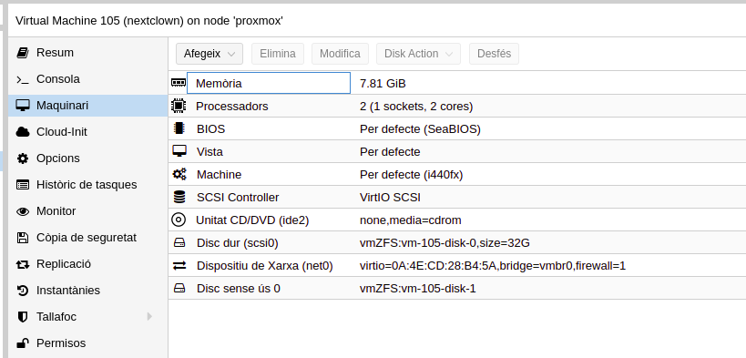{width=50%}

Després esborrem el disc que havíem creat per crear la VM, disk-0 de 32G i seleccionat el disc nou l'afegim, en aquests moments esta sense ús, l'he canviat també al tipus VirtlO.

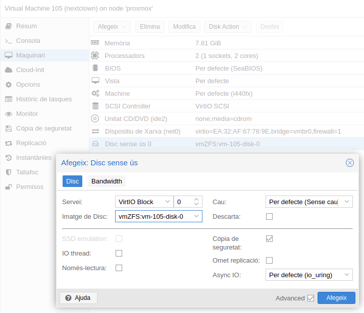{width=50%}

:::{.rmdtip data-latex="{Tip}"}
Si per una d'aquestes mo arranca, mirar en opcions de la VM l'ordre d'arrancada, pot que siga ISO, NET, HD, e intenta arrancar per xarxa, es canviar l'ordre com ho faríem en la bios, i posar el HD endavant de per la xarxa.
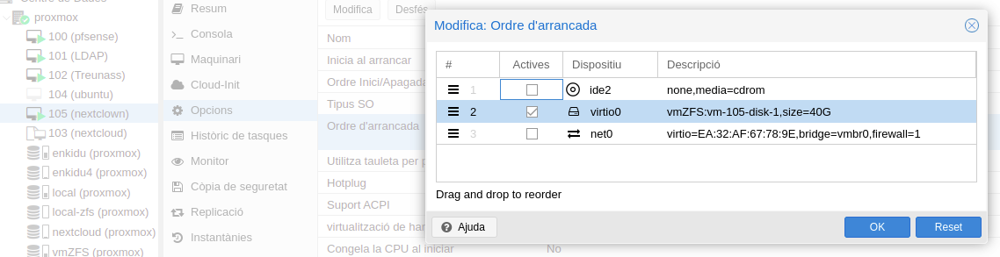{width=80%}
:::

::: {.rmdinfo .centre data-latex="{}"}
Una vegada arrancada es
 user: ncadmin
 passwors: nextcloud
:::

 i ens demana que canviem el pasword de l’admin, el teclat ...

::: {.rmdcuidao data-latex="{Ves amb compte}"}
No es una versió de producció, falten algunes característiques millorades, que es poden instal·lar després dels scripts explicats mes avall, pero per a fer les proves ens val.
 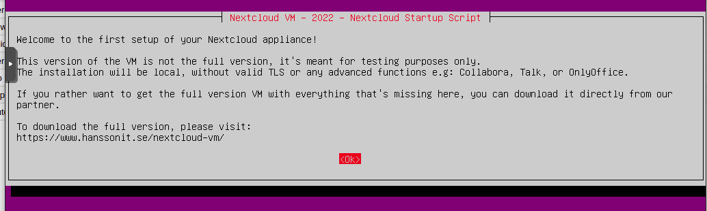{width=80%}
:::

## volum de dades NFS

 Una vegada arrancada la VM, li afegirem el recurs d'espai on volem que es guarden les dades de l'usuari. Sera un recurs compartit per Turenas en NFS

 Instal·lem en el la VM Nextcloud el client de NFS

 ```bash
sudo apt -y install nfs-common
 ```

 Actualitzem el domini.

```bash
sudo nano /etc/idmapd.conf
```

I posem el nostre.

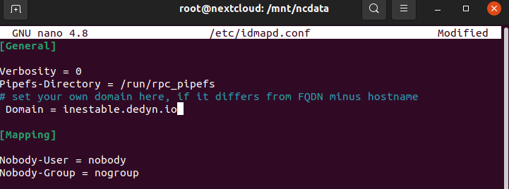{width=80%}

Ara muntem el volum que estem servint en Truenas

::: {.rmdinfo .centre data-latex="{}"}
En la secció de Truenas s'explica com compartir recursos, aci soles el muntarem.
 Directori servit per Tuenas
*/mnt/datatruenas/next*
:::

Primer creem el directori en mnt on muntar el recurs i li donem propietari, li donarem els mateixos permisos que te el que per defecte crea, ncdata.

```bash
root@nextcloud:/mnt# ls -la
total 12
drwxr-xr-x  3 root     root     4096 Oct 21  2021 .
drwxr-xr-x 20 root     root     4096 Oct 21  2021 ..
drwxrwx---  6 www-data www-data 4096 May 28 17:52 ncdata
root@nextcloud:/mnt# mkdir -p /mn/datanext
root@nextcloud:/mnt# chown www-data:www-data /mnt/datanext
root@nextcloud:/mnt# chmod 770 /mnt/datanext
root@nextcloud:/mnt# ls -la
total 16
drwxr-xr-x  4 root     root     4096 May 28 18:51 .
drwxr-xr-x 20 root     root     4096 Oct 21  2021 ..
drwxrwx---  2 www-data www-data 4096 May 28 18:49 datanext
drwxrwx---  6 www-data www-data 4096 May 28 17:52 ncdata
```

Ara muntem el volum

```bash
root@nextcloud:/mnt# mount -t nfs Truenas.inestable.dedyn.io:/mnt/dataTruenas/next\
/mnt/datanext/
```

Si tot va bé, l'afegim a /etc/fstab perquè el munte automàticament en l'arracada.

Comprovem que anat tot be

```bash
root@nextcloud:/mnt# df -h
Filesystem                             Size  Used Avail Use% Mounted on
udev                                   3.8G     0  3.8G   0% /dev
tmpfs                                  778M  1.2M  777M   1% /run
/dev/mapper/ubuntu--vg-ubuntu--lv       39G  5.9G   31G  17% /
tmpfs                                  3.8G   16K  3.8G   1% /dev/shm
tmpfs                                  5.0M     0  5.0M   0% /run/lock
tmpfs                                  3.8G     0  3.8G   0% /sys/fs/cgroup
/dev/vda2                              976M  103M  806M  12% /boot
/dev/loop1                              56M   56M     0 100% /snap/core18/2128
/dev/loop3                              62M   62M     0 100% /snap/core20/1169
/dev/loop5                              68M   68M     0 100% /snap/lxd/21545
/dev/loop7                              56M   56M     0 100% /snap/core18/2409
/dev/loop8                              62M   62M     0 100% /snap/core20/1494
/dev/loop0                              45M   45M     0 100% /snap/snapd/15904
/dev/loop6                              68M   68M     0 100% /snap/lxd/22753
tmpfs                                  778M     0  778M   0% /run/user/1000
Truenas.inestable.dedyn.io:/mnt/dataTruenas/next   30G  128K   30G   1% /mnt/datanext
```

Modifique el /etc/fstab per fer persistent aquest directori, afegint la linea

```bash
Truenas.inestable.dedyn.io:/mnt/dataTruenas/next\
/mnt/datanext nfs auto,nofail,noatime,nolock,intr,tcp,actimeo=1800 0 0
```

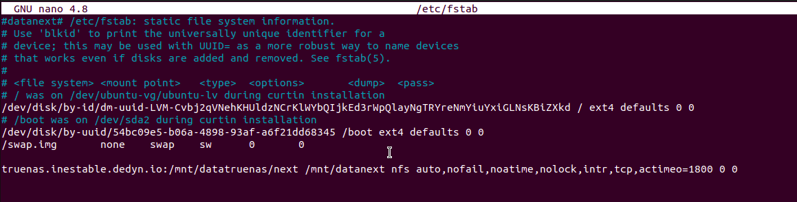{width=80%}

Ara hem de passar els fitxers creats en ncdata al nou directori i configurar en */var/www/nextcloud/config/config.php* de nextcloud el nou directori.

::: {.rmdcuidao data-latex="{arxius importants}"}
Realment els arxius importants son el .htaccess i .ocdata pero copiarem també el index i els logs
:::

```bash
root@nextcloud:/mnt# ls -hla /mnt/ncdata/
total 40K
drwxrwx--- 6 www-data www-data 4.0K May 28 17:52 .
drwxr-xr-x 4 root     root     4.0K May 28 18:51 ..
drwxr-xr-x 4 www-data www-data 4.0K May 28 17:05 2585289c-72e1-103c-8cae-9fbe74979792
drwxr-xr-x 8 www-data www-data 4.0K May 28 16:38 appdata_ocru8ytkzh2p
-rw-rw-r-- 1 www-data www-data    0 Oct 21  2021 audit.log
-rw-r--r-- 1 root     www-data  542 Oct 21  2021 .htaccess
drwxr-xr-x 4 www-data www-data 4.0K May 28 16:38 incitato
-rw-rw-r-- 1 www-data www-data    0 May 28 16:35 index.html
-rw-rw-r-- 1 www-data www-data    0 May 28 16:35 .ocdata
-rw-rw-r-- 1 www-data www-data  11K May 28 16:35 updater.log
drwxrwxr-x 4 www-data www-data 4.0K May 28 16:35 updater-oc
```

Per poder fer aço, primer hem de donar permisos al root en el recurs compartit en Truenas.

:::{.rmdwarn data-latex="{Perill}"}
Hem de posar en el Truenas permís per al root per poder copiar els arxius, després ho canviarem a www

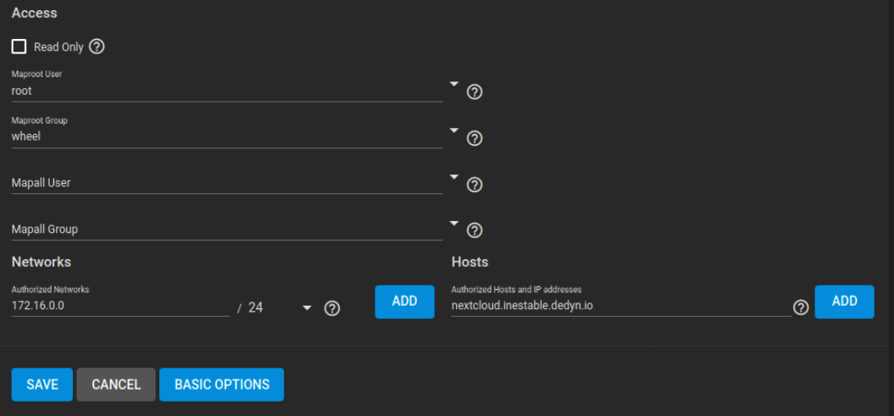{width=80%}
:::

Apaguem el servei apache en VM Nextcloud, perquè no canvie els arxius mentre els estem copiant per si de cas.

```bash
sytemctl stop apache2
cp -R /mnt/ncdate/ /mnt/datanext/
```

Hem de canviar el directori que apunta les dates en el fitxer de configuració

```bash
root@nextcloud:/home/ncadmin# nano /var/www/nextcloud/config/config.php
```

i canviar datadirectory pel nou

> 'datadirectory' => '/mnt/datanext',

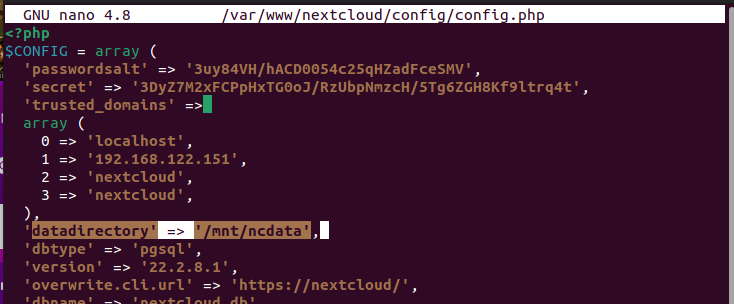{width=80%}

Copiem el .htaccess i li donem els mateixos permisos que tenia

```bash
root@nextcloud:/mnt# cp ncdata/audit.log index.html .ocdata /mnt/datanext/
root@nextcloud:/mnt# ls -la /mnt/ncdata/.htaccess 
-rw-r--r-- 1 root www-data 542 Oct 21  2021 /mnt/ncdata/.htaccess
```

Li posem els mateixos permisos

```bash
root@nextcloud:/mnt# ls -la ncdata/
total 40
drwxrwx--- 6 www-data www-data  4096 May 28 20:30 .
drwxr-xr-x 4 root     root      4096 May 28 18:51 ..
drwxr-xr-x 4 www-data www-data  4096 May 28 17:05 2585289c-72e1-103c-8cae-9fbe74979792
drwxr-xr-x 8 www-data www-data  4096 May 28 16:38 appdata_ocru8ytkzh2p
-rw-rw-r-- 1 www-data www-data     0 Oct 21  2021 audit.log
-rw-r--r-- 1 root     www-data   542 Oct 21  2021 .htaccess
drwxr-xr-x 4 www-data www-data  4096 May 28 16:38 incitato
-rw-rw-r-- 1 www-data www-data     0 May 28 16:35 index.html
-rw-rw-r-- 1 www-data www-data     0 May 28 16:35 .ocdata
-rw-rw-r-- 1 www-data www-data 10870 May 28 16:35 updater.log
drwxrwxr-x 4 www-data www-data  4096 May 28 16:35 updater-ocru8ytkzh2p
root@nextcloud:/mnt# cd ncdata/
root@nextcloud:/mnt/ncdata# cp audit.log index.html .ocdata /mnt/datanext/
root@nextcloud:/mnt/ncdata# ls -la /mnt/datanext/
total 19
drwxrwx--- 3 root     www-data    7 May 28 20:48 .
drwxr-xr-x 4 root     root     4096 May 28 18:51 ..
drwxr-xr-x 3 www-data www-data    3 May 28 20:43 appdata_ocru8ytkzh2p
-rw-r--r-- 1 root     www-data    0 May 28 20:48 audit.log
-rw-r--r-- 1 www-data www-data  542 May 28 20:27 .htaccess
-rw-r--r-- 1 root     www-data    0 May 28 20:48 index.html
-rw-r--r-- 1 root     www-data    0 May 28 20:48 .ocdata
root@nextcloud:/mnt/ncdata# cd /mnt/datanext/
root@nextcloud:/mnt/datanext# chown www-data audit.log index.html .ocdata 
root@nextcloud:/mnt/datanext# chown root .htaccess 
root@nextcloud:/mnt/datanext# chmod 664 audit.log index.html .ocdata
root@nextcloud:/mnt/datanext# ls -la
total 19
drwxrwx--- 3 root     www-data    7 May 28 20:48 .
drwxr-xr-x 4 root     root     4096 May 28 18:51 ..
drwxr-xr-x 4 www-data www-data    4 May 28 20:50 appdata_ocru8ytkzh2p
-rw-rw-r-- 1 www-data www-data    0 May 28 20:48 audit.log
-rw-r--r-- 1 root     www-data  542 May 28 20:27 .htaccess
-rw-rw-r-- 1 www-data www-data    0 May 28 20:48 index.html
-rw-rw-r-- 1 www-data www-data    0 May 28 20:48 .ocdata
```

Canviem el propietari en Truenas per al recurs compartit per a www

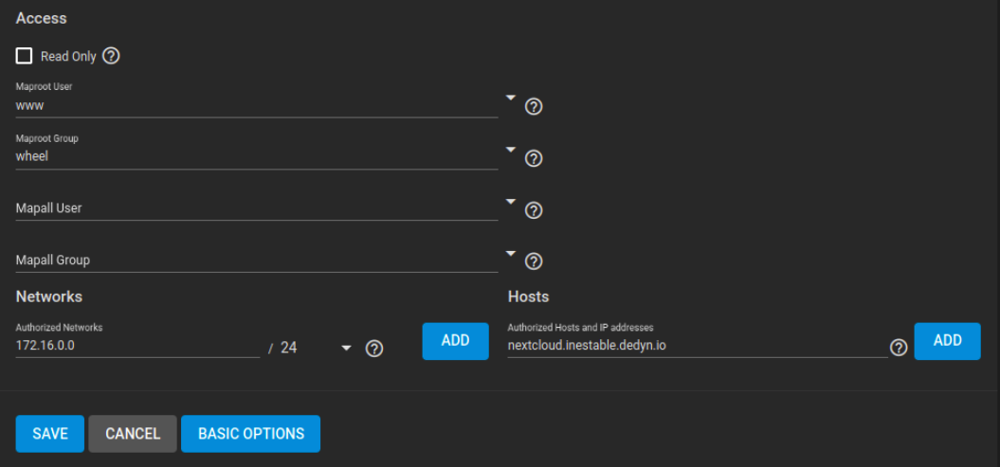{width=50%}

Entrem en Nextclown com a usuari i veiem que es crea la seua carpeta en el nou directori de dades

```bash
root@nextcloud:/mnt/datanext# ls -la
total 20
drwxrwx--- 4 root     www-data    8 May 28 21:03 .
drwxr-xr-x 4 root     root     4096 May 28 18:51 ..
drwxr-xr-x 5 www-data www-data    5 May 28 21:03 appdata_ocru8ytkzh2p
-rw-rw-r-- 1 www-data www-data    0 May 28 20:48 audit.log
-rw-r--r-- 1 root     www-data  542 May 28 20:27 .htaccess
drwxr-xr-x 4 www-data www-data    4 May 28 21:04 incitato
-rw-rw-r-- 1 www-data www-data    0 May 28 20:48 index.html
-rw-rw-r-- 1 www-data www-data    0 May 28 20:48 .ocdata
```

Ara creem una carpeta en l'usuari i en el GUI la crea i en el directori tambe apareix.

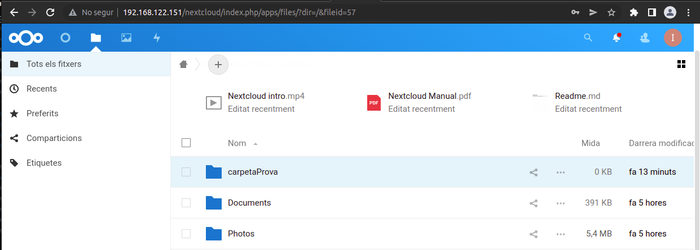{width=80%}

```bash
root@nextcloud:/mnt/datanext# ls -la incitato/files/
total 2
drwxr-xr-x 3 www-data www-data 3 May 28 21:09 .
drwxr-xr-x 5 www-data www-data 5 May 28 21:09 ..
drwxr-xr-x 2 www-data www-data 2 May 28 21:09 carpetaProva
```

:::{.rmdtip data-latex="{Tip}"}
En afegir-lo com a recurs per xarxa, en fer les còpies de seguretat de les VM des de Proxmox, aquest recurs no entra en el Backup, soles guarda la VM.

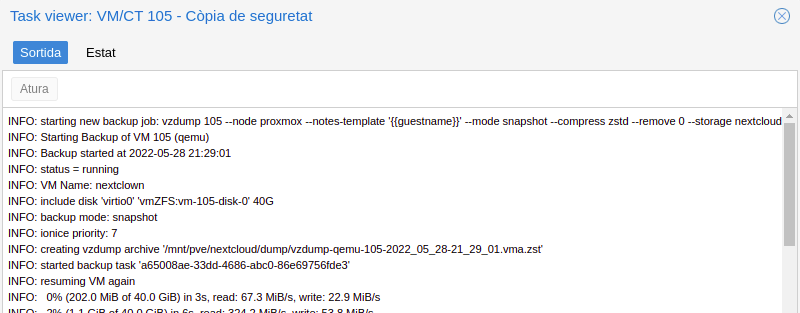
:::

## Gestió d'usuaris openLDAP

La gestió de l'usuari es farà per LDAP, Hem configurat una VM que sera el servidor de LDA. Nexcloud té en la GUI del administrador un connector que ens facilita aquesta feina.

Primer hem d'activar el mòdul LDAP, en l'usuari Administrador, anem a aplicacions, i baix de tot prenem el botó d'activació.

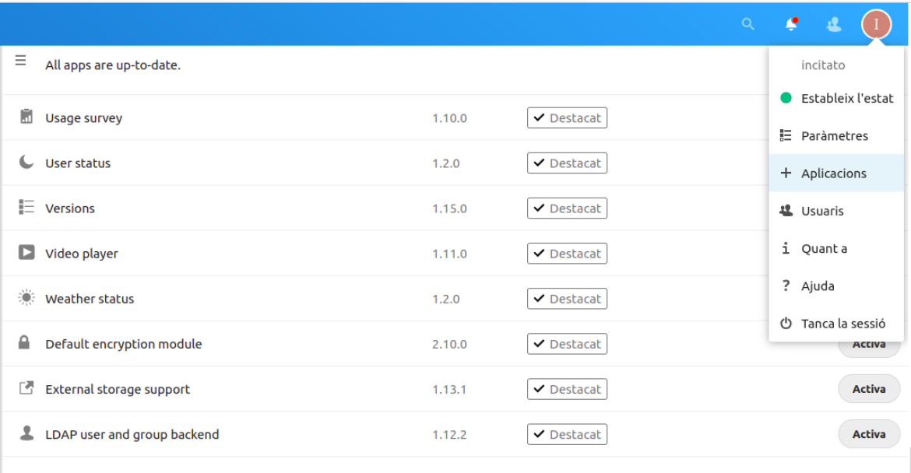{width=50%}

Després anem a paràmetres i configurem que busque en el nostre servidor LDAP.inestable.dedyn.io

1. Donar el nom del nostre servidor
2. detecta el port, ho fa automaticament
3. usuari de cerca, com ho tenim configurat, realitzar cerques anonimes, no seria necesari.
4. Detecta la Base, ho fa automaticament.

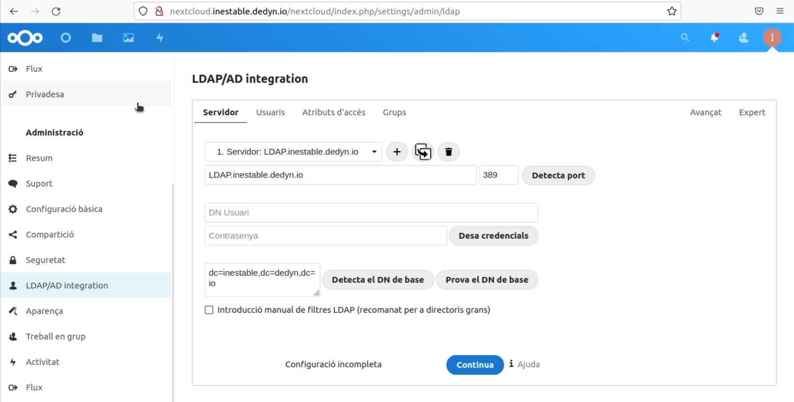{width=50%}

::: {.rmdcuidao data-latex="{configuracio basica de LDAP}"}
De moment estem en una configuracio basica de LDAP, hem creat un usuari per provar que funciona, més avant, crearem una estructura real de LDAP, de moment elegim posisxAccount
:::

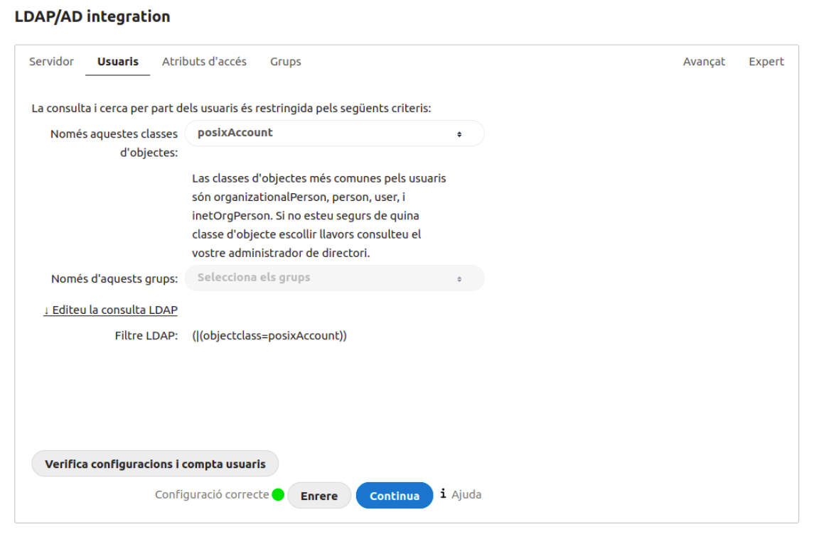{width=50%}

Finalment, els grups que tenen dret a accedir, eligiriem nextcloud, que es el grup on afegirem els usuaris amb acces.

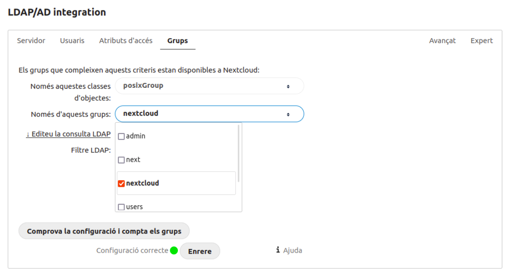{width=50%}

Entrem en un usuari que no està en el fitxer /etc/passwd

```bash
root@nextcloud:/home/ncadmin# getent passwd
root:x:0:0:root:/root:/bin/bash
daemon:x:1:1:daemon:/usr/sbin:/usr/sbin/nologin
bin:x:2:2:bin:/bin:/usr/sbin/nologin
sys:x:3:3:sys:/dev:/usr/sbin/nologin
sync:x:4:65534:sync:/bin:/bin/sync
games:x:5:60:games:/usr/games:/usr/sbin/nologin
man:x:6:12:man:/var/cache/man:/usr/sbin/nologin
lp:x:7:7:lp:/var/spool/lpd:/usr/sbin/nologin
mail:x:8:8:mail:/var/mail:/usr/sbin/nologin
news:x:9:9:news:/var/spool/news:/usr/sbin/nologin
uucp:x:10:10:uucp:/var/spool/uucp:/usr/sbin/nologin
proxy:x:13:13:proxy:/bin:/usr/sbin/nologin
www-data:x:33:33:www-data:/var/www:/usr/sbin/nologin
backup:x:34:34:backup:/var/backups:/usr/sbin/nologin
list:x:38:38:Mailing List Manager:/var/list:/usr/sbin/nologin
irc:x:39:39:ircd:/var/run/ircd:/usr/sbin/nologin
gnats:x:41:41:Gnats Bug-Reporting System (admin):/var/lib/gnats:/usr/sbin/nologin
nobody:x:65534:65534:nobody:/nonexistent:/usr/sbin/nologin
systemd-network:x:100:102:systemd Network Management,,,:/run/systemd:/usr/sbin/nologin
systemd-resolve:x:101:103:systemd Resolver,,,:/run/systemd:/usr/sbin/nologin
systemd-timesync:x:102:104:systemd Time Synchronization,,,:/run/systemd:/usr/sbin/nologin
messagebus:x:103:106::/nonexistent:/usr/sbin/nologin
syslog:x:104:110::/home/syslog:/usr/sbin/nologin
_apt:x:105:65534::/nonexistent:/usr/sbin/nologin
tss:x:106:111:TPM software stack,,,:/var/lib/tpm:/bin/false
uuidd:x:107:112::/run/uuidd:/usr/sbin/nologin
tcpdump:x:108:113::/nonexistent:/usr/sbin/nologin
landscape:x:109:115::/var/lib/landscape:/usr/sbin/nologin
pollinate:x:110:1::/var/cache/pollinate:/bin/false
sshd:x:111:65534::/run/sshd:/usr/sbin/nologin
systemd-coredump:x:999:999:systemd Core Dumper:/:/usr/sbin/nologin
ncadmin:x:1000:1000:ncadmin:/home/ncadmin:/bin/bash
lxd:x:998:100::/var/snap/lxd/common/lxd:/bin/false
postgres:x:112:118:PostgreSQL administrator,,,:/var/lib/postgresql:/bin/bash
incitato:x:1001:1001:,,,:/home/incitato:/bin/bash
_rpc:x:113:65534::/run/rpcbind:/usr/sbin/nologin
statd:x:114:65534::/var/lib/nfs:/usr/sbin/nologin
root:x:0:0:root:/root:/bin/sh
nobody:x:65534:65534:nobody:/:/usr/sbin/nologin
```

L`usuari *ramiro* creat en ldap, no apareix com a un del sistema, soles es podra logar en Netxcloud, no hem tocat la configuracio del sistema base.

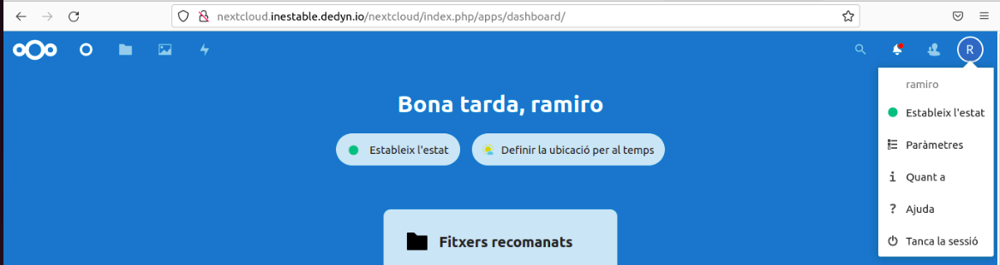{width=80%}

## Certificat Let’s Encrypt

Farem el certificat en [Let's Encrypt](https://certbot.eff.org/instructions?ws=apache&os=debianbuster)

Seguint els pasos que ens diu ho farem amb [certbot](https://certbot.eff.org/)

Mitjançant snap

```bash
sudo snap install core; sudo snap refresh core
sudo snap install --classic certbot
```

Fem un enllaç a /usr/bin/cerbot per asegurar-nos que es pot executar

```bash
sudo ln -s /snap/bin/certbot /usr/bin/certbot
```

Per obtenir un certificat i que Certbot edite la configuració d'apache automàticament, activant l'accés HTTPS en un sol pas.

```bash
sudo certbot --apache
```

El crea una carpeta dins de /etc on guarda els certificats

```bash
root@inestable:/etc/letsencrypt/live/inestable.dedyn.io# ls
cert.pem  chain.pem  dhparam.pem  fullchain.pem  privkey.pem  README
```

Els certificats de Let's Encrypt només són vàlids durant noranta dies.
Verificació de la renovació automàtica de Certbot, ja s'encarrega afegint un script de renovació a /etc/cron.d per verificar que funciona.

```bash
sudo certbot renew --dry-run
```

Ara simplement dins de /etc/apache2/sites-enables/inestable.dedyn.io afegim en e'apartat de virtualhost *:443 l'encriptat si no ho haguera fet automaticament.

```bash
 ### LOCATION OF CERT FILES ###

    SSLCertificateChainFile /etc/letsencrypt/live/inestable.dedyn.io/chain.pem
    SSLOpenSSLConfCmd DHParameters /etc/letsencrypt/live/inestable.dedyn.io/dhparam.pem
    Protocols h2
    SSLEngine on
    SSLCertificateFile /etc/letsencrypt/live/inestable.dedyn.io/cert.pem
    SSLCertificateKeyFile /etc/letsencrypt/live/inestable.dedyn.io/privkey.pem
    SSLCACertificateFile /etc/letsencrypt/live/inestable.dedyn.io/chain.pem
    SSLVerifyClient none
```

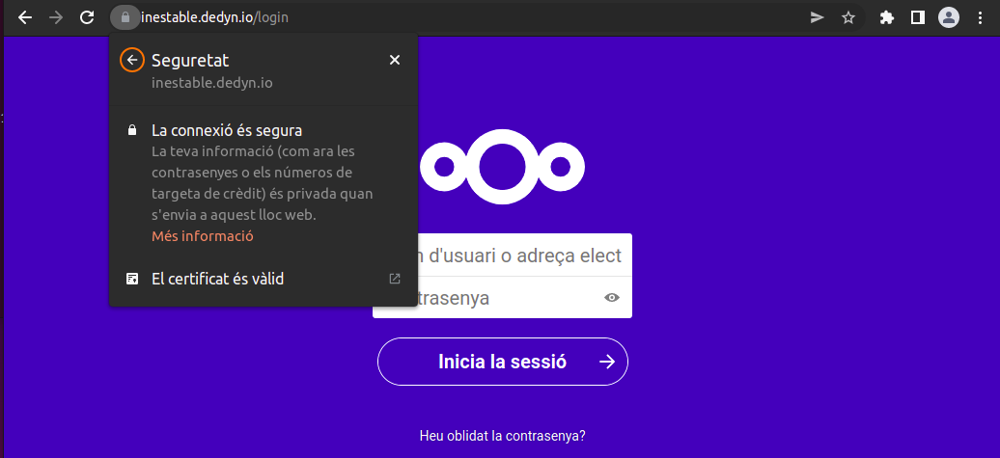{width=80%}

:::{.rmdtip data-latex="{la mateixa forma}"}
Es faria de la mateixa forma per a Zoneminder, el servidor web o el sevei que volem tindre el certificat.
:::

::: {.rmdinfo .centre data-latex="{primera versio}"}
Aquest procediment el vaig fer en la primera versio de les proves, en Virtual Box, on el servei de nextcloud estava directament en inestable.dedyn.io, per a fer-lo en subdominis em pareix que hem de crear un registre txt amb una clau que el dona al fer el certificat, per demostrar que tens control sobre el DNS.
:::

## Configuracio d'aplicacions Nextcloud

Ara soles quedaria la configuracio de les aplicacions dins de Nextcloud, com [Collabora](https://nextcloud.com/collaboraonline/), [Talk](https://nextcloud.com/talk/), afegir recursos externs (li afegirem la carpeta de videos editats de Truenas), Compartir carpetes per a grups ...

Seria anar a Aplicacions en l'administrador i seleccionar les que volem.

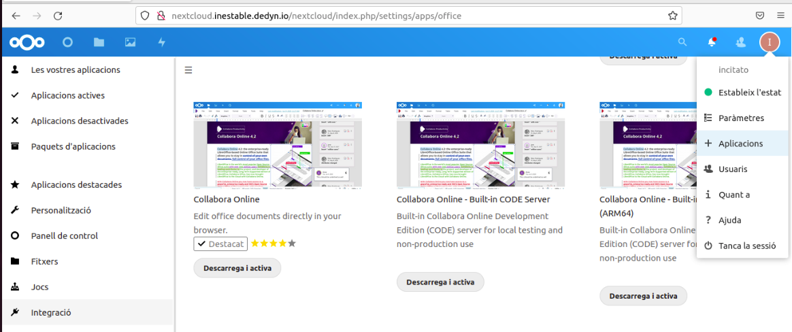{width=80%}

:::{.rmdtip data-latex="{Tip}"}
Es recomana per a TALK crear un altre recurs DNS i configurar el protocol STUN Session Traversal Utilities for NAT (STUN) permet que un dispositiu descobrisca la seua adreça IP pública. Si es descobreix l'adreça IP pública tant de la persona que truca com de la persona que truca, és possible establir una connexió directa entre la persona que truca i la persona que truca, que normalment es coneix com a trucada d'igual a igual.
Seria cosa de configurar pfSense aquest port i tocar les Qos.
Queda pendent
:::
