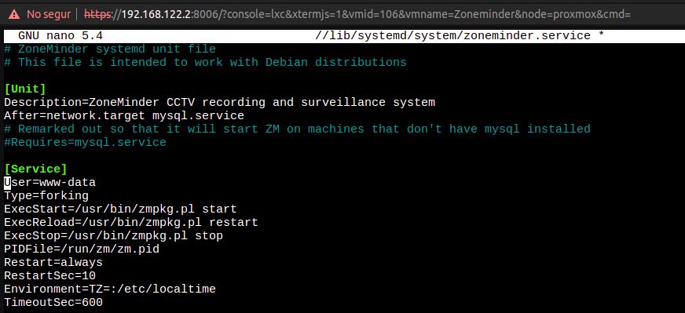
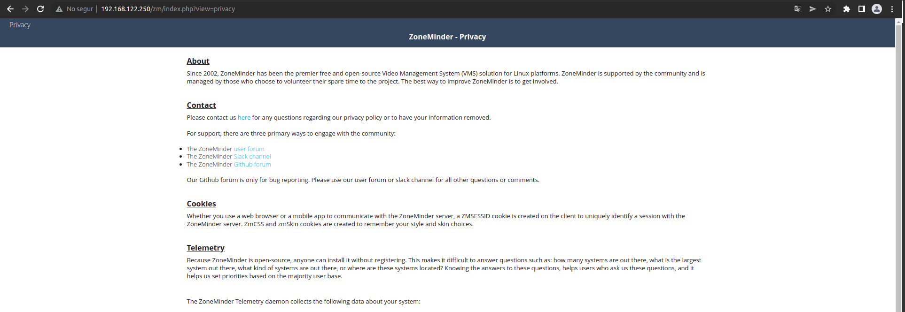
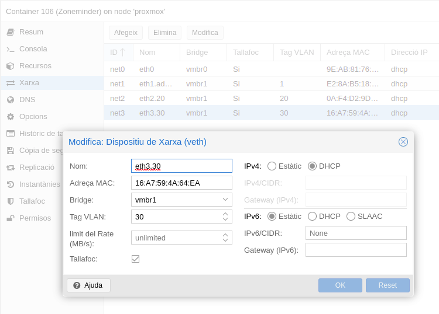

# Zoneminder


[Fulla oficialzoneminder](https://zoneminder.com/downloads/)

[Resenya](https://community.home-assistant.io/t/my-opinion-zoneminder-vs-motioneye-vs-shinobi/316831)

[VM zonaminder turnkey](https://www.turnkeylinux.org/zoneminder)

[Documentacio oficial](https://zoneminder.readthedocs.io/en/latest/userguide/definemonitor.html)

Per provar el servei de zoneminder, crec que no és necessari una VM dedicada. Amb un contenidor LXC tenim suficient, a més, tampoc és un servei molt intensiu d'ús de recursos del sistema. Per la forma que s'utilitzara, no es faran servir les opcions de reconeixement d'esdeveniments i detecció de moviment, és soles per gravar video o veure-ho en directe d'una forma senzilla. Es pot fer servir directament VCL per a veure les càmeres en directe, o connectar a la web de la camera, l'aplicació és soles per a facilitar l'ús.

La forma de funcionament de les càmeres ip ens permet poder adoptar multitud d'opcions a l'hora de fer la captura de les imatges, des de poder desar-les en un servidor ftp, per samba... directament de la camera, sense fer ús de cap programa intermedi, a poder ser gestionades des d'alguna aplicació que és la que realitzara la captura, com OBS que ens permet retransmetre després en streaming o guardar. O podem habilitar altres aplicacions per poder veure en directe el que està passant, gravar-ho o veure arxius antics, es sembla molt a un NVDR, per això provarem aquesta tecnologia encara que es podem implementar amb convicció de diverses solucions sobre el mateix recurs de disc, per compartir de diferents formes segons les necessitats de l'usuari, i els permisos que els volem donar.

Seguint els passos de la [guia oficial](https://wiki.zoneminder.com/Debian_11_Bullseye_with_Zoneminder_1.36.x)

Instal·lar debian base amb LAMB, aprofitem el contenidor que hem creat an Proxmox, el 106 LXC

```bash
$ apt install apache2 mariadb-server php libapache2-mod-php php-mysql lsb-release gnupg2
```

Assegurem mariadb

```bash
$ mysql_secure_installation
```

Afegim el repositori de zoneminder a /etc/source.list

```bash
$ echo "deb https://zmrepo.zoneminder.com/debian/release-1.36 "`lsb_release -c -s`"/"\
>> /etc/apt/sources.list.d/zoneminder.list
```

La clau, actualitzem i instal·lem

```bash
$ wget -O - https://zmrepo.zoneminder.com/debian/archive-keyring.gpg | apt-key add -
$ apt-get update && apt install zoneminder=1.36.11-bullseye1
```

Hem d'habilitar els serveis
 
```bash
$ systemctl enable zoneminder.service
$ systemctl start zoneminder
$ a2enconf zoneminder
$ a2enmod rewrite headers expires
$ service apache2 reload
```

::: {.rmdwarn data-latex="{Perill}"
Dona un error
root@Zoneminder:~# systemctl start zoneminder
Job for zoneminder.service failed because the service did not take the steps required by its unit configuration.
See "systemctl status zoneminder.service" and "journalctl -xe" for details.
:::

::: {.rmdtip data-latex="{Tip}"}
Per arreglar este [error](https://forums.zoneminder.com/viewtopic.php?t=28935) em de canviar en la configuracio /lib/systemd/system/zoneminder.service i descomentar **#User=www-data** 

{width=80%}
:::

Hebilitem els moduls

```bash
$ a2enmod cgi
$ a2enmod zoneminder
$ a2enmod rewrite
```

Reiniciem

```bash
# service apache2 reload
```

{width=80%}

Ja podem entrar en zoneminder per afegir les càmeres i configurar l'espai per a fer les còpies de seguretat

## LDAP Apache

[Apache with LDAP authentication](https://medium.com/@uri.tau/apache-and-ldap-cc7bff1f629d)
[Apache Web Server and LDAP](https://ldapwiki.com/wiki/Apache%20Web%20Server%20and%20LDAP)

Necesitem els moduls d'apache 
Ara mira per configurar els permisos per accedir al recurs.
Mirar LDAP d'accés a Apache ldap, authnz_ldap, proxy i proxy_http.

Els activem

```bash
a2enmod authnz_ldap proxy_http 
```

Configurem el servidor apache, en etc/apache/sites-avaible/el_nostre_ZM

```bash
<VirtualHost *:80>
 <Location />
  Order allow,deny
  Allow from all
  AuthName "AuthRequired"
  AuthType Basic
  AuthBasicProvider ldap
  AuthzLDAPAuthoritative on
  AuthLDAPURL "ldap://ldap.inestable.dedyn.io:389/ou=People,DC=inestable,
  DC=dedyn,DC=io?cn?sub?(objectClass=inetOrgPerson)"
  require valid-user
  require ldap-group CN=video,OU=Groups,DC=inestable,DC=dedyn,DC=io
 </Location>
</VirtualHost>
```

Tambe ho podem fer per zoneminder.conf, hem de canviar 

[Seguint els consells dáquesta fulla](https://forums.zoneminder.com/viewtopic.php?t=23886)

```bash
Below /zm Alias:
<Directory /usr/share/zoneminder/www>
AuthName "ZoneMinder Login"
AuthBasicProvider ldap
AuthLDAPURL "ldap://ldap.inestable.dedyn.io/ou=video,dc=inestable,dc=dedyn,dc=io"
Require valid-user
php_flag register_globals off
[...]
```

[Docu oficial](https://zoneminder.readthedocs.io/en/stable/installationguide/index.html)

::: {.rmdinfo .centre data-latex="{}"}
Pendent de provar refinar permisos, grups ... LDAP
:::

## VLAN

Aquesta màquina tindrà accés a tres VLAN LA de video per connectar en les càmeres, que no tenen internet, la privada per poder els usuaris de video accedir a les funcions de Zonaminder i veure privadament en streaming assajos, apache sols servira aquesta web per la xarxa de VLAN privat, gravar..., i la d’admim que és per on farem el compartiment de l'espai NFS o iSCI

### Configuracio de les targetes de xarxa

Li posarem 3 una per a cada VLAN connectades al pont de l'Open vswitch *vmbr1* configurem cadascuna de les VLAN amb el dhcp de pfSense, perque li done una IP estàtica, també a les càmeres que es compren, a més del DNS.

{width=60%}

::: {.rmdcuidao data-latex="{net0 l'esborrarem}"}
La net0 l'esborrarem o desactivarem quan estiga tot configurat, de moment és per la que estem administrant tots els serveis.
:::

## Configuració de les càmeres

Depenent la camera que es compre, es configurara el protocol que suporte, la majoria és RTSP, configuraren les IP de les càmeres com a fixes en la VLAN 30 i afegirem registre DNS per a cadascuna Cam1 cam2 ... 

Si esten en la VLAN de video, les podem connectar a qualsevol programa que vulguem gastar, des de l'editor de la taula de llums, l’OBS per fer streamin, inclos el VLC per fer captures o veureo en directe.

Es pot configurar en molte d'elles des del seu servidor web, que copien a un nas, servidor FTP... és una altra posibilitat per gestionar-les.

La configuració de l'app en si és deixa pendent per mes avant, quat es tinga la cam física.

[Documentació user Zoneminder](https://zoneminder.readthedocs.io/en/stable/userguide/index.html)

Vaig revisar la documentació oficial i ens deixa fer tot el que volem, 
Amb diversos modes de funcionament, el de reconeixement de moviments per detectar la presència de gent i registra els esdeveniments sospitosos, és el mes problematic en consum de CPU i memòria, pero realment no ens interessa, a no ser que es pose una camera per aquest propòsit.
El més interessant és el de gravació directa, i vista directa, que no consumeix molts recursos, ja que la codificació de video la fa la mateixa camera.
Des del mateix programa es poden visionar gravacions antigues, esborrar-les, descarregar-les ... No obstant aixo. Muntarem aquest recurs d'espai també en Nextcloud com a recurs extern. Donarem permís al grup de video, amb carpeta compartida de grup. Per facilitar les coses, i que puguen compartir amb usuaris no del grup video, que vulga tindre accés a un recurs determinat. Podent configurar des d’aci els permisos de validesa de temps, poder o no descarregar ... És molt flexible Nextcloud en aquest aspecte.

Tambe disposa d'app [ZoneMinder Client App](https://play.google.com/store/apps/details?id=com.lennycorp.zoneminderclient&gl=US) per android.

Pendent

## Espai d'emmagatzematge 

Aquest apart seria igual al que vam fer en Nextcloud, servir per NFS el dataset de video i muntar-lo en /mnt/video per a guardar alli les gravacions.

## Proves pendents
Està planejat fer proves fent servir [VLC](https://wiki.videolan.org/Documentation:Streaming_HowTo_New/) com a servidor RTSP, més avant, si no arriben les càmeres.

Exemple de servidor VLC l'escriptori per RSTP

```bash
vlc -I rc screen:// --sout="#transcode{vcodec=h264,vb=400,scale=0.25,fps=10}\
:rtp{dst=127.0.0.1,port=4444,sdp=rtsp://localhost:8080/test.sdp}"
```

Pendent
