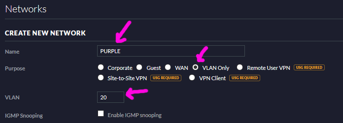
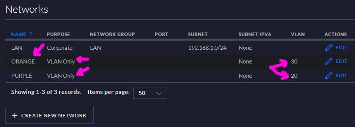
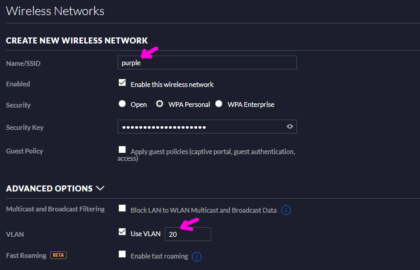

# Instal·lació de wifi

Es realitzara amb dues antenes UniFi, una en l'entrada del recinte, i l'altra en meitat de l'escenari, per donar bona cobertura al públic i els actors. Hi ha molts aparells per les parets i estructures metàliques que podrien afectar a la qualitat del senyal.

### Potència de la connexió d'internet per donar servei

Es requereix que l'amplada de banda de la connexió d'internet puga donar servei almenys a 92 espectadors, que és l'aforament del pati de butaques.

S'ha de limitar l'amplada de banda que oferim als espectadors. En cas de dur a terme la reproducció en línia al mateix temps. Açò ho realitzem assegurant l'amplada de banda en la xarxa del circuit d'imatge Qos en el pfSense, per a la VLAN 30, en la seua configuracio, pero s’han de fer proves per veure el valor òptim. Es recomana contractar una connexió d'amplada de banda minima 300Mb.

## Muntatge

Antena, una d'aquestes [Unifi](https://ui.com/wi-fi), recomane U6 Professional, pero no sé en les parets tan grans que hi ha en la sala, valdrà un sol per a tot l'espai. Es pot posar un altre repetidor sol per l'entrada. La idea, és fer tres xarxes. Una per al públic, en accés a internet i al servidor web intern de promocions d'espectacles. Una altra que tinga accés a la xarxa de l'oficina i recursos del servidor. I la tercera, soles per al tràfic de video, sense accés a internet, per poder utilitzar camera del movil en espectacles. No per al video de les càmeres IP que aniran per cable, molt més fiable que el wifi.

Les antenes proposades són PoE, les alimentarem amb el switch, pel cable de xarxa.

[Software i documentació](https://www.ui.com/download/unifi/default/default/unifi-dream-router-datasheet), posar-lo en una VM, en el servidor.
[Paquet .deb](https://dl.ui.com/unifi/7.1.61/unifi_sysvinit_all.deb), per instal·lar en la màquina que fem servir de servidor. min 2GB de Ram, 20 GB hd.
[Especificacions antena pro](https://dl.ui.com/ds/u6-pro_ds)

## Com fer-ho

Documentació

[unifi wifi en pfsense](https://www.adamintech.com/ubiquiti-unifi-with-pfsense-and-other-routers/)
[vlan wifi](https://blog.barclayhowe.com/setting-up-a-vlan-in-pfsense-and-unifi/)
[video configuracio](https://lawrence.technology/networking/unifi-pfsense-deployment-setup-and-planning-with-wifi-vlan-guest-network/)
[Configuracio VLAN pública, sols internet](https://brendonmatheson.com/2020/03/14/unifi-ap-with-pfsense-vlans.html)

Configurarem dos punts d'accés WiFi autònoms que funciona per si sol i que depenen d'un encaminador independent per a DHCP/encaminament a Internet. Per a això, utilitzarem punts d'accés WiFi autònoms amb Ubiquiti UniFi.

La Ubiquiti UniFi AP-AC Lite admet una velocitat wifi de fins a 300 Mbps a 2,4 GHz i 867 Mbps a una freqüència de 5 GHz.

Els productes UniFi d'Ubiquiti usen "controlador de xarxa UniFi", que és un programari que s'executa al vostre ordinador/servidor per gestionar diversos punts d'accés i configuració/provisionalment. És necessari per al subministrament per primera vegada del nostre punt d'accés UniFi, però no és necessari que s'execute constantment, ja que tota la configuració s'emmagatzema al mateix dispositiu.

Comencem baixant l'instal·lador des d'aci [UniFi-Installer](https://dl.ui.com/unifi/5.11.46/UniFi-installer.exe) per a windows. El controlador de xarxa UniFi depen de Java per funcionar.

### Procediment

* Definiu les VLAN i les subxarxes a pfSense
* Configureu DHCP a pfSense
* Configureu les regles del tallafoc a pfSense
* Mapar les VLAN al controlador UniFi
* Definiu els SSID WiFi al controlador UniFi
  
::: {.rmdinfo data-latex="{}"}
Els tres primers passos els tenim en l'apartat de pfSense
:::

xarxes a configurar

* Privada VLAN 20
* Pública VLAN 40
* Video, No internet VLAN 30

La diferència entre aquests és que la xarxa pública pot accedir als recursos de la xarxa interna, Nextcloud, registrador de video, la publica soles a internet, i la de video soles a la seua xarxa ...

### Assigna les VLAN al controlador UniFi

A continuació, anem a UniFi Controller per assignar les VLAN als SSID WiFi

* A la configuració, feu clic a Xarxes i després a Crea una xarxa nova.
* Seleccioneu VLAN Només per al propòsit, poseu un nom a la xarxa Privat i doneu-li l'etiqueta VLAN 20 com vam fer a pfSense

{width=50%}

* Deseu la xarxa i feu el mateix per definir la VLAN Pública
* Després de desar aquestes dues xarxes, es mostraran a la llista de xarxes; confirmeu que són correctes

{width=50%}

#### Definiu els SSID de WiFi a UniFi Controller

A continuació, crearem els SSID de WiFi i els enllaçarem a les nostres VLAN

* Al menú Configuració, trieu Xarxes sense fil (just a sobre de Xarxes) i feu clic a Crea una xarxa sense fil nova
* Doneu el nom SSID "Privat" i configureu el xifratge com corresponga (p. ex. WPA-PSK)
* Feu clic a Opcions avançades per mostrar el camp de l'etiqueta VLAN i introduïu 20 perquè aquest SSID gestionarà el trànsit de la VLAN Privat.

{width=50%}

La publica i video, de la mateixa forma.

::: {.rmdinfo data-latex="{}"}
Les imatges de configuració tretes de la fulla web de l'exemple, per no disposar de les antenes ni usuari registrat per al programa.
:::

### unifi-pfsense, on instal.lar el controlador de les antenes

::: {.rmdcuidao data-latex="{usuari registrat}"}
El programa de configuració, no el podem utilitzar fins que no tinguem les antenes i l'usuari registrat, es deixa pendent de configurar.
:::

Un script que instal·la el programari UniFi Controller a pfSense i altres sistemes FreeBSD
[repositori](https://github.com/unofficial-unifi/unifi-pfsense)

:::{.rmdwarn data-latex="{Perill}"}
Perill, es trenca si pfSense està en MBR
Aquest script destruirà un sistema BIOS heretat arrencat des d'un volum arrel ZFS amb format MBR Per evitar aquest problema, utilitzeu el mode UEFI si està disponible, feu servir particions GPT o utilitzeu un sistema de fitxers diferent de ZFS.
:::

L'actualitzador de pfSense eliminarà tot el que instal·leu que no haja arribat a pfSense, inclosos els paquets instal·lats per aquest script.

Després d'actualitzar pfSense, haureu de tornar a executar aquest script per restaurar les dependències i el programari.

Massa pegues. Ho instal·larem en una LXC soles per aquest proposit, una vegada configurades les antenes el programa soles ens fa falta per si volem fer auditories de les connexions, apagarem el contenidor, i el tindrem reservat per si es vol canviar la configuració.
