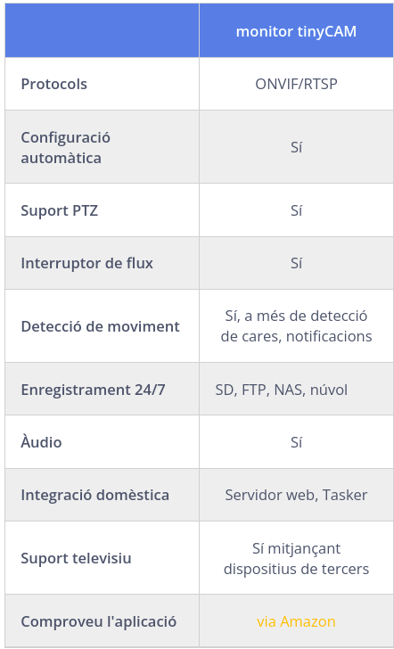
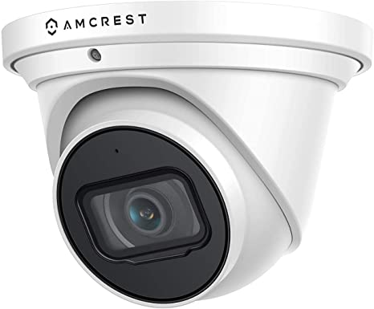
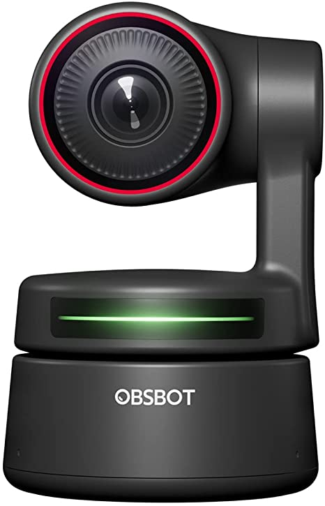

# Reproducció en línia

*Implantació d'un sistema de reproducció en línia per a la sala*

Es vol posar un sistema de streaming per a la sala per a les representacions, o per tindre una còpia de les obres per poder-les editar més tard.

## Materials

*Es requeriria*

1. **Servidor**, podria ser un ordinador de sobretaula, es pot mirar el que es gasta ara per a la venda d'entrades, per veure si compleix els requisits mínims per als serveis que finalment es volen donar, o un servidor dedicat, on centralitzem tots els serveis. (Comentaré aquest cas en l'apartat servidor)

2. **Un servidor de disc**, que podria ser el servidor dels altres apartats per guardar una còpia de les diferents càmeres. Si hi ha pressupost, es faria un [RAID 5](https://ca.wikipedia.org/wiki/RAID).

3. **Càmeres ip** i millors **micròfons** que envien el so per la connexió de xarxa de la càmera.

4. [**Switch**](https://www.vadavo.com/blog/switch-poe-que-es-y-que-tipos-hay/) [**PoE**](https://ca.wikipedia.org/wiki/Power_over_Ethernet), es podria posar una de 4 ports en l'escenari, per a facilitar l'escalat posterior del projecte que no són massa cars, i un switch (aquest no PoE) en les oficines per centralitzar la xarxa. Tirar cable entre ells i les càmeres. Reduint la distància del PoE a les càmeres ip.

::: {.rmdtip data-latex="{Consell}"}
Examinat la distribució del teatre, el millor és fer una topologia senzilla de la xarxa, Posar un switch i el servidor, en el quarto de les llums que està centrat, seria un bon joc, i d'alli traure cables a la resta dels departaments.
:::

5. **Conte** en una plataforma de streaming de l'elecció de la sala, youtube, [twitch](https://www.twitch.tv/).

6. **Programa de streaming** (OBS, Livestream Studio, Wirecast, vMix, mimoLive o Tricaster) alternatives gratuïtes.

7. Un ordinador o portàtil que duga a terme les tasques de **producció**, podria ser un dels ordinadors de l'empresa que gasta per a disseny, s'utilitzaria en el moment de fer la producció en viu. Per a fer streaming d'una obra editada a posteriori, de les còpies fetes en el servidor de disc, no faria falta.

## Projecte d'instil·lació

Es faria fent tres xarxes diferents, una per al circuit d'imatge i so de les càmeres, altra per al wifi de la sala i la tercera per als equips d'administració. Per això, necessitem un switch en l'oficina que puga fer diverses xarxes virtuals, per tindre-les separades. (no volem que un espectador puga entrar en els ordinadors de l'oficina, o sature internet i done latència al streaming)

## Software

Programes de streaming, OBS, Livestream Studio, Wirecast, mimoLive.

Es recomana per a començar OBS o Livestream, en cas que l'ordinador que farà de centre de producció siga un Mac, l'opció serà OBS.

| **Programes**                                | **Desc**                                          |
|:---------------------------------------------|---------------------------------------------------|
| [OBS](https://obsproject.com/)               | Programari gratis per a gravar video i streaming. |
| [Livestream Studio](https://streamlabs.com/) | Per a Windows                                     |
| [Wirecast](https://www.telestream.net/)      | De pagament.                                      |
| [MimoLive](https://mimolive.com/)            | Pagament processional.                            |

## Hardware necessari

### Servidor

Es comenta que es pot reutilitzar l'ordinador que es te en venda d'entrades, es pot mirar a veure si compleix els requisits mínims requerits. En principi, no crec que faça falta un massa potent per al que volem posar.

En el servidor s'implementaran serveis de DNS, Servidor de fulles web, (controlador de domini, no crec que siga necessari, però es pot posar també, si volem controlar els recursos que tinga accés cada membre)

Es podia discutir si interessa un sistema de comunicacions intern, per poder comunicar mitjançant so, vídeo o xat entre el control i l'escenari. o volen passar informació en temps real als actors en l'escenari des de control. hi ha diverses opcions lliures, per exemple [Jitsi meet](https://meet.jit.si/), hauria de mirar-ho, ho he de provar varie vegades, i no he pogut fer-lo funcionar, es cosa d'insistir. Aço li donaria un poc mes de faena al servidor, però com no serien molts interlocutors, no crec que requerisca massa potencia.

Es podria posar també un sistema de [cloud](https://nextcloud.com/) intern, que ja integra les videoconferències i moltes més coses per al treball en equip, però supose que amb un equip reduït, igual no val la pena, si soles es local, i la gent treballa des de casa la major part del temps. Es pot contractar un conte en línia, però ja s'està gastant el drive. Es pot fer una demo, i si interessa es deixa.

Sistema de correu intern, no li veig massa sentit, però es pot posar.

Al servidor de web, es pot instal·lar una còpia de WordPress, per si es vol experimentar com es veuen les coses abans de publicar-les. Es pot configurar perquè cada usuari de la sala tinga el seu directori per penjar les seues fulles.

Crec que seria interessant, per servir presentacions de les obres que es van a representar, si al final s'instal·la wifi en la sala, que tinguen una primera fulla al connectar, on es parle de l'obra que van a veure, de les pròximes que es representaran una fulla, o on es puga interactuar amb ells, passant qüestionaris, convidant-los a fer comentaris ... ( açò es intern i soles es pot realitzar amb la gent que es connecte al wifi)

En principi l'ordinador per fer el streaming, ha de tindre una targeta de vídeo mitjanament potent, no crec que siga el cas del servidor, aquest no requereix ni pantalla una vegada instal·lat, es gastaria algun altre disponible en la sala, en cas necessari, ho podíem fer també en aquest, però va augmentant el nivell de requisits mínims de potència.

`Si se m'ocorre alguna cosa més la posaré, o ja em digueu.`

### Servidor de disc

Si es volen guardar les còpies de les càmeres, i la idea es no fer un streaming pur, més bé editar a posteriori les imatges, o tindre una còpia dels assajos per veure en què es pot millorar, es requeriria espai per fer aquestes còpies. Hi ha dues possibilitats.

- [NAS](https://en.wikipedia.org/wiki/Network-attached_storage), sistema de disc en xarxa, La millor opció.

- Que la torre que gastem de servidor , faça de servidor de disc, on es pot implementar configurar RAID en diferents tipus de redundàncies, segons el nombre de discs durs que tinguem, i si ens interessa més la velocitat o la redundància.

### Càmeres ip

Hi ha dos tipus de càmeres ip que ens vindrien bé, unes són del tipus [PTZ](https://ca.wikipedia.org/wiki/C%C3%A0mera_PTZ) es poden controlar remotament, i altres que són fixes, més barates. Es podria fer una mix dels dos tipus, la frontal a l'escenari, podria fer fixa, i en algun lateral posar una amb moviment.

El projecte es pot implantar per fases, primer provar en una, i si dona resultat anar ampliant, segons necessitats.

Per les característiques dels espectacles, es requeriria càmeres amb bona lluminositat, bones lents, açò augmentara el pressupost, pero segons les capacitats es pot anar fent, i millorar si es considera que val la pena.

Les càmeres i el muntatge està pensat per poder ser fàcilment desmuntable i transportat en cas de tindre la necessitat de realitzar l'espectacle extern a la sala. O reutilitzar el material obsolet per aquest fi.

`Llista provisional de recerca de càmeres i marques.`

- [camera en amazon zowietek](https://www.amazon.es/dp/B086X637W2?ref_=as_li_ss_tl&language=en_US&linkCode=gs2&linkId=a19d43bd6c875dd9cde44b1b4f5a3776&tag=getlockers0f8-21&th=1)

- [Axis](https://www.axis.com/en-us/products/axis-v59-series)

- [Getlockers](https://getlockers.com/best-ptz-camera-for-live-streaming/)

- [Ptzoptics](https://ptzoptics.com/sdi/)

### El compte del streaming

És traure un compte en alguna de les plataformes que existeixen, ja teniu un compte en youtube, es pot gastar eixa o traure en [twitch](https://www.twitch.tv/), a veure quina deixa configurar més la pàgina d'inici, es pot crear una nova on enllaçar els continguts, o integrar-los en les fulles de l'empresa.

## Muntatge

Faré proves de tot açò i penjaré el resultat de com es fa.

## càmeres

L'únic requisit és que totes les vostres càmeres IP, independentment del fabricant, siguen compatibles amb el protocol ONVIF o el flux RTSP/MJPEG.

Les millors aplicacions de visualització de càmeres IP per a dispositius Android

**monitor tinyCAM**
El monitor tinyCam ve en dues versions, la gratuïta amb funcions limitades i la versió professional de pagament. El bàsic pot funcionar bé si busqueu alguna cosa senzilla.
Utilitza el protocol ONVIF, la transmissió RTSP, etc., i pot transmetre en directe el canal de vídeo sense cap retard.
La versió de pagament és d'uns 5 dòlars i és un pagament únic.
Podeu utilitzar aquesta aplicació per veure la vista en directe de les vostres càmeres

## La gravadora (NVR)

En un sistema de càmeres de seguretat IP, el NVR (Network Video Recorder) és central que gestiona i emmagatzema les imatges de vídeo. Totes les càmeres IP enviaran les seues dades a les gravadores des de les quals podeu visualitzar en directe o fer còpies de seguretat de les gravacions.

L'NVR està especialitzat a fer funcionar la càmera sense problemes, utilitzen diversos algorismes de compressió per gestionar i emmagatzemar el metratge de manera eficient. Depenent de la marca, podeu instal·lar 1-4 peces d'un disc dur a l'NVR.
La qualitat de la imatge dels vídeos depén de la càmera (no de l'NVR), com més alta siga la resolució i més clara siga la imatge. Tots els sistemes de càmeres enumerats en aquesta guia ofereixen imatges d'alta resolució (4MP o més).

[camera amcrestultra hd 4k](https://www.amazon.es/dp/B07RYBHWZM/ref=as_li_tl?ie=UTF8&linkCode=gs2&linkId=5ffd9566b7959f94208952ac3587cf3e&creativeASIN=B07RYBHWZM&tag=rhp15904-21&creative=9325&camp=1789)
Amcrest UltraHD 4K (8MP) Càmera PoE de Seguridad IP para Exteriores, 3840 x 2160, 164 pies de visión Nocturna, Lente de 2,8 mm, IP67 Resistente a la Intemperie, grabación MicroSD **239,68€**
**Cuenta con una capacidad mejorada de poca luz utilizando el último sensor de imagen IMX274 Sony Starvis y el chipset S3LM Ambarella.**

 CCTV AND NVR SOLUTION INSTALLATION GUIDE FOR UBUNTU 20.04 LINUX!
 [install](https://hendgrow.com/2020/12/30/33-cctv-and-nvr-solution-installation-guide-for-ubuntu-20-04-linux/)

[Location of text walk through:](https://hendgrow.com/ugs/HendGrow_CCTV_Text_Guide.txt)

    Guide Start

    Download the install script
    $ sudo wget https://gitlab.com/Shinobi-Systems/Shinobi-Installer/raw/master/shinobi-install.sh
    $ sudo chmod 777 shinobi-install.sh
    $ sudo ./shinobi-install.sh

    Installtion prompt responses 
    ---------------------------------------------
    Install the Development branch?
    (y)es or (N)o? Default : No
    ->No
    ---------------------------------------------
    ========
    Select your OS
    If your OS is not on the list please refer to the docs.
    ========
    1. Ubuntu - Fast and Touchless
    2. Ubuntu - Advanced
    3. CentOS
    4. CentOS - Quick Install
    5. MacOS
    6. FreeBSD
    7. OpenSUSE
    ========
    -> 1
    ---------------------------------------------
    Shinobi - Do you want to temporarily disable IPv6?
    Sometimes IPv6 causes Ubuntu package updates to fail. Only do this if your machine doesn't rely on IPv6.
    (y)es or (N)o
    -> Y
    ---------------------------------------------
    =====================================
    ||=====   Install Completed   =====||
    =====================================
    || Login with the Superuser and create a new user!!
    ||===================================
    || Open http://172.16.195.4:8080/super in your web browser.
    ||===================================
    || Default Superuser : admin@shinobi.video
    || Default Password : admin
    =====================================
    =====================================
    -----------------------------------------------

    Once you have created your admin user under the /super url navigate to http://YOUR_RPI_IP_ADDRESS and login with the credentials you created.

• 720p outdoor analog and IP PoE PTZ security camera price would be $70-$200.
• 1080p PoE PTZ IP camera price is typically $130-$400.
• 4MP (1440p) & 5MP outdoor PoE PTZ IP camera price is $200-$600.
• The 4K Ultra HD outdoor PTZ security camera price range is $1000-$3000.
• The price of outdoor PoE PTZ dome cameras with auto motion tracking is $300-$700.

## Zoneminder

[Fulla oficialzoneminder](https://zoneminder.com/downloads/)
[Resenya](https://community.home-assistant.io/t/my-opinion-zoneminder-vs-motioneye-vs-shinobi/316831)
[VM zonaminder turnkey](https://www.turnkeylinux.org/zoneminder)
[Documentacio oficial](https://zoneminder.readthedocs.io/en/latest/userguide/definemonitor.html)

Track Motion
Aquesta i les quatre opcions següents s'utilitzen amb la funció de moviment experimental. Això només funcionarà si la vostra càmera admet modes de moviment mapejat en què un punt d'una imatge es pot assignar a una comanda de control. Això és generalment més comú a les càmeres de xarxa, però es pot replicar fins a cert punt en altres càmeres que admeten modes de moviment relatiu. Consulteu la secció Control de la càmera per obtenir més detalls. Marqueu aquesta casella per activar el seguiment de moviment.

**estimacio de memoria que necesita**
[ref](https://zoneminder.readthedocs.io/en/latest/faq.html)

Min Bits of Memory = 20% overhead *(image-width*image-height*image buffer size*target color space*number of cameras)
image-width i image-height són l'amplada i l'alçada de les imatges per a les quals està configurada la càmera (en el meu cas, 1280x960). Aquest valor es troba a la pestanya Font de cada monitor
La mida de la memòria intermèdia és el nombre d'imatges que ZM conservarà a la memòria (ZM l'utilitza per assegurar-se que té imatges prèvies i posteriors abans de detectar una alarma; molt útil perquè quan es detecta una alarma, el motiu de l'alarma pot ser sortir de la vista i un buffer és realment útil per a això, inclòs per analitzar estadístiques/puntuació). Aquest valor es troba a la pestanya de memòria intermèdia de cada monitor
L'espai de color objectiu és la profunditat de color: 8 bits, 24 bits o 32 bits. Torna a estar a la pestanya font de cada monitor

La sobrecàrrega del 20% a la part superior del càlcul per tenir en compte les despeses generals d'imatge/stream (aquesta és una estimació)

El desglossament matemàtic de 4 càmeres amb captura de 1280 x 960, memòria intermèdia de 50 fotogrames, espai de color de 24 bits:

    1280*960 = 1,228,800 (bytes)
    1,228,800 * (3 bytes for 24 bit) = 3,686,400 (bytes)
    3,686,400 * 50 = 184,320,000 (bytes)
    184,320,000 * 4 = 737,280,000 (bytes)
    737,280,000 / 1024 = 720,000 (Kilobytes)
    720,000 / 1024 = 703.125 (Megabytes)
    703.125 / 1024 = 0.686 (Gigabytes)

Uns 700 MB de memòria.

Així que si teniu 2 GB de memòria, hauríeu d'estar tot a punt. Dret? No, realment:

- Aquesta és només la memòria base necessària per capturar els fluxos. Recordeu que ZM sempre està capturant fluxos, independentment de si realment esteu gravant o no, per assegurar-vos que el seu buffer d'anell d'imatge hi hagi amb imatges prèvies quan s'activa una alarma.
- També heu de tenir en compte altres processos no relacionats amb ZM que s'executen a la vostra caixa
- També heu de tenir en compte altres processos ZM; per exemple, em vaig adonar que el dimoni d'auditoria ocupa una bona quantitat de memòria quan s'executa, les actualitzacions de la base de dades també ocupen memòria.
- Si utilitzeu la codificació H264, també emmagatzema molts fotogrames a la memòria.

Per tant, una bona regla general és assegurar-vos que teniu el doble de memòria que el càlcul anterior (i si feu servir el servidor ZM per a altres propòsits, tingueu en compte aquests requisits de memòria també).

Recordeu també que per defecte ZM només utilitza el 50% de la vostra memòria disponible tret que la canvieu

Com a resultat, ZM utilitza memòria mapejada i, de manera predeterminada, el 50% de la vostra memòria física és el que arribarà. Quan arribeu a aquest límit, ZM es descompon amb diversos errors.

Una bona manera de saber quanta memòria s'assigna a ZM per al seu funcionament és fer adf -h

**cpu**

Els diferents elements de ZoneMinder poden estar implicats en una activitat força intensa, especialment mentre s'analitzen imatges per veure'n el moviment. Tanmateix, en general, això no hauria d'aclaparar la vostra màquina tret que sigui molt antiga o amb poca potència.

- unció d'execució. Òbviament, l'execució en els modes Record o Mocord o en Modect amb molts esdeveniments genera molta activitat de base de dades i fitxers i, per tant, augmentarà la CPU i la càrrega.
- Zones de detecció predeterminades bàsiques. Per defecte, quan s'afegeix una càmera, s'afegeix una zona de detecció que cobreix tota la imatge amb un conjunt de paràmetres per defecte. Si la vostra càmera cobreix una vista en la qual és poc probable que diverses regions generin una alarma vàlida (és a dir, el cel), experimentaria amb la reducció de la mida de les zones o afegint zones inactives per esborrar àrees que no voleu controlar.
- Per exemple, si tinc un dimoni "zma" ​​en execució per a un monitor que està capturant una imatge. He comentat l'anàlisi real, així que tot el que fa és combinar la imatge amb l'anterior. En mode de color, això triga ~ 11 mil·lisegons per fotograma al meu sistema i la càmera està capturant a ~ 10 fps. Si utilitzeu 'superior', s'informa que el procés fa servir el ~5% de la CPU i que està permanentment en estat R(un). En canviar al mode d'escala de grisos, la combinació triga ~ 4 ms (com és d'esperar, ja que és aproximadament un terç d'11), però la part superior informa que el procés és ara amb 0% de CPU i permanentment en estat S (leep). Per tant, un canvi real d'ús de recursos de la CPU d'un factor de 3 provoca grans diferències en l'ús de la CPU informat.

*CPU en camara ip*

En mode modect

 Les càmeres IP requereixen un nivell addicional de processament a les targetes analògiques, ja que les imatges jpg o mjpeg s'han de descodificar abans d'analitzar-les. Això necessita grunyits. Si teniu moltes càmeres, necessiteu molts grunyits.

*solucions*
- Augmenta la memòria RAM. Si el vostre sistema ha d'utilitzar l'intercanvi de disc, afectarà Enormement el rendiment en totes les àrees.
- Zoneminder també funciona molt bé amb diversos sistemes de processadors fora de la caixa (si SMP està habilitat al vostre nucli). La càrrega de diferents càmeres es distribueix entre els processadors.

*

**Disc dur**

Com a guia ràpida, tinc 4 càmeres a 320x240 que emmagatzemen 1 fps excepte durant els esdeveniments d'alarma. Després d'1 setmana, s'han utilitzat 60 GB d'espai al volum on s'emmagatzemen els esdeveniments (/var/www/html/zm).
[Calcul de espai](https://www.digitalrebellion.com/webapps/videocalc)
  
    Format HDV 1080
    Resolution 1440x1080
    Frame rate 25
    Video length 1 hours
    Total space: 10.99 GB

    Format H.264 1080
    Resolution 1920x1080
    Frame rate 25
    Video length 1 hours
    Total space: 36.17 GB

**Auto trackin**

zoneminder auto tracking zmtrack.pl

**xarxa**
*RTSP,*
1920 x 1080 at 60 FPS requires a bitrate or 12,288 Kb/s while the
same resolution at 30 FPS only requires a bitrate of 8,192 Kb/s.

*RTMP*
    1920x1080@60fps
    bitrate = 4,500 - 9,000 Kbps
    i-frame interval: 120 (2 seconds)
    CBR

    1920x1080@30fps
    bitrate = 3,000 - 6,000 Kbps
    i-frame interval: 60 (2 seconds)
    CBR

Camera Settings for Low Light Performance
Resolution: 1920x1080p 30fps
Camera Aperture: small such as 1.8
Camera Shutter Speed: slow 1/120
Camera Focus: Manua

Low Light: Noise Reduction
2D Noise Reduction: Ideal for scenes
with a lot of movement.
3D Noise Reduction: Ideal for static
fields of view.
Tip: Try using a combination of 2D & 3D
Noise Reduction for best results

## Motioneye

## camare ip barates

[OBSBOT Tiny](https://www.amazon.com/-/es/autom%C3%A1tico-conferencia-omnidireccionales-seguimiento-transmisi%C3%B3n/dp/B09MVVVWS8/ref=sr_1_9?keywords=auto+tracking+ptz+camera&qid=1652033445&sr=8-9) PTZ Cámara web 4K, encuadre y enfoque automático, cámara de video conferencia 4K con micrófonos omnidireccionales duales, seguimiento automático con cardán de 2 ejes, HDR, 60 FPS, corrección de poca luz, transmisión  US$269.00 usb

Amcrest Cámara 4K POE AI Detección humano/vehículo, UltraHD 8MP Torreta de seguridad para exteriores POE Cámara IP, 3840x2160, gran angular, IP67 resistente a la intemperie, MicroSD, micrófono integrado, blanco (IP8M-T2669EW-AI)
[amcerest](https://www.amazon.com/-/es/Detecci%C3%B3n-exteriores-resistente-intemperie-IP8M-T2669EW-AI/dp/B08NXX27FR/ref=psdc_14241151_t2_B07RHQGS8V) US$139.99 [espaecificacions](https://m.media-amazon.com/images/I/71pf6+6KYIL.pdf)

Amcrest Cámara IP PoE con torreta AI de color nocturno con visión nocturna a todo color
[Amcrest Cámara IP PoE  5Mp](https://www.amazon.com/-/es/seguridad-micr%C3%B3fono-integrado-detecci%C3%B3n-IP5M-T1273EW-AI/dp/B093X7W3GM/ref=sr_1_5?__mk_es_US=%C3%85M%C3%85%C5%BD%C3%95%C3%91&crid=3OFUNOR4E9A7V&keywords=poe+8mp+night+colour+security+camera&qid=1652036679&sprefix=camara+seguridad+poe+8+mp+color+nocturna%2Caps%2C192&sr=8-5) US$89.99

Noise Reduction 3D DNR
Storage FTP,
Protocol IPv4, IPv6, HTTP, TCP, UDP, RTSP, TCP, RTMP, SMTP, FTP, DHCP,
DDNS, UPnP, NTP

LA fixa [Amcrest UltraHD 4K (8 MP) POE IP, cámara exterior, 3840 x 2160, 131 pies NightVision](https://www.amazon.es/Amcrest-NightVision-resistente-intemperie-IP8M-2496EW-28MM/dp/B08SMPGF2L/ref=sr_1_1_sspa?__mk_es_ES=%C3%85M%C3%85%C5%BD%C3%95%C3%91&crid=B563YL5W8NZG&keywords=Amcrest&qid=1652041726&sprefix=amcrest%2Caps%2C93&sr=8-1-spons&psc=1&spLa=ZW5jcnlwdGVkUXVhbGlmaWVyPUEzNU04RVpYSEg2MTNDJmVuY3J5cHRlZElkPUEwODgxOTQwRDUzMkNEVUg0QUVIJmVuY3J5cHRlZEFkSWQ9QTEwMTQxOTBBNzRSODlYRllZNk4md2lkZ2V0TmFtZT1zcF9hdGYmYWN0aW9uPWNsaWNrUmVkaXJlY3QmZG9Ob3RMb2dDbGljaz10cnVl) 129,99€ [especificacions](https://amcrest.com/downloadable/download/attachment/id/22371/)

**NightColor**
La tecnologia d'avantguarda NightColor us permet obtenir una imatge nítida fins i tot quan és fosc. Aquesta càmera té 2 LED blancs que transmeten els seus raigs infrarojos en una freqüència imperceptible a l'ull humà. Les llums blanques emeten brillants que ofereixen una increïble gamma de NightColor de 66 peus. Amb aquesta potent funció, podeu obtenir una consciència total sobre allò que no s'havia vist anteriorment i fer-ho d'una manera indetectable.

**cameraes amb nightvolor**
[barata](https://www.amazon.es/Exteriores-Seguridad-vigilancia-detecci%C3%B3n-humanoide/dp/B09CMRTXCH/ref=sr_1_5?__mk_es_ES=%C3%85M%C3%85%C5%BD%C3%95%C3%91&crid=1HGWT0B8AQ04L&keywords=ptz+Visi%C3%B3n+Nocturna+a+Color+poe&qid=1652043379&s=tools&sprefix=ptz+visi%C3%B3n+nocturna+a+color+poe%2Cdiy%2C95&sr=1-5)

[Reolink 5MP PTZ Cámara](https://www.amazon.es/Reolink-Seguridad-Seguimiento-Autom%C3%A1tico-Outdoor-V3/dp/B099F2LGSB/ref=sr_1_9?__mk_es_ES=%C3%85M%C3%85%C5%BD%C3%95%C3%91&crid=1HGWT0B8AQ04L&keywords=ptz+Visi%C3%B3n+Nocturna+a+Color+poe&qid=1652043379&s=tools&sprefix=ptz+visi%C3%B3n+nocturna+a+color+poe%2Cdiy%2C95&sr=1-9) 139,99€

[fixa reolink 4K](https://www.amazon.es/Reolink-Vigilancia-Bidireccional-Impermeable-RLC-812A/dp/B096K1P2RK/ref=sr_1_10?__mk_es_ES=%C3%85M%C3%85%C5%BD%C3%95%C3%91&crid=1HGWT0B8AQ04L&keywords=ptz+Visi%C3%B3n+Nocturna+a+Color+poe&qid=1652043379&s=tools&sprefix=ptz+visi%C3%B3n+nocturna+a+color+poe%2Cdiy%2C95&sr=1-10)  94,99€
