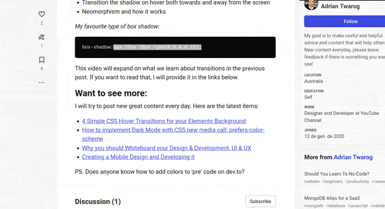

# Notes

Recordatoris de com es fan les coses, després el esborrare

## Recordatoris

### no gif en pede. un altra imatge

falta fer que no ixca el r

```{r sheets-option-drag0, fig.pos='h' ,echo = FALSE, fig.cap="Prova de gif"}
if(knitr::is_html_output(excludes="markdown"))  
```

::: {rmdinfo}
**Pera que els gif no vagen al pdf**

Falta saber com es canvia per un png

\`\`\`{r sheets-option-drag, fig.pos='h', fig.cap="Prova de gif"}\
if(knitr::is_html_output(excludes="markdown")) \
\`\`\`
:::

**Per a comprimir els gif**

``` bash
$ gifsicle -O3 --colors=64 --use-col=web --lossy=100 prova.gif -o comgif.gif  
o no tan bestia  
$ gifsicle -O3 --lossy=80 prova.gif -o provacomp1.gif  
```

::: {.rmdinfo .centre data-latex="{}"}
::: {.rmdinfo .centre data-latex="{}"}\
la la la\
:::
:::

::: {.rmdcuidao data-latex="{Ves en conter}"}
{.rmdcuidao data-latex="{ves en conter}"}
:::

:::{.rmdtip data-latex="{Tip}"}

:::{.rmdwarn data-latex="{Perill}"}
:::


:::{.rmdtip data-latex="{Tip}"}
:::

::: {.rmdnote data-latex="{Nota}"}
 **Aço es una nota** {.rmdnote data-latex="{Nota}"}\
ves en cuidaoooo no se si açò tancara o continua fins el mas enllà\
ves en cuidaoooo no se si açò tancara o continua fins el mas enllà
:::

::: {.rmdinfo data-latex="{}"}
**Perquè no isca en el pdf**

\`\`\`{asis, echo=!knitr::is_latex_output()}\
::: {.rmdcuidao}\
ves en cuidaoooo no se si açò tancara o continua fins el mas enllà :::\
\`\`\`
:::
