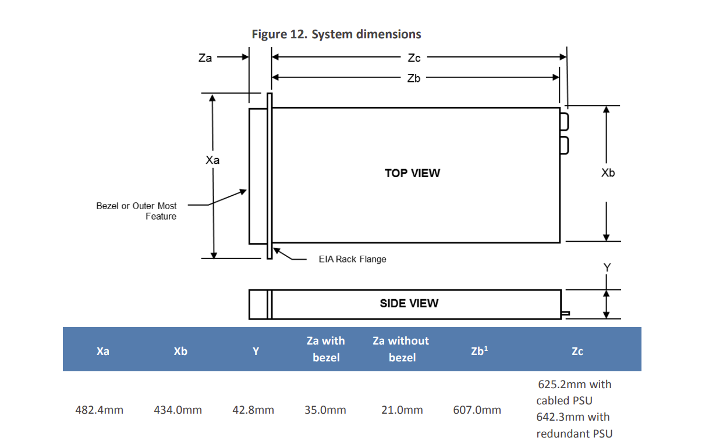

# Servidor

Es proposa la compra d'un servidor d'ebay, per fer alli les màquines virtuals que requerim, per desenvolupar el projecte.

- En el servidor es vol crear instàncies d'un servidor de disc per a les gravacions de video.
  
- Servidor de pàgines web.

- Servidor de Nextcloud.
  
- Maquina virtual per controlar el wifi de la sala.

- Tallafocs i entorn de seguretat.

- Mirar si es posa un Ldap o en l'entorn de Nextcloud es pot controlar els accessos i recursos servits als usuaris.
  
Tutorial [nextcloud](https://www.youtube.com/watch?v=sshqDf01Xyc)

## Material

1. [Servidor](https://www1.la.dell.com/content/products/productdetails.aspx/poweredge-r320?c=ve&l=es&s=corp&cs=vecorp1). En [ebai](https://www.ebay.es/itm/125269454776?hash=item1d2aa42fb8:g:aTIAAOSw3ExiXvm5) el podem trobar per uns 250 euros, amb 64G de Ram, podríem estirar més fins als 128G, Pero realment no esn fa falta tanta, per al que volem posar. (mirar més models), té 4 badies per a hdd on podem fer un Raid 5 en tres d'ells i l'altre pe arrancar les VM.

Especificacions

[Documentació del model](https://i.dell.com/sites/csdocuments/Shared-Content_data-Sheets_Documents/ja/jp/Dell-PowerEdge-R320Technical-Guide.pdf), si va avant, mirar posar un ssd, no està clar.
No veig comp amb [ubuntu](https://ubuntu.com/certified?category=Server&vendor=Dell+EMC&offset=20), igual mirar altre server.

Nota: Si és compatible.

*Dimensions servidor*

Cal buscar un rack que done les dimensions.

[video de instal-lació](https://www.dell.com/support/contents/es-es/videos/videoPlayer/os-deployment-installing-microsoft-windows-2012-r2-operating-system-by-using-lifecycle-controller/6079802988001)

2. Discs durs, admet segons documentació 4 SATA de 4Gb.
   Recomane
   [SEAGATE Barracuda ST4000DM004 4000GB 3.5 Serial ATA III](https://www.pcbox.com/st4000dm004-seagate-barracuda--st4000dm004-4000gb-3-5--serial-ata-iii/p)
   [amazon](https://www.amazon.es/Seagate-Barracuda-Disco-Interno-cach%C3%A9/dp/B0713R3Y6F/ref=sr_1_5?__mk_es_ES=%C3%85M%C3%85%C5%BD%C3%95%C3%91&crid=JR7AGWGKGDES&keywords=hd%2Bsata%2B4tb&qid=1651315567&sprefix=hd%2Bsata%2B4tb%2Caps%2C93&sr=8-5&th=1)
   [amazon usa](https://www.amazon.com/Seagate-BarraCuda-Internal-Drive-3-5-Inch/dp/B07D9C7SQH/ref=sr_1_1_sspa?keywords=4tb%2Bsata%2Bhard%2Bdrive&qid=1651315472&sr=8-1-spons&spLa=ZW5jcnlwdGVkUXVhbGlmaWVyPUExSldCREdJVFMzRUtNJmVuY3J5cHRlZElkPUEwNTc5NTIwMlRYQzQ0OTA0QVNDOCZlbmNyeXB0ZWRBZElkPUEwNjQxNjk2MjU1VkFSWjM1NVA4MiZ3aWRnZXROYW1lPXNwX2F0ZiZhY3Rpb249Y2xpY2tSZWRpcmVjdCZkb05vdExvZ0NsaWNrPXRydWU&th=1)
   Farien falta 3 per a fer el Raid, estaria bé tindre un de reserva per si falla, un disc, i regenerar el raid. Si s'adquiriren 4, es pot fer un Raid 6 que té dos de paritat. Ell soles es regenera.  

   Tindríem dos discs de 4 TB, que serien 8Gb d'espai efectiu i un de paritat.

3. Preguntar a Toni el Hypervisor més adequat.
4. Un Sai, mirar potencia, quan es decideixen el server.
   Es pot posar també una segona font al servidor. Buscar preus.
5. Un armari [Rack](https://www.pccomponentes.com/microconnect-armario-rack-19-6u-600x600mm-negro) per al servidor i el switch.
6. Switch, preguntar a Toni sobre els cisco, reciclats.
7. [Patch panel](https://www.pccomponentes.com/buscar/?query=patch%20panel&or-relevance), cables, connectors rj45 ...

## Avantatges

La idea és muntar un servidor de Nextcloud, per l'emmagatzematge dels fitxers de la sala. Aprofitar aquest entorn per a posar també, treball en grup de documents amb [Collabora](https://www.collaboraoffice.com/), o si els agrada més el plug de MS office en línia. Encara que hi ha altres solucions dins el mateix Nextcloud per a fer treball en grup.
Provar d'integrar [Etherpad](https://etherpad.org/) en Nextcoud, en un Docker i afegir-lo al menu.

Crear grups de treball on es puga compartir fitxers, com per exemple, un de redactors de la revista, on puguen discutir sobre els articles a publicar.
Un altre per als treballadors, per a l'administració, inclús es pot fer grups per a les companyies convidades per fer els seus espectacles.

Es pot aprofitar el sistema de Talk que té, per poder fer comunicacions entre els membres de l'empresa, entre el comandament de llums i el vestuari dels actors, entre redactors i director de la revista per discutir els articles...
Amb el seu servei de comunicacions privat.

### Pfsense

Primer que res, hem de posar un sistema de seguretat o [DZM](https://en.wikipedia.org/wiki/DMZ_%28computing%29), o farem amb [Pfsense](https://www.pfsense.org/), mitjançant una VM en el servidor.
  
::: { .rmdtip data-latex="{Tip}"}

A l'hora de configurar el pfsese tenim dues opcions.

- Fer una VPN
- Exposar els ports que volem, el 443
  
:::

El millor seria fer una VPN, pero per l'administració de després pot ser un poc complicat per a l'empresa, si no tenen un administrador.

Ens decantarem per exposar el port 443.

La configuració la posaré en un apartat posterior.
Configurarem el DHCP, les vpn, el DDNS i el DNS en aquesta màquina virtual, que sera el cor de la xarxa.

### DDNS

Traure conter en un DNS dinàmic.
En fer la instal.lació de Nexctcloud VM pels scripts de guithub, ja en s crea un en dedyn.io, mirar altres opcions. A més ens crea un certificat d'aquest domini en Lets encrypt. Mirar la possibilitat de la creació d'un subdomini en el domini de l'empresa, preguntar el dns suporta subdominis, i qui dona el servei.

### Nextcloud

Fem servir els [scripts](https://github.com/nextcloud/vm.git) de instal.lacio, que afegeixen millores de seguretat i rendiment.

::: {.rmdtip data-latex="{Tip}"}
Fer un lvm en el RAID 5 del servidor i donar format ZFS, la VM de Nextcloud en el ssd si el podem posar o en el disc de les VM
:::

## Accés point del wifi

En una altra VM posar el software que controla les antenes del wifi

## Servidor de disc per al video

Normalment les càmeres ip funcionen en un servidor d'ftp on es guarden les gravacions. En el Raid 5 fem una altra partició lvm d'espai per aquest propòsit, i posem un servidor de sftp en una altra VM on també tindrem el servidor web. Aquesta partició de dades la podem compartir per xarxa amb la VM de Nextcloud on podem muntar medis externs i compartir en els usuaris que volem, par a què es puga muntar també en ella, perquè els usuaris puguen veure les gravacions, sols dret de lectura.

## Pressupost

- Servidor 265 + iva = 300 euros
- Hd 90 x 3 =270 euros
- Rack 150 euros
- switch ? al voltant de 300 euros
- Antena wifi 150, per antena, si són dos, el segon pot ser d'uns 100 euros.
- Patch panel 25 euros.
- [Cables](https://www.pccomponentes.com/bobina-cable-utp-cat6-100-mts-negro) cat6 60 euros 100 Mts, [rosetes](https://www.pccomponentes.com/digitus-roseta-empotrable-cat6-2-x-rj45-angulo-hembra) 7 euros, [Rj 45](https://www.pccomponentes.com/equip-conector-rj45-cat6-100-unidades) 20 euros (100 unitats)
- Imprevistos 15%
- 3%, el 3% clar.  
  
**Total, crec que al voltant de 1500 euros, està fet.**

  Càmeres ip, el que vulgueu gastar, de 2500 una amb cmos sony, o per 450 una [Aida HD-NDI-200](https://aidaimaging.com/hd-ndi-200/), amb una lent fixa, es posa enfocat a l'infinit, amb una lent lluminosa, en gran profunditat de camp, i arreglat. [video](https://www.youtube.com/watch?v=khAv4d11J3g)
[video poca llum](https://www.youtube.com/watch?v=q8G6seZMzqU), [atre](https://www.youtube.com/watch?v=3zD6n6GNAuA), o es pot provar en càmeres ip de cctv, que per 100 euros hi ha que no estan malament, El problema és la poca llum de la sala. I l'aberració esfèrica que es veu en alguns videos de youtube, deu ser cosa de l'ull de peix que posen per ampliar el camp de visió.
Convertidor a ndi, es pot posar per convertir el senyal de la camera HDMI a ndi, o es pot fer en un pc mitjanament potent i el software de DNI.
[Nx Witness VMS](https://support.networkoptix.com/hc/en-us/articles/360010535793-Ubuntu-Linux-OS-Installation-Guide)
[nginx streamer video](https://www.digitalocean.com/community/tutorials/how-to-set-up-a-video-streaming-server-using-nginx-rtmp-on-ubuntu-20-04)
[Shinobi](https://shinobi.video/) El recomanat
