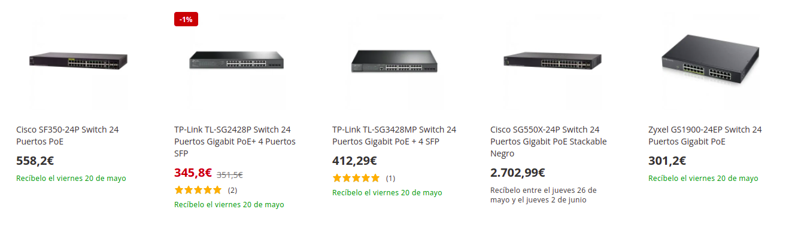

# Proposta de projecte

Es muntar tres xarxa en el teatre Espacio Inestable per a que done el següents serveis.

1 Xarxa interna del serveis per als treballadors.
2. Xarxa pública (soles wifi)
3. Xarxa interna cctv per al video, no connectada a internet.
4. Xarxa administració. Soles VPN o directa al servidor.

## serveis

* Entorn de serveis d'allotjament de fitxers. Nextcloud és funcionalment similar a Dropbox , Office 365 o Google Drive quan s'utilitza amb les seves solucions d'oficina integrades Collabora Online o OnlyOffice.
* Servei de comunicació entre membres, mitjan Nextcloud Talk, video, audio o xat.
* Servei de wifi per a la sala, separant tres xarxes. 
    * Interna, membres del equip. (internet i xarxa local de serveis)
    * Public, (soles accés a internet)
    * video, (sense accés a internet)
* servei de video tipus videovigilància que ens permet gravar obres en directe, retransmetre a usuaris autenticats (per veure assajos), o veure copies de events gravats de forma senzilla.
  
## Hardware

Per a realitzar les propostes es requeriria

1. [Servidor](https://www.ebay.es/itm/125269454776?hash=item1d2aa42fb8:g:aTIAAOSw3ExiXvm5) 
   
   **Cost 250 euros + iva -> 300 euros**
  
   

   No porta Discs durs.

2. Discs durs per al servidor, minim 3 per fer un sistema RAID de seguretat a fallades.
   Te espai per a 4 de connexió en calent dins la seua caixa, si fera falta mes en un futur es podem posar mes, pero ja fora del xassís.

   **Cost de 4TB, sobre 90 euros cada un**
   
   [SEAGATE Barracuda ST4000DM004 4000GB 3.5 Serial ATA III](https://www.pcbox.com/st4000dm004-seagate-barracuda--st4000dm004-4000gb-3-5--serial-ata-iii/p)
   [amazon Barracuda 4TB](https://www.amazon.es/Seagate-Barracuda-Disco-Interno-cach%C3%A9/dp/B0713R3Y6F/ref=sr_1_5?__mk_es_ES=%C3%85M%C3%85%C5%BD%C3%95%C3%91&crid=JR7AGWGKGDES&keywords=hd%2Bsata%2B4tb&qid=1651315567&sprefix=hd%2Bsata%2B4tb%2Caps%2C93&sr=8-5&th=1)

   De 2TB mes barats.
   El espai que aconseguim es n-1 discs. (amb 3 de 4TB tindríem 8TB)

3. Switch, [Aci hi ha varis](https://www.pccomponentes.com/buscar/?query=switch%2024%20poe&or-relevance)

  Realment que siga PoE( alimentació elèctrica del dispositiu per el cable LAN) soles es per a les càmeres minim 2 i les antenes wifi , 2 mes.
  Es pot escalar mes tard i la ip cam que es retire, es pot posar com a camera de vigilància del local...  
  **cost entre 300 i 600 estaria be**

   Em tenen que dir de un lloc de switch cisco reacondicionats.
  segurament seran per el mateix preu, pero son els millors.

   o es pot posar un [switch PoE de 8](https://www.pccomponentes.com/buscar/?query=switch%208%20poe&or-relevance) ports per uns **150 euros** i un altre no PoE de 24, pero no val la pena ni en consum ni en complexitat de la xarxa.
Sempre es millor i te menor consum un switch de 24 que dos de 12.

4. Armari [Rack](https://www.pccomponentes.com/microconnect-armario-rack-19-6u-600x600mm-negro) per al servidor i el switch.
**Cost Microconnect Armario Rack 19" 6U 600X600mm Negro 130,56€**

5. [Patch panel](https://www.pccomponentes.com/buscar/?query=patch%20panel&or-relevance), **Cost depen dels ports del switch, sobre 30 euros**

6. Cablejat i rosetes, depen de l'electricista. Hores i material, **700 euros** no els lleva ningú.

7. Càmeres ip, Aci es obri mes el pressupost

   * **Professional** hi ha de Sony, pero de 2500 euros no baixen.

   * Barates 
  
     **cameraes amb nightvolor**

     [barata](https://www.amazon.es/Exteriores-Seguridad-vigilancia-detecci%C3%B3n-humanoide/dp/B09CMRTXCH/ref=sr_1_5?__mk_es_ES=%C3%85M%C3%85%C5%BD%C3%95%C3%91&crid=1HGWT0B8AQ04L&keywords=ptz+Visi%C3%B3n+Nocturna+a+Color+poe&qid=1652043379&s=tools&sprefix=ptz+visi%C3%B3n+nocturna+a+color+poe%2Cdiy%2C95&sr=1-5) 67.99 euros

     [Reolink 5MP PTZ Cámara ](https://www.amazon.es/Reolink-Seguridad-Seguimiento-Autom%C3%A1tico-Outdoor-V3/dp/B099F2LGSB/ref=sr_1_9?__mk_es_ES=%C3%85M%C3%85%C5%BD%C3%95%C3%91&crid=1HGWT0B8AQ04L&keywords=ptz+Visi%C3%B3n+Nocturna+a+Color+poe&qid=1652043379&s=tools&sprefix=ptz+visi%C3%B3n+nocturna+a+color+poe%2Cdiy%2C95&sr=1-9) 139,99€ 

     [fixa reolink 4K](https://www.amazon.es/Reolink-Vigilancia-Bidireccional-Impermeable-RLC-812A/dp/B096K1P2RK/ref=sr_1_10?__mk_es_ES=%C3%85M%C3%85%C5%BD%C3%95%C3%91&crid=1HGWT0B8AQ04L&keywords=ptz+Visi%C3%B3n+Nocturna+a+Color+poe&qid=1652043379&s=tools&sprefix=ptz+visi%C3%B3n+nocturna+a+color+poe%2Cdiy%2C95&sr=1-10)  94,99€

*Segons fabricant* 
La tecnologia d'avantguarda NightColor us permet obtenir una imatge nítida fins i tot quan és fosc. Aquesta càmera té 2 LED blancs que transmeten els seus raigs infrarojos en una freqüència imperceptible a l'ull humà. Les llums blanques emeten brillants que ofereixen una increïble gamma de NightColor de 66 peus. Amb aquesta potent funció, podeu obtenir una consciència total sobre allò que no s'havia vist anteriorment i fer-ho d'una manera indetectable.

     Pero no se jo. Es pot provar en una a veure com va, si no mola es pot
     posar de camera de vigilància de la entrada de la sala.

* Un poc millor
[Amcrest UltraHD 4K (8 MP) POE IP, càmera exterior, 3840 x 2160, 131 pies NightVision](https://www.amazon.es/Amcrest-NightVision-resistente-intemperie-IP8M-2496EW-28MM/dp/B08SMPGF2L/ref=sr_1_1_sspa?__mk_es_ES=%C3%85M%C3%85%C5%BD%C3%95%C3%91&crid=B563YL5W8NZG&keywords=Amcrest&qid=1652041726&sprefix=amcrest%2Caps%2C93&sr=8-1-spons&psc=1&spLa=ZW5jcnlwdGVkUXVhbGlmaWVyPUEzNU04RVpYSEg2MTNDJmVuY3J5cHRlZElkPUEwODgxOTQwRDUzMkNEVUg0QUVIJmVuY3J5cHRlZEFkSWQ9QTEwMTQxOTBBNzRSODlYRllZNk4md2lkZ2V0TmFtZT1zcF9hdGYmYWN0aW9uPWNsaWNrUmVkaXJlY3QmZG9Ob3RMb2dDbGljaz10cnVl) 129,99€ [especificacions](https://amcrest.com/downloadable/download/attachment/id/22371/)

* Gama Mitja
[Zowietek PTZ Pro Cámara PTZ](https://www.amazon.es/Zowietek-PTZ-Pro-transmisi%F3n-videoconferencia/dp/B086X637W2/ref=sr_1_2_sspa?keywords=Zowietek%2BPro%2BCamera%2B20X%2BLive&qid=1652728314&sr=8-2-spons&th=1) 
**Sobre 700 euros**
D'aquesta gama hi ha moltes.

Tinc mes models guardats els enllaç per la documentació.

Pero millor si preguntes a algú que entenga.
O provar per les barates, i si no tira, es pot posar de videovigilància.

`Pero el disney de la xarxa no varia, la inversió en cables i maquines es independent de les càmeres que es posen.`

Conta també en algun extra que no es sap fins que no es posa en marxa.